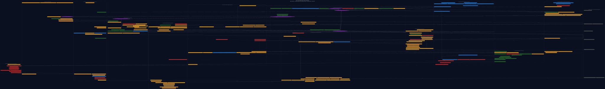

# ARC / CLIDE complete end-to-end system atlas

> **Historical architecture capture.** Generated on 2026-08-11; use it to
> understand the intended system and its then-observed overlay, not as current
> implementation truth. The current serving and handoff boundary is
> [`ATLAS-RELEASE-READINESS-2026-08-20.md`](./ATLAS-RELEASE-READINESS-2026-08-20.md).

Generated from repository HEAD `00b9a49d679c31b169ee1962d68880aaa0357154` on 2026-08-11 with source state `committed-head-plus-live-working-tree-overlay` and 10 visible dirty path(s). This is a component-complete atlas for the current canonical architecture plus the measured live working-tree overlay and a generated file-level module appendix. It does not claim that every future task-specific adapter or operator can be enumerated in advance.

**Provenance warning:** this generation includes concurrent uncommitted work. Those files are visible measured substrate, not committed baseline truth and not safe to delete or overwrite.



Interactive surface: [open the bounded visual explorer](./index.html).

Execution continuation: [historical next-agent E2E handoff](./NEXT-AGENT-COMPLETE-E2E-HANDOFF-2026-08-11.md).

## Status legend

- **SOLE AUTHORITY / CONSTITUTION**: 6 atlas modules.
- **LIVE / DEFAULT**: 29 atlas modules.
- **LIVE / PARTIAL**: 114 atlas modules.
- **EXISTS / DARK OR NON-PROMOTIONAL**: 20 atlas modules.
- **MISSING / LAUNCH BLOCKER**: 27 atlas modules.
- **OPTIONAL EXTERNAL / PATTERN ONLY**: 8 atlas modules.

Edge law: solid = current flow or binding; purple = durable authority/history; blue dashed = advisory proposal; red dotted = missing required connection; gray dashed = optional external adapter/pattern.

## Measured repository scale

| Surface | Current measured value |
|---|---:|
| Atlas modules | 204 |
| Atlas cross-module relations | 225 |
| Referenced implementation files | 239 |
| Missing referenced implementation files | 0 |
| Script modules scanned | 2125 |
| Static live closure | 458 |
| Test drivers | 1125 |
| Verification drivers | 189 |
| Dark deep-research modules | 27 |
| Orphan candidates | 326 |
| Unresolved dynamic-import modules | 15 |
| Registered levers | 430 |
| Live-at-default levers | 37 |
| TaskEvent V9 event types | 58 |
| Memory stores | 7 |
| Model weight artifacts | 44 |
| Domain routing configurations | 57 |
| Executable domain packs | 3 |

## Complete module catalogue

### 00 · HUMAN, PRODUCT, AND MODALITY SURFACES

| Module | Status | Interface | Implementations | Detail |
|---|---|---|---|---|
| **Owner intent, values, constraints** | SOLE AUTHORITY / CONSTITUTION | Human instruction and approval | future/deep module | Protected mission and live interjection source. |
| **CLIDE Rust TUI** | LIVE / PARTIAL | Chat, work, code, research, project and recovery panes | [apps/arc-tui/src/main.rs](/home/raed/.agentic-os/apps/arc-tui/src/main.rs)<br>[apps/arc-tui/src/workspace/mod.rs](/home/raed/.agentic-os/apps/arc-tui/src/workspace/mod.rs) |  |
| **Agentic OS CLI / one-shot** | LIVE / PARTIAL | Task invocation and local administration | [scripts/agentic-os.mjs](/home/raed/.agentic-os/scripts/agentic-os.mjs)<br>[apps/arc-tui/src/oneshot.rs](/home/raed/.agentic-os/apps/arc-tui/src/oneshot.rs) |  |
| **Public WebSocket ingress** | LIVE / DEFAULT | Versioned client frames | [scripts/arc-daemon.mjs](/home/raed/.agentic-os/scripts/arc-daemon.mjs) |  |
| **Mode, permission and route selection** | LIVE / PARTIAL | basic, auto, research, execute, plan | [scripts/chat-turn-runner.mjs](/home/raed/.agentic-os/scripts/chat-turn-runner.mjs)<br>[scripts/deep-research/task-mode-router.mjs](/home/raed/.agentic-os/scripts/deep-research/task-mode-router.mjs) |  |
| **Attachments and multimodal ingress** | LIVE / PARTIAL | Typed document/image/browser sources | [scripts/document-ingest-router.mjs](/home/raed/.agentic-os/scripts/document-ingest-router.mjs)<br>[scripts/specialist-consult.mjs](/home/raed/.agentic-os/scripts/specialist-consult.mjs) |  |
| **Questions, approvals, cancellation, steering** | LIVE / PARTIAL | Typed operator checkpoints | [scripts/operator-question-bus.mjs](/home/raed/.agentic-os/scripts/operator-question-bus.mjs)<br>[scripts/operator-question-classifier.mjs](/home/raed/.agentic-os/scripts/operator-question-classifier.mjs)<br>[scripts/interactive-approval-transport.mjs](/home/raed/.agentic-os/scripts/interactive-approval-transport.mjs) |  |
| **Diff, candidate, evidence and receipt views** | LIVE / PARTIAL | Read-only authoritative projections | [apps/arc-tui/src/workspace/diff.rs](/home/raed/.agentic-os/apps/arc-tui/src/workspace/diff.rs)<br>[apps/arc-tui/src/workspace/cognitive_projection.rs](/home/raed/.agentic-os/apps/arc-tui/src/workspace/cognitive_projection.rs) |  |
| **Automations, long-horizon and heartbeat entry** | LIVE / PARTIAL | Scheduled task triggers | [scripts/autonomous-loop-runner.mjs](/home/raed/.agentic-os/scripts/autonomous-loop-runner.mjs)<br>[scripts/multihour-loop-runner.mjs](/home/raed/.agentic-os/scripts/multihour-loop-runner.mjs)<br>[scripts/task-heartbeat.mjs](/home/raed/.agentic-os/scripts/task-heartbeat.mjs) |  |
| **User-visible answer, artifact, effect or unresolved result** | LIVE / PARTIAL | Typed final surface | [scripts/chat-turn-runner.mjs](/home/raed/.agentic-os/scripts/chat-turn-runner.mjs)<br>[apps/arc-tui/src/workspace/protocol.rs](/home/raed/.agentic-os/apps/arc-tui/src/workspace/protocol.rs) |  |

### 01 · NORMATIVE, LANGUAGE, INTENT, AND ACCEPTANCE PLANE

| Module | Status | Interface | Implementations | Detail |
|---|---|---|---|---|
| **Protected hierarchical intent map** | SOLE AUTHORITY / CONSTITUTION | Immutable root mission and workstreams | [docs/canon/ARC-CLIDE-INTENT-MAP.json](/home/raed/.agentic-os/docs/canon/ARC-CLIDE-INTENT-MAP.json) |  |
| **Exact prompt and conversation prefix** | LIVE / DEFAULT | Byte-preserving source | [scripts/chat-turn-runner.mjs](/home/raed/.agentic-os/scripts/chat-turn-runner.mjs) |  |
| **Prompt sanitiser and instruction/data fence** | LIVE / PARTIAL | Taint-preserving source zones | [scripts/prompt-sanitizer.mjs](/home/raed/.agentic-os/scripts/prompt-sanitizer.mjs)<br>[scripts/injection-defense.mjs](/home/raed/.agentic-os/scripts/injection-defense.mjs) |  |
| **Semantic Source Atoms V1** | LIVE / PARTIAL | Exact Unicode spans and opaque zones | [scripts/semantic-source-atoms-v1.mjs](/home/raed/.agentic-os/scripts/semantic-source-atoms-v1.mjs) |  |
| **Physical UD counterparser** | LIVE / PARTIAL | Pinned CPU subprocess observation | [scripts/semantic-ud-counterparser-v1.mjs](/home/raed/.agentic-os/scripts/semantic-ud-counterparser-v1.mjs)<br>[scripts/semantic-ud-counterparser-v1.py](/home/raed/.agentic-os/scripts/semantic-ud-counterparser-v1.py) |  |
| **Intent compiler / objective analyser** | LIVE / PARTIAL | Task facts, constraints and shaping | [scripts/intent-compiler.mjs](/home/raed/.agentic-os/scripts/intent-compiler.mjs)<br>[scripts/objective-analyser.mjs](/home/raed/.agentic-os/scripts/objective-analyser.mjs) |  |
| **IntentProgram V1 compatibility IR** | LIVE / PARTIAL | Typed work occurrences and topology | [scripts/intent-program-v1.mjs](/home/raed/.agentic-os/scripts/intent-program-v1.mjs) |  |
| **Semantic Intent IR V2** | LIVE / PARTIAL | Sequence, alternative, conditional and reference graph | [scripts/semantic-intent-ir-v2.mjs](/home/raed/.agentic-os/scripts/semantic-intent-ir-v2.mjs) |  |
| **Semantic Intent V2 projection** | LIVE / PARTIAL | Source-bound V2 plus V1 compatibility view | [scripts/semantic-intent-v2-projection-v1.mjs](/home/raed/.agentic-os/scripts/semantic-intent-v2-projection-v1.mjs) |  |
| **Semantic Intent Certificate V2** | LIVE / PARTIAL | Physical counterparse plus internal controls | [scripts/semantic-intent-certificate-v2.mjs](/home/raed/.agentic-os/scripts/semantic-intent-certificate-v2.mjs) |  |
| **GraphControl semantic admission** | LIVE / PARTIAL | Admitted or explicit refusal before GraphControl | [scripts/semantic-intent-graph-control-admission-v1.mjs](/home/raed/.agentic-os/scripts/semantic-intent-graph-control-admission-v1.mjs) |  |
| **Frozen TaskSpec V1** | LIVE / DEFAULT | Task identity, facts, constraints and acceptance | [scripts/intent-compiler.mjs](/home/raed/.agentic-os/scripts/intent-compiler.mjs)<br>[scripts/task-spec-artifact-store.mjs](/home/raed/.agentic-os/scripts/task-spec-artifact-store.mjs) |  |
| **GoalCapsule / proof-carrying intent** | LIVE / DEFAULT | Goal, checks, invariants and authority | [scripts/proof-carrying-intent.mjs](/home/raed/.agentic-os/scripts/proof-carrying-intent.mjs) |  |
| **Append-only GoalRefinement** | LIVE / PARTIAL | Versioned refinement without rewriting V1 | [scripts/goal-refinement-v1.mjs](/home/raed/.agentic-os/scripts/goal-refinement-v1.mjs)<br>[scripts/goal-refinement-artifact-store-v1.mjs](/home/raed/.agentic-os/scripts/goal-refinement-artifact-store-v1.mjs) |  |
| **Obligation and acceptance graph** | LIVE / PARTIAL | Required achievements, prohibitions and checks | [scripts/obligation-compiler.mjs](/home/raed/.agentic-os/scripts/obligation-compiler.mjs)<br>[scripts/obligation-coverage.mjs](/home/raed/.agentic-os/scripts/obligation-coverage.mjs)<br>[scripts/intent-as-tests.mjs](/home/raed/.agentic-os/scripts/intent-as-tests.mjs) |  |
| **Repository grounding requirement** | LIVE / DEFAULT | Required versus optional governed evidence | [scripts/repository-grounding-requirement-v1.mjs](/home/raed/.agentic-os/scripts/repository-grounding-requirement-v1.mjs) |  |
| **Typed ambiguity / clarification transaction** | EXISTS / DARK OR NON-PROMOTIONAL | Question, alternatives, scope and resume binding | [scripts/operator-question-bus.mjs](/home/raed/.agentic-os/scripts/operator-question-bus.mjs) |  |
| **Universal epistemic compiler** | MISSING / LAUNCH BLOCKER | Compile instruction, observation, claim, evidence, adversarial text and unknown | future/deep module | Required to generalise beyond current semantic task lane. |

### 02 · AUTHORITY, IDENTITY, EVENT, ARTIFACT, AND RECOVERY PLANE

| Module | Status | Interface | Implementations | Detail |
|---|---|---|---|---|
| **Contracts V9** | SOLE AUTHORITY / CONSTITUTION | Exact TaskEvent and artifact schemas | [scripts/contracts.mjs](/home/raed/.agentic-os/scripts/contracts.mjs) |  |
| **EventKernel** | SOLE AUTHORITY / CONSTITUTION | Append-only cognitive history and replay brand | [scripts/event-kernel.mjs](/home/raed/.agentic-os/scripts/event-kernel.mjs) |  |
| **TaskRuntime** | SOLE AUTHORITY / CONSTITUTION | Sole lifecycle, effect and completion interpreter | [scripts/task-runtime.mjs](/home/raed/.agentic-os/scripts/task-runtime.mjs) |  |
| **Cross-graph binding compiler** | MISSING / LAUNCH BLOCKER | Task, entity, scope, time, epoch, lineage and permitted influence | future/deep module | Current bindings are distributed across compilers rather than one deep module. |
| **TaskDelta V2** | LIVE / DEFAULT | Append-only authority-zero graph/artifact proposals | [scripts/task-delta-v2.mjs](/home/raed/.agentic-os/scripts/task-delta-v2.mjs) |  |
| **Task, worktree, model and authoring leases** | LIVE / DEFAULT | Exclusive ownership, heartbeat and expiry | [scripts/task-runtime.mjs](/home/raed/.agentic-os/scripts/task-runtime.mjs)<br>[scripts/task-heartbeat.mjs](/home/raed/.agentic-os/scripts/task-heartbeat.mjs) |  |
| **Durable checkpoints and handoffs** | LIVE / DEFAULT | Restart and exact resume identity | [scripts/durable-checkpoint.mjs](/home/raed/.agentic-os/scripts/durable-checkpoint.mjs)<br>[scripts/model-handoff.mjs](/home/raed/.agentic-os/scripts/model-handoff.mjs)<br>[scripts/arc-checkpoints.mjs](/home/raed/.agentic-os/scripts/arc-checkpoints.mjs) |  |
| **Effect request/commit/in-doubt ledger** | LIVE / PARTIAL | Reservation, observation and reconciliation | [scripts/task-runtime.mjs](/home/raed/.agentic-os/scripts/task-runtime.mjs)<br>[scripts/governed-action-loop.mjs](/home/raed/.agentic-os/scripts/governed-action-loop.mjs) |  |
| **Capability and authority policy** | LIVE / PARTIAL | Legal tool/effect surface | [scripts/capability-policy.mjs](/home/raed/.agentic-os/scripts/capability-policy.mjs)<br>[scripts/operator-surface-governance.mjs](/home/raed/.agentic-os/scripts/operator-surface-governance.mjs) |  |
| **Taint, privacy, egress and secret policy** | LIVE / PARTIAL | Information-flow membrane | [scripts/prompt-sanitizer.mjs](/home/raed/.agentic-os/scripts/prompt-sanitizer.mjs)<br>[scripts/egress-gateway.mjs](/home/raed/.agentic-os/scripts/egress-gateway.mjs)<br>[scripts/data-retention-policy.mjs](/home/raed/.agentic-os/scripts/data-retention-policy.mjs) |  |
| **TaskSpec and epoch artifact stores** | LIVE / DEFAULT | Content-addressed task parents | [scripts/task-spec-artifact-store.mjs](/home/raed/.agentic-os/scripts/task-spec-artifact-store.mjs)<br>[scripts/task-epoch-artifact-store-v1.mjs](/home/raed/.agentic-os/scripts/task-epoch-artifact-store-v1.mjs) |  |
| **TaskGraph artifact store** | LIVE / DEFAULT | Content-addressed plan/control artifacts | [scripts/task-graph-artifact-store.mjs](/home/raed/.agentic-os/scripts/task-graph-artifact-store.mjs) |  |
| **Candidate artifact store** | LIVE / DEFAULT | Immutable typed candidate bytes | [scripts/candidate-artifact-v1.mjs](/home/raed/.agentic-os/scripts/candidate-artifact-v1.mjs) |  |
| **Verifier/oracle artifact stores** | EXISTS / DARK OR NON-PROMOTIONAL | Capsule, experiment, result, commitment and adequacy bytes | [scripts/verifier-capsule-artifact-store.mjs](/home/raed/.agentic-os/scripts/verifier-capsule-artifact-store.mjs)<br>[scripts/verifier-experiment-artifact-store-v1.mjs](/home/raed/.agentic-os/scripts/verifier-experiment-artifact-store-v1.mjs)<br>[scripts/verifier-result-artifact-store.mjs](/home/raed/.agentic-os/scripts/verifier-result-artifact-store.mjs)<br>[scripts/oracle-construction-commitment-store-v1.mjs](/home/raed/.agentic-os/scripts/oracle-construction-commitment-store-v1.mjs) |  |
| **RuntimeInvocationReceipt store** | LIVE / PARTIAL | Signed physical invocation identity | [scripts/runtime-invocation-receipt-v1.mjs](/home/raed/.agentic-os/scripts/runtime-invocation-receipt-v1.mjs) |  |
| **External mutable state root** | LIVE / DEFAULT | XDG state outside checkout | [scripts/path-resolver.mjs](/home/raed/.agentic-os/scripts/path-resolver.mjs) |  |
| **Recovery baseline and rescue ref** | LIVE / DEFAULT | Private full visible-state and Git recovery | [scripts/recovery-baseline-v1.mjs](/home/raed/.agentic-os/scripts/recovery-baseline-v1.mjs) |  |
| **Worktree hygiene and Holt** | LIVE / DEFAULT | Stable-boundary and preservation gates | [scripts/worktree-hygiene-v1.mjs](/home/raed/.agentic-os/scripts/worktree-hygiene-v1.mjs) |  |
| **Canon registry, findings and authority events** | SOLE AUTHORITY / CONSTITUTION | Protected intent versus measured implementation truth | [CODEX.md](/home/raed/.agentic-os/CODEX.md)<br>[docs/canon/CANONICAL-DOCS.json](/home/raed/.agentic-os/docs/canon/CANONICAL-DOCS.json)<br>[scripts/canon-governance.mjs](/home/raed/.agentic-os/scripts/canon-governance.mjs) |  |

### 03 · BELIEF, EVIDENCE, EXPERIMENT, AND DYNAMIC CONTROL PLANE

| Module | Status | Interface | Implementations | Detail |
|---|---|---|---|---|
| **TaskDecisionState V1** | LIVE / PARTIAL | Known, believed, contested, unknown, forbidden and resources | [scripts/task-decision-state-v1.mjs](/home/raed/.agentic-os/scripts/task-decision-state-v1.mjs) |  |
| **Epistemic claim/evidence graph** | LIVE / PARTIAL | Support, refute, contradiction and open-world absence | [scripts/epistemic-graph-v1.mjs](/home/raed/.agentic-os/scripts/epistemic-graph-v1.mjs) |  |
| **Absence, inhibition and invalidation graph** | LIVE / PARTIAL | Unavailable, stale, forbidden, omitted and unsafe | [scripts/task-decision-state-v1.mjs](/home/raed/.agentic-os/scripts/task-decision-state-v1.mjs) |  |
| **Semantic bootstrap PlanGraph** | LIVE / DEFAULT | Single authority-free starting frontier | [scripts/task-bootstrap-plan-v1.mjs](/home/raed/.agentic-os/scripts/task-bootstrap-plan-v1.mjs) |  |
| **Task-conditioned workflow profile** | LIVE / PARTIAL | Work kinds, required achievements and legal operators | [scripts/task-conditioned-workflow-v1.mjs](/home/raed/.agentic-os/scripts/task-conditioned-workflow-v1.mjs) |  |
| **Control hypergraph** | LIVE / PARTIAL | AND obligations, OR tactics, guards, joins and outcomes | [scripts/task-conditioned-workflow-v1.mjs](/home/raed/.agentic-os/scripts/task-conditioned-workflow-v1.mjs) |  |
| **Decision frontier plan** | LIVE / PARTIAL | Open decision regions and branch candidates | [scripts/decision-frontier-v1.mjs](/home/raed/.agentic-os/scripts/decision-frontier-v1.mjs) |  |
| **GraphControl Kernel V2** | LIVE / PARTIAL | Bounded shadow decision and cycle compiler | [scripts/graph-control-kernel-v2.mjs](/home/raed/.agentic-os/scripts/graph-control-kernel-v2.mjs) |  |
| **Evidence-conditioned GraphControl cycle** | LIVE / PARTIAL | Exactly one bounded retry after a typed observation | [scripts/graph-control-evidence-cycle-v1.mjs](/home/raed/.agentic-os/scripts/graph-control-evidence-cycle-v1.mjs) |  |
| **Epistemic repository probe** | LIVE / PARTIAL | Code-owned bounded repository observation | [scripts/epistemic-repository-probe-v1.mjs](/home/raed/.agentic-os/scripts/epistemic-repository-probe-v1.mjs) |  |
| **GraphControl evidence condition** | LIVE / PARTIAL | Exact baseline/observation/relevance/context binding | [scripts/graph-control-evidence-condition-v1.mjs](/home/raed/.agentic-os/scripts/graph-control-evidence-condition-v1.mjs) |  |
| **Candidate eligibility law** | LIVE / PARTIAL | Typed evidence opens only unverified candidate lifecycle | [scripts/graph-control-candidate-eligibility-v1.mjs](/home/raed/.agentic-os/scripts/graph-control-candidate-eligibility-v1.mjs) |  |
| **Adaptive plan proposal and schedule** | LIVE / PARTIAL | Authority-zero branches, budget and ordering | [scripts/adaptive-plan-governor-v1.mjs](/home/raed/.agentic-os/scripts/adaptive-plan-governor-v1.mjs)<br>[scripts/dynamic-branch-schedule-v1.mjs](/home/raed/.agentic-os/scripts/dynamic-branch-schedule-v1.mjs) |  |
| **Dynamic branch invocation** | LIVE / PARTIAL | Request, start, result and join identity | [scripts/dynamic-branch-invocation-v1.mjs](/home/raed/.agentic-os/scripts/dynamic-branch-invocation-v1.mjs)<br>[scripts/dynamic-branch-execution-ledger-v1.mjs](/home/raed/.agentic-os/scripts/dynamic-branch-execution-ledger-v1.mjs) |  |
| **Typed branch model output** | LIVE / PARTIAL | Claims/hypotheses only, never effects | [scripts/dynamic-branch-model-output-v1.mjs](/home/raed/.agentic-os/scripts/dynamic-branch-model-output-v1.mjs)<br>[scripts/dynamic-branch-model-output-rejection-v1.mjs](/home/raed/.agentic-os/scripts/dynamic-branch-model-output-rejection-v1.mjs) |  |
| **Epistemic evaluation frontier** | LIVE / PARTIAL | Independent-evidence need and next decision | [scripts/epistemic-evaluation-frontier-v1.mjs](/home/raed/.agentic-os/scripts/epistemic-evaluation-frontier-v1.mjs) |  |
| **AuthorAction admission** | LIVE / PARTIAL | Clarify, gather evidence, unresolved or typed candidate proposal | [scripts/author-action-admission-v1.mjs](/home/raed/.agentic-os/scripts/author-action-admission-v1.mjs) |  |
| **Active experiment/counterexample designer** | LIVE / PARTIAL | Hypothesis, discriminating action, cost, risk and stop law | [scripts/research-entropy-trigger.mjs](/home/raed/.agentic-os/scripts/research-entropy-trigger.mjs)<br>[scripts/mutation-oracle.mjs](/home/raed/.agentic-os/scripts/mutation-oracle.mjs) |  |
| **Computational homeostat** | MISSING / LAUNCH BLOCKER | Expected decision-loss reduction per token/GPU/time/money/risk | future/deep module | Budgets exist but are not one decision controller. |
| **Universal GraphProgram compiler** | MISSING / LAUNCH BLOCKER | Compile any task into recursive finite typed epochs | future/deep module | The current controller covers a bounded subset. |

### 04 · CONTEXT, REPOSITORY, RETRIEVAL, EXPOSURE, AND COMPACTION PLANE

| Module | Status | Interface | Implementations | Detail |
|---|---|---|---|---|
| **Universal ContextProgram** | MISSING / LAUNCH BLOCKER | Per-node required facts, selectors, budgets, visibility and loss ledger | future/deep module | Current context paths remain fragmented. |
| **ContextCompiler** | LIVE / PARTIAL | Bounded repository context packets | [scripts/context-compiler.mjs](/home/raed/.agentic-os/scripts/context-compiler.mjs) |  |
| **Repository index readiness** | LIVE / PARTIAL | Head-bound index state | [scripts/ensure-repo-index.mjs](/home/raed/.agentic-os/scripts/ensure-repo-index.mjs) |  |
| **Symbol/call/reference graph** | LIVE / PARTIAL | Definitions, callers, callees and neighbourhoods | [scripts/graph-query.mjs](/home/raed/.agentic-os/scripts/graph-query.mjs)<br>[scripts/repo-graph/build-repo-graph.mjs](/home/raed/.agentic-os/scripts/repo-graph/build-repo-graph.mjs) |  |
| **SCIP index lane** | LIVE / PARTIAL | Cross-language semantic edges | [scripts/scip-indexer.mjs](/home/raed/.agentic-os/scripts/scip-indexer.mjs)<br>[scripts/scip-context-discovery.mjs](/home/raed/.agentic-os/scripts/scip-context-discovery.mjs) |  |
| **LSP semantic lane** | LIVE / PARTIAL | Definitions, references and diagnostics | [scripts/lsp-semantic-index.mjs](/home/raed/.agentic-os/scripts/lsp-semantic-index.mjs)<br>[scripts/lsp-diagnostics.mjs](/home/raed/.agentic-os/scripts/lsp-diagnostics.mjs) |  |
| **AST/CFG/call-graph lanes** | LIVE / PARTIAL | Language-specific structure and FFI | [scripts/ast-extractor.mjs](/home/raed/.agentic-os/scripts/ast-extractor.mjs)<br>[scripts/symbol-call-graph.mjs](/home/raed/.agentic-os/scripts/symbol-call-graph.mjs) |  |
| **Lexical/codebase RAG lane** | LIVE / PARTIAL | Text overlap proposer | [scripts/codebase-rag.mjs](/home/raed/.agentic-os/scripts/codebase-rag.mjs) |  |
| **Hybrid retrieval and RRF** | LIVE / PARTIAL | Lexical, graph and embedding fusion | [scripts/hybrid-code-retrieval.mjs](/home/raed/.agentic-os/scripts/hybrid-code-retrieval.mjs)<br>[scripts/listwise-rerank.mjs](/home/raed/.agentic-os/scripts/listwise-rerank.mjs) |  |
| **Embedding/vector lane** | LIVE / PARTIAL | Noisy similarity proposer only | [scripts/lib/embeddings.mjs](/home/raed/.agentic-os/scripts/lib/embeddings.mjs) |  |
| **Structural target context** | LIVE / PARTIAL | Imports, definitions, signatures and neighbours | [scripts/structural-context-facts.mjs](/home/raed/.agentic-os/scripts/structural-context-facts.mjs) |  |
| **Repo-graph memory join** | LIVE / PARTIAL | Target-bound recalled conventions and facts | [scripts/repo-graph/repo-graph-memory-join.mjs](/home/raed/.agentic-os/scripts/repo-graph/repo-graph-memory-join.mjs) |  |
| **Reference facts grounding** | LIVE / PARTIAL | Coverage-aware source facts | [scripts/reference-facts-grounding.mjs](/home/raed/.agentic-os/scripts/reference-facts-grounding.mjs) |  |
| **Installed dependency context** | LIVE / PARTIAL | Package/library definitions | [scripts/installed-dep-context.mjs](/home/raed/.agentic-os/scripts/installed-dep-context.mjs) |  |
| **Skills and practice-pack context** | LIVE / PARTIAL | Task-conditioned procedural instructions | [scripts/skills-registry.mjs](/home/raed/.agentic-os/scripts/skills-registry.mjs)<br>[scripts/practice-packs.mjs](/home/raed/.agentic-os/scripts/practice-packs.mjs) |  |
| **Dynamic branch working set** | LIVE / PARTIAL | Exact model-visible evidence and token budget | [scripts/dynamic-branch-working-set-v1.mjs](/home/raed/.agentic-os/scripts/dynamic-branch-working-set-v1.mjs) |  |
| **Context and exposure manifest** | LIVE / PARTIAL | Physical, visible, citable and evaluator-only refs | [scripts/dynamic-branch-context-manifest-v1.mjs](/home/raed/.agentic-os/scripts/dynamic-branch-context-manifest-v1.mjs)<br>[scripts/candidate-exposure-manifest-v1.mjs](/home/raed/.agentic-os/scripts/candidate-exposure-manifest-v1.mjs) |  |
| **Token and prompt budget authority** | LIVE / PARTIAL | Exact tokenization, narrowing and overflow policy | [scripts/token-count.mjs](/home/raed/.agentic-os/scripts/token-count.mjs)<br>[scripts/prompt-budget-authority.mjs](/home/raed/.agentic-os/scripts/prompt-budget-authority.mjs)<br>[scripts/symbol-span-narrowing.mjs](/home/raed/.agentic-os/scripts/symbol-span-narrowing.mjs) |  |
| **Semantic no-loss compaction** | EXISTS / DARK OR NON-PROMOTIONAL | Representation change with residual/loss accounting | [scripts/prompt-compressor.mjs](/home/raed/.agentic-os/scripts/prompt-compressor.mjs)<br>[scripts/phase-compaction.mjs](/home/raed/.agentic-os/scripts/phase-compaction.mjs) |  |
| **Context freshness controller/watchdog** | LIVE / PARTIAL | Index staleness and refresh plan | [scripts/freshness-controller.mjs](/home/raed/.agentic-os/scripts/freshness-controller.mjs)<br>[scripts/context-watchdog.mjs](/home/raed/.agentic-os/scripts/context-watchdog.mjs) |  |

### 05 · MODEL, SPECIALIST, SUBAGENT, TOOL, SANDBOX, AND EFFECT ROUTING

| Module | Status | Interface | Implementations | Detail |
|---|---|---|---|---|
| **Competence/independence-aware route policy** | MISSING / LAUNCH BLOCKER | Hard legality filter then robust value selection | future/deep module | Current routing is rule/catalog based, not held-out competence based. |
| **Model router and escalation** | LIVE / PARTIAL | Task class to model/runtime | [scripts/model-router.mjs](/home/raed/.agentic-os/scripts/model-router.mjs)<br>[scripts/model-escalation-policy.mjs](/home/raed/.agentic-os/scripts/model-escalation-policy.mjs)<br>[scripts/calibrated-routing.mjs](/home/raed/.agentic-os/scripts/calibrated-routing.mjs) |  |
| **Specialist registry** | LIVE / PARTIAL | 19 specialist identities and capability classes | [scripts/specialist-registry.mjs](/home/raed/.agentic-os/scripts/specialist-registry.mjs) |  |
| **Local llama-server transport** | LIVE / PARTIAL | Pinned local completion transport | [scripts/local-llama-server-transport.mjs](/home/raed/.agentic-os/scripts/local-llama-server-transport.mjs)<br>[scripts/runtime-attested-local-model-v1.mjs](/home/raed/.agentic-os/scripts/runtime-attested-local-model-v1.mjs) |  |
| **Qwen3.5 9B local model** | LIVE / PARTIAL | Primary local author/deliberator | [scripts/start-9b-server.sh](/home/raed/.agentic-os/scripts/start-9b-server.sh) |  |
| **Ollama compatibility runtime** | LIVE / PARTIAL | Compatibility serving adapter | [scripts/local-models.mjs](/home/raed/.agentic-os/scripts/local-models.mjs) |  |
| **Cloud provider transports** | EXISTS / DARK OR NON-PROMOTIONAL | OpenRouter, DeepSeek and Cerebras adapters | [scripts/provider-gateway.mjs](/home/raed/.agentic-os/scripts/provider-gateway.mjs)<br>[scripts/governed-openrouter-transport.mjs](/home/raed/.agentic-os/scripts/governed-openrouter-transport.mjs)<br>[scripts/governed-deepseek-transport.mjs](/home/raed/.agentic-os/scripts/governed-deepseek-transport.mjs)<br>[scripts/governed-cerebras-transport.mjs](/home/raed/.agentic-os/scripts/governed-cerebras-transport.mjs) |  |
| **Bounded multi-agent orchestration** | LIVE / PARTIAL | Independent packets, joins and shared-cache laws | [scripts/subagent-orchestrator.mjs](/home/raed/.agentic-os/scripts/subagent-orchestrator.mjs)<br>[scripts/sequential-subagent-coordinator.mjs](/home/raed/.agentic-os/scripts/sequential-subagent-coordinator.mjs)<br>[scripts/multi-agent-orchestration.mjs](/home/raed/.agentic-os/scripts/multi-agent-orchestration.mjs) |  |
| **Capability/tool registry** | LIVE / PARTIAL | Typed tool identities and grants | [scripts/mcp-federation-manifest.mjs](/home/raed/.agentic-os/scripts/mcp-federation-manifest.mjs)<br>[scripts/capability-policy.mjs](/home/raed/.agentic-os/scripts/capability-policy.mjs) |  |
| **Governed terminal/file operations** | LIVE / PARTIAL | Command, read, write and patch effects | [scripts/bash-action-transport.mjs](/home/raed/.agentic-os/scripts/bash-action-transport.mjs)<br>[scripts/governed-action-loop.mjs](/home/raed/.agentic-os/scripts/governed-action-loop.mjs) |  |
| **Browser and web adapters** | LIVE / PARTIAL | Browser session and governed retrieval | [scripts/arc-browser.mjs](/home/raed/.agentic-os/scripts/arc-browser.mjs)<br>[scripts/searxng-web-search.mjs](/home/raed/.agentic-os/scripts/searxng-web-search.mjs) |  |
| **Research/MCP connectors** | LIVE / PARTIAL | Search, crawl, academic and docs sources | [scripts/research-crawler.mjs](/home/raed/.agentic-os/scripts/research-crawler.mjs)<br>[scripts/mcp-federation-policy.mjs](/home/raed/.agentic-os/scripts/mcp-federation-policy.mjs) |  |
| **Compilers, tests, SMT/CAS and simulation** | LIVE / PARTIAL | Deterministic domain operators | [scripts/deterministic-verifier.mjs](/home/raed/.agentic-os/scripts/deterministic-verifier.mjs)<br>[scripts/environment-provisioner.mjs](/home/raed/.agentic-os/scripts/environment-provisioner.mjs) |  |
| **Sandbox and containment** | LIVE / PARTIAL | bwrap, Landlock, seccomp, no-network and allowlists | [scripts/arc-os-sandbox.mjs](/home/raed/.agentic-os/scripts/arc-os-sandbox.mjs)<br>[scripts/sandbox-engine.mjs](/home/raed/.agentic-os/scripts/sandbox-engine.mjs)<br>[scripts/verifier-executor-v1.mjs](/home/raed/.agentic-os/scripts/verifier-executor-v1.mjs) |  |
| **Egress gateway** | LIVE / PARTIAL | Network/data exfiltration policy | [scripts/egress-gateway.mjs](/home/raed/.agentic-os/scripts/egress-gateway.mjs) |  |
| **Host commit broker** | LIVE / PARTIAL | Governed host-side Git effects | [scripts/host-commit-broker.mjs](/home/raed/.agentic-os/scripts/host-commit-broker.mjs) |  |
| **Measured competence graph** | MISSING / LAUNCH BLOCKER | Success, calibration, cost, latency and failure mechanisms by route | future/deep module | Must be learned from held-out outcomes. |
| **Mechanism independence graph** | MISSING / LAUNCH BLOCKER | Shared model, prompt, source, verifier, tool and failure roots | future/deep module | Required before confidence aggregation. |

### 06 · CODING, RESEARCH, REASONING, REPRESENTATION, AND DOMAIN WORK

| Module | Status | Interface | Implementations | Detail |
|---|---|---|---|---|
| **Chat turn runner** | LIVE / DEFAULT | Product routing and response/candidate orchestration | [scripts/chat-turn-runner.mjs](/home/raed/.agentic-os/scripts/chat-turn-runner.mjs) |  |
| **Chat loop coordinator** | LIVE / PARTIAL | Repo/test discovery, context and coding coordination | [scripts/chat-loop-coordinator.mjs](/home/raed/.agentic-os/scripts/chat-loop-coordinator.mjs) |  |
| **Multi-target decomposition** | LIVE / PARTIAL | Per-target pipelines and joins | [scripts/chat-loop-decomposition.mjs](/home/raed/.agentic-os/scripts/chat-loop-decomposition.mjs) |  |
| **Frontier coding runner** | LIVE / PARTIAL | Localization, context, generation, selection and verification | [scripts/frontier-coding-runner.mjs](/home/raed/.agentic-os/scripts/frontier-coding-runner.mjs) |  |
| **Verifier-guided beam search** | LIVE / PARTIAL | Candidate diversity, ranking and selection | [scripts/verifier-guided-beam-search.mjs](/home/raed/.agentic-os/scripts/verifier-guided-beam-search.mjs) |  |
| **ReliableCodingLoop legacy executor** | LIVE / PARTIAL | Provision, edit, apply, test and telemetry | [scripts/reliable-coding-loop.mjs](/home/raed/.agentic-os/scripts/reliable-coding-loop.mjs) |  |
| **Governed patch generator** | LIVE / PARTIAL | Typed patch generation seam | [scripts/governed-patch-generator.mjs](/home/raed/.agentic-os/scripts/governed-patch-generator.mjs) |  |
| **Patch parse/reanchor/salvage ladder** | LIVE / PARTIAL | Deterministic recovery without widening authority | [scripts/deterministic-diff-reanchor.mjs](/home/raed/.agentic-os/scripts/deterministic-diff-reanchor.mjs)<br>[scripts/fastapply-safety-gate.mjs](/home/raed/.agentic-os/scripts/fastapply-safety-gate.mjs)<br>[scripts/fabrication-salvage.mjs](/home/raed/.agentic-os/scripts/fabrication-salvage.mjs) |  |
| **Existing-repo acceptance and obligations** | LIVE / PARTIAL | Behavioral acceptance checks | [scripts/existing-repo-acceptance.mjs](/home/raed/.agentic-os/scripts/existing-repo-acceptance.mjs)<br>[scripts/obligation-oracle.mjs](/home/raed/.agentic-os/scripts/obligation-oracle.mjs) |  |
| **Mutation/property/metamorphic probes** | LIVE / PARTIAL | Candidate fault discrimination | [scripts/mutation-oracle.mjs](/home/raed/.agentic-os/scripts/mutation-oracle.mjs)<br>[scripts/property-metamorphic-oracle.mjs](/home/raed/.agentic-os/scripts/property-metamorphic-oracle.mjs)<br>[scripts/ast-metamorphic-oracle.mjs](/home/raed/.agentic-os/scripts/ast-metamorphic-oracle.mjs) |  |
| **Deep research specialist** | LIVE / PARTIAL | TaskSpec-bound research entry | [scripts/deep-research-specialist.mjs](/home/raed/.agentic-os/scripts/deep-research-specialist.mjs) |  |
| **Research V2 pipeline** | LIVE / PARTIAL | Plan, retrieve, gap loop, synthesis and validation | [scripts/deep-research/research-v2-pipeline.mjs](/home/raed/.agentic-os/scripts/deep-research/research-v2-pipeline.mjs) |  |
| **Gap ledger** | LIVE / PARTIAL | Typed unknowns, budgets and convergence | [scripts/deep-research/gap-ledger.mjs](/home/raed/.agentic-os/scripts/deep-research/gap-ledger.mjs) |  |
| **Evidence bank** | LIVE / PARTIAL | Sources, claims and outline structure | [scripts/deep-research/evidence-bank.mjs](/home/raed/.agentic-os/scripts/deep-research/evidence-bank.mjs) |  |
| **Research dependency/contradiction graph** | LIVE / PARTIAL | Claim dependencies and contradictions | [scripts/deep-research/dependency-graph.mjs](/home/raed/.agentic-os/scripts/deep-research/dependency-graph.mjs) |  |
| **Research checkpoint/continuation** | LIVE / PARTIAL | Crash and budget resume | [scripts/deep-research/research-checkpoint.mjs](/home/raed/.agentic-os/scripts/deep-research/research-checkpoint.mjs)<br>[scripts/deep-research/research-continuation-packet.mjs](/home/raed/.agentic-os/scripts/deep-research/research-continuation-packet.mjs) |  |
| **Source, citation, FACT/CoVe/RARR checks** | LIVE / PARTIAL | Research evidence quality and abstention | [scripts/deep-research/source-validator.mjs](/home/raed/.agentic-os/scripts/deep-research/source-validator.mjs)<br>[scripts/deep-research/research-citations.mjs](/home/raed/.agentic-os/scripts/deep-research/research-citations.mjs) |  |
| **57 domain routing configurations** | LIVE / PARTIAL | Domain signals, sources and negatives | [scripts/domain-source-registry.mjs](/home/raed/.agentic-os/scripts/domain-source-registry.mjs) |  |
| **3 executable domain packs** | LIVE / PARTIAL | Physics, pure mathematics and theoretical CS | [scripts/deep-research/domain-packs.mjs](/home/raed/.agentic-os/scripts/deep-research/domain-packs.mjs) |  |
| **Prose/code/equation/proof/table/media bridge** | MISSING / LAUNCH BLOCKER | Semantics-preserving representation transformations | future/deep module | Needed for open-world generality. |
| **Black-hole scientific transfer** | MISSING / LAUNCH BLOCKER | Tri-state events, convergence and independent reference | [scripts/black-hole-hidden-experiment-v1.mjs](/home/raed/.agentic-os/scripts/black-hole-hidden-experiment-v1.mjs)<br>[scripts/black-hole-semantic-protocol-v2.mjs](/home/raed/.agentic-os/scripts/black-hole-semantic-protocol-v2.mjs) |  |

### 07 · AUTHORING, CANDIDATE, WORKSPACE, AND EXPOSURE LINEAGE

| Module | Status | Interface | Implementations | Detail |
|---|---|---|---|---|
| **GraphControl AuthorContext** | LIVE / DEFAULT | Typed authority-zero hypotheses and evidence | [scripts/graph-control-author-context-v1.mjs](/home/raed/.agentic-os/scripts/graph-control-author-context-v1.mjs) |  |
| **Greenfield candidate author** | LIVE / PARTIAL | Frozen TaskSpec plus author context to packet | [scripts/greenfield-candidate-author-v1.mjs](/home/raed/.agentic-os/scripts/greenfield-candidate-author-v1.mjs) |  |
| **Existing-repo patch author** | LIVE / PARTIAL | Governed patch prompt and receipt binding | [scripts/governed-patch-generator.mjs](/home/raed/.agentic-os/scripts/governed-patch-generator.mjs) |  |
| **Runtime-signed candidate-author receipt** | MISSING / LAUNCH BLOCKER | Exact author prompt, model, runtime, response and candidate binding | future/deep module | GraphControl calls are signed; candidate-author coverage remains launch work. |
| **Greenfield candidate packet V2** | LIVE / DEFAULT | Typed multi-file candidate payload | [scripts/greenfield-candidate-packet-v2.mjs](/home/raed/.agentic-os/scripts/greenfield-candidate-packet-v2.mjs) |  |
| **Patch candidate packet V1** | LIVE / DEFAULT | Exact unified diff, targets and source lineage | [scripts/patch-candidate-packet-v1.mjs](/home/raed/.agentic-os/scripts/patch-candidate-packet-v1.mjs) |  |
| **CandidateArtifact V1** | LIVE / DEFAULT | Content-addressed candidate identity | [scripts/candidate-artifact-v1.mjs](/home/raed/.agentic-os/scripts/candidate-artifact-v1.mjs) |  |
| **Candidate exposure manifest** | LIVE / PARTIAL | Author-visible and evaluator-hidden lineage | [scripts/candidate-exposure-manifest-v1.mjs](/home/raed/.agentic-os/scripts/candidate-exposure-manifest-v1.mjs) |  |
| **CandidateProposed event** | LIVE / DEFAULT | Exact task/candidate/oracle parent | [scripts/task-runtime.mjs](/home/raed/.agentic-os/scripts/task-runtime.mjs) |  |
| **CandidateWorkspaceRouter V1** | LIVE / DEFAULT | Source-derived greenfield/patch dispatch | [scripts/candidate-workspace-router-v1.mjs](/home/raed/.agentic-os/scripts/candidate-workspace-router-v1.mjs) |  |
| **Greenfield workspace store** | LIVE / DEFAULT | Immutable file materialization | [scripts/candidate-workspace-v1.mjs](/home/raed/.agentic-os/scripts/candidate-workspace-v1.mjs) |  |
| **Patch workspace store** | LIVE / DEFAULT | Repo-base-bound patch materialization | [scripts/patch-candidate-workspace-v1.mjs](/home/raed/.agentic-os/scripts/patch-candidate-workspace-v1.mjs) |  |
| **CandidateMaterialized event** | LIVE / DEFAULT | Exact workspace manifest and candidate lineage | [scripts/task-runtime.mjs](/home/raed/.agentic-os/scripts/task-runtime.mjs) |  |
| **Strict-current workspace verification** | LIVE / DEFAULT | Refuse source/repository drift before effects | [scripts/task-runtime.mjs](/home/raed/.agentic-os/scripts/task-runtime.mjs) |  |

### 08 · ORACLE FOUNDRY, HIDDEN EVALUATION, VERIFIER, MUTATION, AND TRI-STATE

| Module | Status | Interface | Implementations | Detail |
|---|---|---|---|---|
| **Oracle construction commitment** | EXISTS / DARK OR NON-PROMOTIONAL | Pre-candidate sealed public commitment | [scripts/oracle-construction-commitment-v1.mjs](/home/raed/.agentic-os/scripts/oracle-construction-commitment-v1.mjs)<br>[scripts/oracle-construction-commitment-store-v1.mjs](/home/raed/.agentic-os/scripts/oracle-construction-commitment-store-v1.mjs) |  |
| **Oracle portfolio adequacy** | EXISTS / DARK OR NON-PROMOTIONAL | Fault families, controls, witnesses and transfer | [scripts/oracle-portfolio-adequacy-v1.mjs](/home/raed/.agentic-os/scripts/oracle-portfolio-adequacy-v1.mjs) |  |
| **Oracle coverage tensor** | EXISTS / DARK OR NON-PROMOTIONAL | Diagnostic applicability/coverage projection | [scripts/oracle-coverage-tensor-v1.mjs](/home/raed/.agentic-os/scripts/oracle-coverage-tensor-v1.mjs) |  |
| **Oracle co-mutation projections** | EXISTS / DARK OR NON-PROMOTIONAL | Candidate and oracle mutation diagnostics | [scripts/oracle-co-mutation-v1.mjs](/home/raed/.agentic-os/scripts/oracle-co-mutation-v1.mjs)<br>[scripts/oracle-joint-co-mutation-v1.mjs](/home/raed/.agentic-os/scripts/oracle-joint-co-mutation-v1.mjs) |  |
| **Verifier template binding** | EXISTS / DARK OR NON-PROMOTIONAL | Task/candidate/oracle verifier contract | [scripts/verifier-template-binding-v1.mjs](/home/raed/.agentic-os/scripts/verifier-template-binding-v1.mjs) |  |
| **VerifierCapsule V1** | EXISTS / DARK OR NON-PROMOTIONAL | Exact executable verifier admission packet | [scripts/verifier-capsule-v1.mjs](/home/raed/.agentic-os/scripts/verifier-capsule-v1.mjs) |  |
| **Verifier experiment and discrimination** | EXISTS / DARK OR NON-PROMOTIONAL | Positive, negative and mutation controls | [scripts/verifier-experiment-v1.mjs](/home/raed/.agentic-os/scripts/verifier-experiment-v1.mjs)<br>[scripts/verifier-discrimination-v1.mjs](/home/raed/.agentic-os/scripts/verifier-discrimination-v1.mjs) |  |
| **Admitted verifier execution store** | EXISTS / DARK OR NON-PROMOTIONAL | Reservation, prepared result and in-doubt recovery | [scripts/admitted-verifier-execution-v1.mjs](/home/raed/.agentic-os/scripts/admitted-verifier-execution-v1.mjs) |  |
| **Contained verifier executor** | EXISTS / DARK OR NON-PROMOTIONAL | Pinned bwrap/runtime/executable with no network | [scripts/verifier-executor-v1.mjs](/home/raed/.agentic-os/scripts/verifier-executor-v1.mjs)<br>[scripts/runtime-attested-verifier-v1.mjs](/home/raed/.agentic-os/scripts/runtime-attested-verifier-v1.mjs) |  |
| **VerifierResult artifact/event** | EXISTS / DARK OR NON-PROMOTIONAL | Verdict plus exact runtime receipt lineage | [scripts/verifier-result-v1.mjs](/home/raed/.agentic-os/scripts/verifier-result-v1.mjs)<br>[scripts/verifier-result-artifact-store.mjs](/home/raed/.agentic-os/scripts/verifier-result-artifact-store.mjs) |  |
| **Runtime-attested sealed oracle batch** | MISSING / LAUNCH BLOCKER | Code-owned cases, controls, receipts and exact denominator | [scripts/runtime-attested-oracle-batch-v1.mjs](/home/raed/.agentic-os/scripts/runtime-attested-oracle-batch-v1.mjs) | Integrity projection exists; promotional runtime transaction is not installed. |
| **Private semantic evaluator store** | EXISTS / DARK OR NON-PROMOTIONAL | Encrypted private plans, attempts and reconciliation | [scripts/private-semantic-evaluator-v1.mjs](/home/raed/.agentic-os/scripts/private-semantic-evaluator-v1.mjs) |  |
| **Candidate × oracle × fault matrix** | MISSING / LAUNCH BLOCKER | Base, candidate mutant, oracle mutant and double-fault cancellation | future/deep module | Must be derived from physical signed executions. |
| **Supported / refuted / unresolved law** | MISSING / LAUNCH BLOCKER | Exact controls, coverage, receipts and abstention | future/deep module | Current daemon evaluation records unresolved only. |
| **Candidate-bound OracleEvaluationRecorded** | MISSING / LAUNCH BLOCKER | Promotional candidate-specific evaluation | [scripts/task-runtime.mjs](/home/raed/.agentic-os/scripts/task-runtime.mjs) | Current producer is deliberately unresolved and non-promotional. |
| **Black-hole independent numerical reference** | MISSING / LAUNCH BLOCKER | Tri-state event/convergence/exact-binding witness | [scripts/black-hole-verifier-calibration-v1.mjs](/home/raed/.agentic-os/scripts/black-hole-verifier-calibration-v1.mjs) |  |

### 09 · CANDIDATE-SPECIFIC EFFECT, RECONCILIATION, POST-VERIFY, AND COMPLETION

| Module | Status | Interface | Implementations | Detail |
|---|---|---|---|---|
| **Candidate-specific effect admission** | MISSING / LAUNCH BLOCKER | Exact supported evaluation plus current workspace | [scripts/product-task-terminal-bridge-v1.mjs](/home/raed/.agentic-os/scripts/product-task-terminal-bridge-v1.mjs) | Bridge deliberately refuses because transaction is absent. |
| **Effect reservation** | MISSING / LAUNCH BLOCKER | Idempotency key and exact candidate bytes | future/deep module | Must precede external mutation. |
| **Governed patch/app effect** | MISSING / LAUNCH BLOCKER | Apply exact immutable candidate in isolated worktree | future/deep module | Legacy apply exists but is not candidate-bound promotion authority. |
| **EffectObserved / EffectInDoubt** | MISSING / LAUNCH BLOCKER | Physical state, receipt and uncertainty | future/deep module | Required for crash-safe reconciliation. |
| **External effect reconciliation** | MISSING / LAUNCH BLOCKER | Inspect before retry; compensate where legal | future/deep module | No blind exactly-once claim. |
| **Post-effect candidate-bound verification** | MISSING / LAUNCH BLOCKER | Same oracle lineage against observed state | future/deep module | Required before promotion. |
| **completeCandidate transaction** | MISSING / LAUNCH BLOCKER | Exact candidate/evaluation/effect promotion | [scripts/task-runtime.mjs](/home/raed/.agentic-os/scripts/task-runtime.mjs) | Projection-only fixture completion is quarantined. |
| **TaskCompleted event** | MISSING / LAUNCH BLOCKER | Final authoritative product success | [scripts/event-kernel.mjs](/home/raed/.agentic-os/scripts/event-kernel.mjs) |  |
| **Product terminal bridge** | LIVE / PARTIAL | Exact lineage/current-source check then honest refusal | [scripts/product-task-terminal-bridge-v1.mjs](/home/raed/.agentic-os/scripts/product-task-terminal-bridge-v1.mjs) |  |

### 10 · EPISODIC MEMORY, CLAIM MEMORY, PROCEDURAL LEARNING, COMPETENCE, AND PLASTICITY

| Module | Status | Interface | Implementations | Detail |
|---|---|---|---|---|
| **EventKernel episodic history** | LIVE / DEFAULT | Immutable task episodes | [scripts/event-kernel.mjs](/home/raed/.agentic-os/scripts/event-kernel.mjs) |  |
| **Governed memory store** | LIVE / PARTIAL | Authoritative admitted claims | [scripts/governed-memory.mjs](/home/raed/.agentic-os/scripts/governed-memory.mjs) | Available but currently empty in the measured self-model. |
| **Agent advisory memory** | LIVE / PARTIAL | Advisory task memories | [scripts/agent-memory.mjs](/home/raed/.agentic-os/scripts/agent-memory.mjs) |  |
| **Project intent store** | LIVE / PARTIAL | Active feature and project facts | [scripts/project-intent-store.mjs](/home/raed/.agentic-os/scripts/project-intent-store.mjs) |  |
| **Semantic cache** | LIVE / PARTIAL | Advisory derived context | [scripts/semantic-cache.mjs](/home/raed/.agentic-os/scripts/semantic-cache.mjs) |  |
| **Research memory** | LIVE / PARTIAL | Advisory evidence-backed research records | [scripts/deep-research/research-context-mount.mjs](/home/raed/.agentic-os/scripts/deep-research/research-context-mount.mjs) |  |
| **Vector memory store** | EXISTS / DARK OR NON-PROMOTIONAL | Experimental similarity index | [scripts/memory-vector-index.mjs](/home/raed/.agentic-os/scripts/memory-vector-index.mjs) |  |
| **Letta archival memory** | EXISTS / DARK OR NON-PROMOTIONAL | Experimental advisory archive | [scripts/letta-kernel.mjs](/home/raed/.agentic-os/scripts/letta-kernel.mjs) |  |
| **Recall, anchor, budget and signals** | LIVE / PARTIAL | Task-conditioned advisory retrieval | [scripts/memory-intent-anchor.mjs](/home/raed/.agentic-os/scripts/memory-intent-anchor.mjs)<br>[scripts/memory-retrieval-budget.mjs](/home/raed/.agentic-os/scripts/memory-retrieval-budget.mjs)<br>[scripts/memory-recall-signals.mjs](/home/raed/.agentic-os/scripts/memory-recall-signals.mjs) |  |
| **Harvest, surprise and utility events** | LIVE / PARTIAL | Outcome-conditioned nominations | [scripts/memory-harvest-producer.mjs](/home/raed/.agentic-os/scripts/memory-harvest-producer.mjs)<br>[scripts/memory-surprise-gate.mjs](/home/raed/.agentic-os/scripts/memory-surprise-gate.mjs)<br>[scripts/memory-utility-events.mjs](/home/raed/.agentic-os/scripts/memory-utility-events.mjs) |  |
| **Reconsolidation, contradiction and supersession** | LIVE / PARTIAL | Revise or tombstone scoped memory | [scripts/memory-reconsolidation.mjs](/home/raed/.agentic-os/scripts/memory-reconsolidation.mjs) |  |
| **Cross-task/repo scope promotion** | EXISTS / DARK OR NON-PROMOTIONAL | Bounded promotion with counter-triggers | [scripts/memory-scope-promotion.mjs](/home/raed/.agentic-os/scripts/memory-scope-promotion.mjs) |  |
| **Sleep clock and consolidation** | LIVE / PARTIAL | Slow background nomination/consolidation | [scripts/sleep-clock.mjs](/home/raed/.agentic-os/scripts/sleep-clock.mjs)<br>[scripts/memory-consolidation-scheduler.mjs](/home/raed/.agentic-os/scripts/memory-consolidation-scheduler.mjs) |  |
| **Mechanism-level procedural memory** | MISSING / LAUNCH BLOCKER | Reusable scoped intervention, trigger, falsifier and rollback | future/deep module | Outcome hoarding must not replace mechanism learning. |
| **Reversible plasticity governor** | MISSING / LAUNCH BLOCKER | Held-out causal benefit, negative transfer and rollback | future/deep module | Promotion law remains design. |
| **Repository/runtime self-model** | LIVE / DEFAULT | Generated current substrate census | [scripts/reconstruction-self-model.mjs](/home/raed/.agentic-os/scripts/reconstruction-self-model.mjs) |  |

### 11 · CLIDE PROJECTION, OBSERVABILITY, SECURITY, OPERATIONS, ONBOARDING, AND RELEASE

| Module | Status | Interface | Implementations | Detail |
|---|---|---|---|---|
| **Verified read-only TaskRuntime snapshot** | LIVE / DEFAULT | Task/event/candidate/decision projection | [scripts/task-runtime.mjs](/home/raed/.agentic-os/scripts/task-runtime.mjs)<br>[scripts/arc-daemon.mjs](/home/raed/.agentic-os/scripts/arc-daemon.mjs) |  |
| **CLIDE wire protocol** | LIVE / PARTIAL | Frames and versioned projections | [apps/arc-tui/src/workspace/protocol.rs](/home/raed/.agentic-os/apps/arc-tui/src/workspace/protocol.rs)<br>[apps/arc-tui/src/workspace/daemon.rs](/home/raed/.agentic-os/apps/arc-tui/src/workspace/daemon.rs) |  |
| **CLIDE workspace state/input/selection** | LIVE / PARTIAL | User navigation and task state | [apps/arc-tui/src/workspace/state.rs](/home/raed/.agentic-os/apps/arc-tui/src/workspace/state.rs)<br>[apps/arc-tui/src/workspace/input.rs](/home/raed/.agentic-os/apps/arc-tui/src/workspace/input.rs)<br>[apps/arc-tui/src/workspace/selection.rs](/home/raed/.agentic-os/apps/arc-tui/src/workspace/selection.rs) |  |
| **CLIDE render/layout/panes/markdown/diff** | LIVE / PARTIAL | User-visible product experience | [apps/arc-tui/src/workspace/render.rs](/home/raed/.agentic-os/apps/arc-tui/src/workspace/render.rs)<br>[apps/arc-tui/src/workspace/layout.rs](/home/raed/.agentic-os/apps/arc-tui/src/workspace/layout.rs)<br>[apps/arc-tui/src/workspace/panes.rs](/home/raed/.agentic-os/apps/arc-tui/src/workspace/panes.rs)<br>[apps/arc-tui/src/workspace/markdown.rs](/home/raed/.agentic-os/apps/arc-tui/src/workspace/markdown.rs) |  |
| **Terminal/backend/clipboard/thumbnail** | LIVE / PARTIAL | Local terminal and media substrate | [apps/arc-tui/src/core/backend.rs](/home/raed/.agentic-os/apps/arc-tui/src/core/backend.rs)<br>[apps/arc-tui/src/core/terminal.rs](/home/raed/.agentic-os/apps/arc-tui/src/core/terminal.rs)<br>[apps/arc-tui/src/core/clipboard.rs](/home/raed/.agentic-os/apps/arc-tui/src/core/clipboard.rs)<br>[apps/arc-tui/src/core/thumbnail.rs](/home/raed/.agentic-os/apps/arc-tui/src/core/thumbnail.rs) |  |
| **Onboarding and file browser** | LIVE / PARTIAL | Project/model setup and navigation | [apps/arc-tui/src/onboarding/screens.rs](/home/raed/.agentic-os/apps/arc-tui/src/onboarding/screens.rs)<br>[apps/arc-tui/src/onboarding/file_browser.rs](/home/raed/.agentic-os/apps/arc-tui/src/onboarding/file_browser.rs) |  |
| **Run observability and telemetry** | LIVE / PARTIAL | Timeline, events, receipts and metrics | [scripts/run-observability.mjs](/home/raed/.agentic-os/scripts/run-observability.mjs)<br>[scripts/telemetry-bus.mjs](/home/raed/.agentic-os/scripts/telemetry-bus.mjs)<br>[scripts/observability-governance.mjs](/home/raed/.agentic-os/scripts/observability-governance.mjs) |  |
| **Daemon/context/model watchdogs** | LIVE / PARTIAL | Health, liveness and backpressure | [scripts/watchdog-process.mjs](/home/raed/.agentic-os/scripts/watchdog-process.mjs)<br>[scripts/context-watchdog.mjs](/home/raed/.agentic-os/scripts/context-watchdog.mjs) |  |
| **Storage, retention and lifecycle** | LIVE / PARTIAL | Quota, deletion law, archival and retirement | [scripts/storage-manager.mjs](/home/raed/.agentic-os/scripts/storage-manager.mjs)<br>[scripts/data-retention-policy.mjs](/home/raed/.agentic-os/scripts/data-retention-policy.mjs)<br>[scripts/lifecycle-retirement-policy.mjs](/home/raed/.agentic-os/scripts/lifecycle-retirement-policy.mjs) |  |
| **Hardware/model recommender and installer** | LIVE / PARTIAL | Catalog to artifact/runtime setup | [scripts/onboarding/model-installer.mjs](/home/raed/.agentic-os/scripts/onboarding/model-installer.mjs)<br>[scripts/local-models.mjs](/home/raed/.agentic-os/scripts/local-models.mjs) |  |
| **Model/daemon service launch** | LIVE / PARTIAL | Pinned local processes and roots | [scripts/start-9b-server.sh](/home/raed/.agentic-os/scripts/start-9b-server.sh)<br>[scripts/dev-live.sh](/home/raed/.agentic-os/scripts/dev-live.sh) |  |
| **Token/GPU/time/money budgets** | LIVE / PARTIAL | Resource ceilings and provider economics | [scripts/token-enforcer.mjs](/home/raed/.agentic-os/scripts/token-enforcer.mjs)<br>[scripts/model-pricing.mjs](/home/raed/.agentic-os/scripts/model-pricing.mjs)<br>[scripts/research-budget.mjs](/home/raed/.agentic-os/scripts/research-budget.mjs) |  |
| **Failure ecology and chaos campaigns** | EXISTS / DARK OR NON-PROMOTIONAL | Restart, stale context, poisoned memory, wrong oracle and malformed tool arms | [scripts/full-system-stress-harness.mjs](/home/raed/.agentic-os/scripts/full-system-stress-harness.mjs)<br>[scripts/hard-stress-campaign.mjs](/home/raed/.agentic-os/scripts/hard-stress-campaign.mjs) |  |
| **Answer-free Grand Challenge factory** | EXISTS / DARK OR NON-PROMOTIONAL | Cross-domain held-out product proof | [docs/canon/GRAND-CHALLENGE-PROTOCOL.md](/home/raed/.agentic-os/docs/canon/GRAND-CHALLENGE-PROTOCOL.md) |  |
| **Packaging, signed release and rollback** | MISSING / LAUNCH BLOCKER | Fresh-machine reproducible launch | [scripts/packaging-reproducibility.mjs](/home/raed/.agentic-os/scripts/packaging-reproducibility.mjs) |  |

### 12 · EXTERNAL OSS AND SERVICES — ADAPTERS OR PATTERNS, NEVER PEER AUTHORITY

| Module | Status | Interface | Implementations | Detail |
|---|---|---|---|---|
| **LangGraph / Temporal / n8n** | OPTIONAL EXTERNAL / PATTERN ONLY | Borrow scheduling, activities and UI patterns | future/deep module |  |
| **OpenKB** | OPTIONAL EXTERNAL / PATTERN ONLY | Borrow file/tree/citation/read-only skill patterns | future/deep module |  |
| **Langfuse** | OPTIONAL EXTERNAL / PATTERN ONLY | One-way off-box OTLP/read model | future/deep module |  |
| **iii** | OPTIONAL EXTERNAL / PATTERN ONLY | Borrow catalog/schema/console patterns only | future/deep module |  |
| **Vector databases** | OPTIONAL EXTERNAL / PATTERN ONLY | Rebuildable similarity proposer | future/deep module |  |
| **FalkorDB / graph databases** | OPTIONAL EXTERNAL / PATTERN ONLY | Optional derived query projection | [scripts/falkordb-engine.mjs](/home/raed/.agentic-os/scripts/falkordb-engine.mjs) |  |
| **Model providers and local runtimes** | OPTIONAL EXTERNAL / PATTERN ONLY | Adapters behind governed route policy | future/deep module |  |
| **MCP/connectors/browser/office ecosystem** | OPTIONAL EXTERNAL / PATTERN ONLY | Phase-gated capability adapters | future/deep module |  |

## Cross-plane flow catalogue

| From | Relation | To | Edge class |
|---|---|---|---|
| Owner intent, values, constraints | protects | Protected hierarchical intent map | flow |
| Owner intent, values, constraints | task/interjection | Public WebSocket ingress | flow |
| CLIDE Rust TUI | frames | Public WebSocket ingress | flow |
| Agentic OS CLI / one-shot | flows to | Mode, permission and route selection | flow |
| Public WebSocket ingress | flows to | Mode, permission and route selection | flow |
| Attachments and multimodal ingress | flows to | Prompt sanitiser and instruction/data fence | flow |
| Mode, permission and route selection | flows to | Exact prompt and conversation prefix | flow |
| Protected hierarchical intent map | normative parent | Frozen TaskSpec V1 | durable |
| Exact prompt and conversation prefix | flows to | Prompt sanitiser and instruction/data fence | flow |
| Prompt sanitiser and instruction/data fence | flows to | Semantic Source Atoms V1 | flow |
| Semantic Source Atoms V1 | flows to | Physical UD counterparser | flow |
| Semantic Source Atoms V1 | flows to | Semantic Intent IR V2 | flow |
| Physical UD counterparser | flows to | Semantic Intent Certificate V2 | flow |
| Intent compiler / objective analyser | flows to | Frozen TaskSpec V1 | flow |
| IntentProgram V1 compatibility IR | flows to | Semantic Intent V2 projection | flow |
| Semantic Intent IR V2 | flows to | Semantic Intent V2 projection | flow |
| Semantic Intent V2 projection | flows to | Semantic Intent Certificate V2 | flow |
| Semantic Intent Certificate V2 | flows to | GraphControl semantic admission | flow |
| GraphControl semantic admission | admit/refuse | TaskRuntime | durable |
| Frozen TaskSpec V1 | flows to | GoalCapsule / proof-carrying intent | flow |
| GoalCapsule / proof-carrying intent | flows to | Obligation and acceptance graph | flow |
| GoalCapsule / proof-carrying intent | flows to | Append-only GoalRefinement | flow |
| Frozen TaskSpec V1 | flows to | Repository grounding requirement | flow |
| GraphControl semantic admission | unsupported | Typed ambiguity / clarification transaction | advisory |
| Universal epistemic compiler | future | Semantic Intent IR V2 | missing |
| Contracts V9 | validates | EventKernel | durable |
| EventKernel | replay state | TaskRuntime | durable |
| TaskRuntime | private append | EventKernel | durable |
| Cross-graph binding compiler | future complete join | EventKernel | missing |
| TaskDelta V2 | shadow proposal | EventKernel | durable |
| Task, worktree, model and authoring leases | flows to | TaskRuntime | flow |
| Durable checkpoints and handoffs | flows to | TaskRuntime | flow |
| Capability and authority policy | flows to | TaskRuntime | flow |
| Taint, privacy, egress and secret policy | flows to | Capability and authority policy | flow |
| Effect request/commit/in-doubt ledger | flows to | EventKernel | flow |
| TaskSpec and epoch artifact stores | flows to | EventKernel | flow |
| TaskGraph artifact store | flows to | EventKernel | flow |
| Candidate artifact store | flows to | EventKernel | flow |
| Verifier/oracle artifact stores | flows to | EventKernel | flow |
| RuntimeInvocationReceipt store | flows to | EventKernel | flow |
| External mutable state root | flows to | EventKernel | flow |
| Recovery baseline and rescue ref | flows to | Worktree hygiene and Holt | flow |
| Worktree hygiene and Holt | stable boundary | Canon registry, findings and authority events | flow |
| Canon registry, findings and authority events | registers authority | Protected hierarchical intent map | durable |
| TaskRuntime | flows to | TaskDecisionState V1 | flow |
| Frozen TaskSpec V1 | flows to | TaskDecisionState V1 | flow |
| GoalCapsule / proof-carrying intent | flows to | TaskDecisionState V1 | flow |
| Epistemic claim/evidence graph | flows to | TaskDecisionState V1 | flow |
| Absence, inhibition and invalidation graph | flows to | TaskDecisionState V1 | flow |
| TaskDecisionState V1 | flows to | Semantic bootstrap PlanGraph | flow |
| Semantic bootstrap PlanGraph | flows to | Task-conditioned workflow profile | flow |
| Task-conditioned workflow profile | flows to | Control hypergraph | flow |
| Control hypergraph | flows to | Decision frontier plan | flow |
| Decision frontier plan | flows to | GraphControl Kernel V2 | flow |
| GraphControl semantic admission | flows to | GraphControl Kernel V2 | flow |
| GraphControl Kernel V2 | flows to | Adaptive plan proposal and schedule | flow |
| Adaptive plan proposal and schedule | flows to | Dynamic branch invocation | flow |
| Dynamic branch invocation | flows to | Dynamic branch working set | flow |
| Dynamic branch working set | flows to | Typed branch model output | flow |
| Typed branch model output | flows to | Epistemic evaluation frontier | flow |
| Epistemic evaluation frontier | flows to | AuthorAction admission | flow |
| Epistemic evaluation frontier | evidence request | Epistemic repository probe | flow |
| Epistemic repository probe | flows to | GraphControl evidence condition | flow |
| GraphControl evidence condition | flows to | Evidence-conditioned GraphControl cycle | flow |
| Evidence-conditioned GraphControl cycle | epoch N+1 | GraphControl Kernel V2 | flow |
| GraphControl evidence condition | flows to | Candidate eligibility law | flow |
| Candidate eligibility law | flows to | AuthorAction admission | flow |
| Active experiment/counterexample designer | flows to | Epistemic claim/evidence graph | flow |
| Computational homeostat | future VOI | Adaptive plan proposal and schedule | missing |
| Universal GraphProgram compiler | future universal compile | Control hypergraph | missing |
| Repository grounding requirement | flows to | Universal ContextProgram | flow |
| ContextCompiler | flows to | Dynamic branch working set | flow |
| Repository index readiness | flows to | ContextCompiler | flow |
| Symbol/call/reference graph | flows to | ContextCompiler | flow |
| SCIP index lane | flows to | Symbol/call/reference graph | flow |
| LSP semantic lane | flows to | Symbol/call/reference graph | flow |
| AST/CFG/call-graph lanes | flows to | Symbol/call/reference graph | flow |
| Lexical/codebase RAG lane | flows to | Hybrid retrieval and RRF | flow |
| Embedding/vector lane | flows to | Hybrid retrieval and RRF | flow |
| Symbol/call/reference graph | flows to | Hybrid retrieval and RRF | flow |
| Hybrid retrieval and RRF | flows to | ContextCompiler | flow |
| Structural target context | flows to | ContextCompiler | flow |
| Repo-graph memory join | flows to | ContextCompiler | flow |
| Reference facts grounding | flows to | ContextCompiler | flow |
| Installed dependency context | flows to | ContextCompiler | flow |
| Skills and practice-pack context | flows to | ContextCompiler | flow |
| Context and exposure manifest | flows to | Dynamic branch working set | flow |
| Token and prompt budget authority | flows to | Dynamic branch working set | flow |
| Semantic no-loss compaction | flows to | Dynamic branch working set | flow |
| Context freshness controller/watchdog | flows to | Repository index readiness | flow |
| Universal ContextProgram | future unified compile | Dynamic branch working set | missing |
| TaskDecisionState V1 | flows to | Competence/independence-aware route policy | flow |
| Computational homeostat | future | Competence/independence-aware route policy | flow |
| Measured competence graph | future | Competence/independence-aware route policy | missing |
| Mechanism independence graph | future | Competence/independence-aware route policy | missing |
| Competence/independence-aware route policy | future selection | Model router and escalation | missing |
| Model router and escalation | flows to | Local llama-server transport | flow |
| Local llama-server transport | flows to | Qwen3.5 9B local model | flow |
| Model router and escalation | flows to | Ollama compatibility runtime | flow |
| Model router and escalation | flows to | Cloud provider transports | flow |
| Model router and escalation | flows to | Specialist registry | flow |
| Model router and escalation | flows to | Bounded multi-agent orchestration | flow |
| Capability and authority policy | flows to | Capability/tool registry | flow |
| Capability/tool registry | flows to | Governed terminal/file operations | flow |
| Capability/tool registry | flows to | Browser and web adapters | flow |
| Capability/tool registry | flows to | Research/MCP connectors | flow |
| Capability/tool registry | flows to | Compilers, tests, SMT/CAS and simulation | flow |
| Sandbox and containment | flows to | Governed terminal/file operations | flow |
| Sandbox and containment | flows to | Contained verifier executor | flow |
| Egress gateway | flows to | Browser and web adapters | flow |
| Egress gateway | flows to | Research/MCP connectors | flow |
| Host commit broker | flows to | Candidate-specific effect admission | flow |
| Mode, permission and route selection | flows to | Chat turn runner | flow |
| Chat turn runner | flows to | Chat loop coordinator | flow |
| Chat loop coordinator | flows to | Multi-target decomposition | flow |
| Chat loop coordinator | flows to | Frontier coding runner | flow |
| Multi-target decomposition | flows to | Frontier coding runner | flow |
| ContextCompiler | flows to | Frontier coding runner | flow |
| Frontier coding runner | flows to | Verifier-guided beam search | flow |
| Verifier-guided beam search | flows to | ReliableCodingLoop legacy executor | flow |
| ReliableCodingLoop legacy executor | flows to | Governed patch generator | flow |
| Governed patch generator | flows to | Patch parse/reanchor/salvage ladder | flow |
| Patch parse/reanchor/salvage ladder | flows to | Existing-repo acceptance and obligations | flow |
| Mutation/property/metamorphic probes | flows to | Verifier-guided beam search | flow |
| Chat turn runner | flows to | Deep research specialist | flow |
| Deep research specialist | flows to | Research V2 pipeline | flow |
| Research V2 pipeline | flows to | Gap ledger | flow |
| Research V2 pipeline | flows to | Evidence bank | flow |
| Gap ledger | flows to | Research dependency/contradiction graph | flow |
| Source, citation, FACT/CoVe/RARR checks | flows to | Evidence bank | flow |
| Research checkpoint/continuation | flows to | Research V2 pipeline | flow |
| Research/MCP connectors | flows to | Research V2 pipeline | flow |
| 57 domain routing configurations | flows to | Research V2 pipeline | flow |
| 3 executable domain packs | flows to | Compilers, tests, SMT/CAS and simulation | flow |
| Prose/code/equation/proof/table/media bridge | future | 3 executable domain packs | missing |
| Black-hole scientific transfer | transfer | Runtime-attested sealed oracle batch | missing |
| Evidence bank | typed plan delta | Epistemic claim/evidence graph | advisory |
| AuthorAction admission | flows to | GraphControl AuthorContext | flow |
| GraphControl AuthorContext | flows to | Greenfield candidate author | flow |
| GraphControl AuthorContext | flows to | Existing-repo patch author | flow |
| Model router and escalation | flows to | Greenfield candidate author | flow |
| Model router and escalation | flows to | Existing-repo patch author | flow |
| Greenfield candidate author | missing receipt | Runtime-signed candidate-author receipt | missing |
| Existing-repo patch author | missing receipt | Runtime-signed candidate-author receipt | missing |
| Greenfield candidate author | flows to | Greenfield candidate packet V2 | flow |
| Existing-repo patch author | flows to | Patch candidate packet V1 | flow |
| Greenfield candidate packet V2 | flows to | CandidateArtifact V1 | flow |
| Patch candidate packet V1 | flows to | CandidateArtifact V1 | flow |
| Candidate exposure manifest | flows to | CandidateArtifact V1 | flow |
| CandidateArtifact V1 | append | CandidateProposed event | durable |
| CandidateProposed event | flows to | CandidateWorkspaceRouter V1 | flow |
| CandidateWorkspaceRouter V1 | flows to | Greenfield workspace store | flow |
| CandidateWorkspaceRouter V1 | flows to | Patch workspace store | flow |
| Greenfield workspace store | flows to | CandidateMaterialized event | flow |
| Patch workspace store | flows to | CandidateMaterialized event | flow |
| CandidateMaterialized event | flows to | Strict-current workspace verification | flow |
| Oracle construction commitment | pre-candidate parent | CandidateProposed event | durable |
| Oracle portfolio adequacy | flows to | Oracle coverage tensor | flow |
| Oracle portfolio adequacy | flows to | Oracle co-mutation projections | flow |
| Oracle construction commitment | flows to | Runtime-attested sealed oracle batch | flow |
| CandidateMaterialized event | flows to | Runtime-attested sealed oracle batch | flow |
| Private semantic evaluator store | flows to | Runtime-attested sealed oracle batch | flow |
| Verifier template binding | flows to | VerifierCapsule V1 | flow |
| VerifierCapsule V1 | flows to | Admitted verifier execution store | flow |
| Verifier experiment and discrimination | flows to | Admitted verifier execution store | flow |
| Admitted verifier execution store | flows to | Contained verifier executor | flow |
| Contained verifier executor | flows to | RuntimeInvocationReceipt store | flow |
| RuntimeInvocationReceipt store | flows to | VerifierResult artifact/event | flow |
| VerifierResult artifact/event | flows to | Runtime-attested sealed oracle batch | flow |
| Candidate × oracle × fault matrix | required | Runtime-attested sealed oracle batch | missing |
| Runtime-attested sealed oracle batch | derive | Supported / refuted / unresolved law | missing |
| Supported / refuted / unresolved law | append | Candidate-bound OracleEvaluationRecorded | missing |
| Black-hole independent numerical reference | transfer witness | Runtime-attested sealed oracle batch | missing |
| Candidate-bound OracleEvaluationRecorded | supported only | Candidate-specific effect admission | missing |
| Strict-current workspace verification | flows to | Candidate-specific effect admission | flow |
| Product terminal bridge | currently refuses | Candidate-specific effect admission | flow |
| Candidate-specific effect admission | flows to | Effect reservation | missing |
| Effect reservation | flows to | Governed patch/app effect | missing |
| Governed patch/app effect | flows to | EffectObserved / EffectInDoubt | missing |
| EffectObserved / EffectInDoubt | if in doubt | External effect reconciliation | missing |
| EffectObserved / EffectInDoubt | if observed | Post-effect candidate-bound verification | missing |
| Post-effect candidate-bound verification | flows to | completeCandidate transaction | missing |
| completeCandidate transaction | append | TaskCompleted event | missing |
| TaskCompleted event | flows to | User-visible answer, artifact, effect or unresolved result | flow |
| EventKernel | flows to | EventKernel episodic history | flow |
| Epistemic claim/evidence graph | flows to | Governed memory store | flow |
| Project intent store | advisory parent | Frozen TaskSpec V1 | flow |
| Semantic cache | flows to | ContextCompiler | flow |
| Research memory | flows to | Research V2 pipeline | flow |
| Vector memory store | flows to | Recall, anchor, budget and signals | flow |
| Letta archival memory | flows to | Recall, anchor, budget and signals | flow |
| Governed memory store | flows to | Recall, anchor, budget and signals | flow |
| Recall, anchor, budget and signals | flows to | Repo-graph memory join | flow |
| TaskCompleted event | outcome | Harvest, surprise and utility events | flow |
| Harvest, surprise and utility events | flows to | Reconsolidation, contradiction and supersession | flow |
| Reconsolidation, contradiction and supersession | flows to | Cross-task/repo scope promotion | flow |
| Sleep clock and consolidation | flows to | Reconsolidation, contradiction and supersession | flow |
| Cross-task/repo scope promotion | future | Reversible plasticity governor | missing |
| Reversible plasticity governor | future | Mechanism-level procedural memory | missing |
| Mechanism-level procedural memory | future | Skills and practice-pack context | missing |
| Repository/runtime self-model | future evidence | Measured competence graph | missing |
| EventKernel | flows to | Verified read-only TaskRuntime snapshot | flow |
| Verified read-only TaskRuntime snapshot | flows to | CLIDE wire protocol | flow |
| CLIDE wire protocol | flows to | CLIDE workspace state/input/selection | flow |
| CLIDE workspace state/input/selection | flows to | CLIDE render/layout/panes/markdown/diff | flow |
| Terminal/backend/clipboard/thumbnail | flows to | CLIDE render/layout/panes/markdown/diff | flow |
| Onboarding and file browser | flows to | CLIDE Rust TUI | flow |
| CLIDE render/layout/panes/markdown/diff | flows to | CLIDE Rust TUI | flow |
| EventKernel | flows to | Run observability and telemetry | flow |
| RuntimeInvocationReceipt store | flows to | Run observability and telemetry | flow |
| Daemon/context/model watchdogs | flows to | Model/daemon service launch | flow |
| Storage, retention and lifecycle | flows to | External mutable state root | flow |
| Hardware/model recommender and installer | flows to | Model/daemon service launch | flow |
| Model/daemon service launch | flows to | Qwen3.5 9B local model | flow |
| Token/GPU/time/money budgets | future unified control | Computational homeostat | missing |
| Failure ecology and chaos campaigns | flows to | Answer-free Grand Challenge factory | flow |
| Answer-free Grand Challenge factory | after product proof | Packaging, signed release and rollback | missing |
| LangGraph / Temporal / n8n | borrow patterns | Adaptive plan proposal and schedule | external |
| OpenKB | borrow patterns | Universal ContextProgram | external |
| Langfuse | one-way export | Run observability and telemetry | external |
| iii | borrow catalog | Capability/tool registry | external |
| Vector databases | adapter | Embedding/vector lane | external |
| FalkorDB / graph databases | derived projection | Symbol/call/reference graph | external |
| Model providers and local runtimes | adapter | Model router and escalation | external |
| MCP/connectors/browser/office ecosystem | phase-gated adapter | Capability/tool registry | external |

## TaskEvent V9 event vocabulary

- `TaskCreated`
- `TaskStateChanged`
- `PlanAccepted`
- `TaskSpecFrozen`
- `TaskSpecAmended`
- `ProgressLedgerUpdated`
- `TaskLeaseAcquired`
- `TaskLeaseRenewed`
- `TaskLeaseReleased`
- `WorktreeLeaseAcquired`
- `WorktreeLeaseRenewed`
- `WorktreeLeaseReleased`
- `HeartbeatRecorded`
- `CheckpointRecorded`
- `HandoffCreated`
- `HandoffResumed`
- `ToolCalled`
- `ToolResultRecorded`
- `EvidenceRecorded`
- `VerificationCompleted`
- `ApprovalRequested`
- `ApprovalRecorded`
- `OperatorQuestionRaised`
- `OperatorQuestionAnswered`
- `OperatorQuestionCancelled`
- `OperatorQuestionAnswerApplied`
- `OperatorQuestionTimedOut`
- `OperatorNodeResumeStarted`
- `OperatorNodeResumeCompleted`
- `TaskCompleted`
- `TaskFailed`
- `TaskCancelled`
- `TaskDeltaRecorded`
- `TaskSpecVersionActivated`
- `PlanGraphAccepted`
- `PlanNodeTransitioned`
- `CapabilityGrantRecorded`
- `EffectRequested`
- `EffectCommitted`
- `NodeVerificationRecorded`
- `PlanGraphInsertionAccepted`
- `GoalRefinementRecorded`
- `CandidateProposed`
- `CandidateMaterialized`
- `VerifierCapsuleAdmitted`
- `VerifierResultRecorded`
- `DecisionGapRecorded`
- `PlanGraphDecisionInsertionAccepted`
- `ResearchProposalAdmitted`
- `DecisionResolved`
- `PlanNodeOperatorAnswerApplied`
- `DynamicBranchExecutionRequested`
- `DynamicBranchExecutionStarted`
- `DynamicBranchExecutionResultRecorded`
- `DynamicBranchExecutionJoined`
- `OraclePortfolioAdequacyAdmitted`
- `OracleConstructionCommitted`
- `OracleEvaluationRecorded`

## Measured memory stores

| Store | Class | Status | Total | Evidence-backed |
|---|---|---|---:|---:|
| governed-memory | authoritative | available | 0 | 0 |
| agent-memory | advisory | available-empty | 0 | 0 |
| project-intent | authoritative | available | 7 | 0 |
| semantic-cache | advisory | available | 1 | 0 |
| vector-store | experimental | not-configured | 0 | 0 |
| research-memory | advisory | available | 988 | 757 |
| letta-archival | experimental | detected | 192 | 0 |

## Model and domain state laws

Model: `catalogued` -> `artifact-present` -> `runtime-compatible` -> `served` -> `capability-probed` -> `task-verified` -> `product-routed`

Domain: `taxonomy-id` -> `research-routing-config` -> `materialized-pack` -> `trigger-proven` -> `task-verified` -> `product-routed`

<details>
<summary>All 458 statically live script modules</summary>

- [scripts/academic-search-facade.mjs](/home/raed/.agentic-os/scripts/academic-search-facade.mjs)
- [scripts/acceptance-elicitor-grant.mjs](/home/raed/.agentic-os/scripts/acceptance-elicitor-grant.mjs)
- [scripts/acceptance-elicitor.mjs](/home/raed/.agentic-os/scripts/acceptance-elicitor.mjs)
- [scripts/acceptance-scaffold.mjs](/home/raed/.agentic-os/scripts/acceptance-scaffold.mjs)
- [scripts/account-rotator.mjs](/home/raed/.agentic-os/scripts/account-rotator.mjs)
- [scripts/adaptive-plan-governor-v1.mjs](/home/raed/.agentic-os/scripts/adaptive-plan-governor-v1.mjs)
- [scripts/admitted-verifier-execution-v1.mjs](/home/raed/.agentic-os/scripts/admitted-verifier-execution-v1.mjs)
- [scripts/agentic-os.mjs](/home/raed/.agentic-os/scripts/agentic-os.mjs)
- [scripts/apply-path-parity.mjs](/home/raed/.agentic-os/scripts/apply-path-parity.mjs)
- [scripts/apply-salvage-ladder.mjs](/home/raed/.agentic-os/scripts/apply-salvage-ladder.mjs)
- [scripts/arc-browser.mjs](/home/raed/.agentic-os/scripts/arc-browser.mjs)
- [scripts/arc-chat-send-replay-v1.mjs](/home/raed/.agentic-os/scripts/arc-chat-send-replay-v1.mjs)
- [scripts/arc-checkpoints.mjs](/home/raed/.agentic-os/scripts/arc-checkpoints.mjs)
- [scripts/arc-daemon.mjs](/home/raed/.agentic-os/scripts/arc-daemon.mjs)
- [scripts/arc-hooks.mjs](/home/raed/.agentic-os/scripts/arc-hooks.mjs)
- [scripts/arc-operator-turn-journal.mjs](/home/raed/.agentic-os/scripts/arc-operator-turn-journal.mjs)
- [scripts/arc-os-sandbox.mjs](/home/raed/.agentic-os/scripts/arc-os-sandbox.mjs)
- [scripts/armed-config.mjs](/home/raed/.agentic-os/scripts/armed-config.mjs)
- [scripts/arxiv-search.mjs](/home/raed/.agentic-os/scripts/arxiv-search.mjs)
- [scripts/ast-metamorphic-oracle.mjs](/home/raed/.agentic-os/scripts/ast-metamorphic-oracle.mjs)
- [scripts/author-action-admission-v1.mjs](/home/raed/.agentic-os/scripts/author-action-admission-v1.mjs)
- [scripts/auto-import-compensator.mjs](/home/raed/.agentic-os/scripts/auto-import-compensator.mjs)
- [scripts/autonomous-loop-runner.mjs](/home/raed/.agentic-os/scripts/autonomous-loop-runner.mjs)
- [scripts/autonomous-loop.mjs](/home/raed/.agentic-os/scripts/autonomous-loop.mjs)
- [scripts/autopilot-timer.mjs](/home/raed/.agentic-os/scripts/autopilot-timer.mjs)
- [scripts/b4-selector.mjs](/home/raed/.agentic-os/scripts/b4-selector.mjs)
- [scripts/bash-action-transport.mjs](/home/raed/.agentic-os/scripts/bash-action-transport.mjs)
- [scripts/behaviour-model-store.mjs](/home/raed/.agentic-os/scripts/behaviour-model-store.mjs)
- [scripts/benchmark-constitution.mjs](/home/raed/.agentic-os/scripts/benchmark-constitution.mjs)
- [scripts/callee-signatures.mjs](/home/raed/.agentic-os/scripts/callee-signatures.mjs)
- [scripts/campaign-configs.mjs](/home/raed/.agentic-os/scripts/campaign-configs.mjs)
- [scripts/candidate-artifact-v1.mjs](/home/raed/.agentic-os/scripts/candidate-artifact-v1.mjs)
- [scripts/candidate-workspace-router-v1.mjs](/home/raed/.agentic-os/scripts/candidate-workspace-router-v1.mjs)
- [scripts/candidate-workspace-v1.mjs](/home/raed/.agentic-os/scripts/candidate-workspace-v1.mjs)
- [scripts/canonical-file-scope.mjs](/home/raed/.agentic-os/scripts/canonical-file-scope.mjs)
- [scripts/capability-policy.mjs](/home/raed/.agentic-os/scripts/capability-policy.mjs)
- [scripts/cast-chunk-index.mjs](/home/raed/.agentic-os/scripts/cast-chunk-index.mjs)
- [scripts/chat-loop-coordinator.mjs](/home/raed/.agentic-os/scripts/chat-loop-coordinator.mjs)
- [scripts/chat-loop-decomposition.mjs](/home/raed/.agentic-os/scripts/chat-loop-decomposition.mjs)
- [scripts/chat-turn-runner.mjs](/home/raed/.agentic-os/scripts/chat-turn-runner.mjs)
- [scripts/clide-comparison-input-v1.mjs](/home/raed/.agentic-os/scripts/clide-comparison-input-v1.mjs)
- [scripts/clide-runtime-comparator-v1.mjs](/home/raed/.agentic-os/scripts/clide-runtime-comparator-v1.mjs)
- [scripts/clide-runtime-comparison-receipt-v1.mjs](/home/raed/.agentic-os/scripts/clide-runtime-comparison-receipt-v1.mjs)
- [scripts/clide-task-runtime-projection-v1.mjs](/home/raed/.agentic-os/scripts/clide-task-runtime-projection-v1.mjs)
- [scripts/codebase-rag.mjs](/home/raed/.agentic-os/scripts/codebase-rag.mjs)
- [scripts/cognitive-operator-v1.mjs](/home/raed/.agentic-os/scripts/cognitive-operator-v1.mjs)
- [scripts/coherence-anchor.mjs](/home/raed/.agentic-os/scripts/coherence-anchor.mjs)
- [scripts/coherence-escalation.mjs](/home/raed/.agentic-os/scripts/coherence-escalation.mjs)
- [scripts/coherence-guard.mjs](/home/raed/.agentic-os/scripts/coherence-guard.mjs)
- [scripts/context-compiler.mjs](/home/raed/.agentic-os/scripts/context-compiler.mjs)
- [scripts/context-lod.mjs](/home/raed/.agentic-os/scripts/context-lod.mjs)
- [scripts/context-refresh-daemon.mjs](/home/raed/.agentic-os/scripts/context-refresh-daemon.mjs)
- [scripts/contracts.mjs](/home/raed/.agentic-os/scripts/contracts.mjs)
- [scripts/conversational-read-loop.mjs](/home/raed/.agentic-os/scripts/conversational-read-loop.mjs)
- [scripts/decision-action-outcome-v1.mjs](/home/raed/.agentic-os/scripts/decision-action-outcome-v1.mjs)
- [scripts/decision-frontier-v1.mjs](/home/raed/.agentic-os/scripts/decision-frontier-v1.mjs)
- [scripts/decision-selection-v1.mjs](/home/raed/.agentic-os/scripts/decision-selection-v1.mjs)
- [scripts/deep-research-fact-validator.mjs](/home/raed/.agentic-os/scripts/deep-research-fact-validator.mjs)
- [scripts/deep-research-specialist.mjs](/home/raed/.agentic-os/scripts/deep-research-specialist.mjs)
- [scripts/deep-research/cloud-model-adapter.mjs](/home/raed/.agentic-os/scripts/deep-research/cloud-model-adapter.mjs)
- [scripts/deep-research/concept-coverage.mjs](/home/raed/.agentic-os/scripts/deep-research/concept-coverage.mjs)
- [scripts/deep-research/contradiction-validity-gate.mjs](/home/raed/.agentic-os/scripts/deep-research/contradiction-validity-gate.mjs)
- [scripts/deep-research/dependency-graph.mjs](/home/raed/.agentic-os/scripts/deep-research/dependency-graph.mjs)
- [scripts/deep-research/domain-pack-fanout.mjs](/home/raed/.agentic-os/scripts/deep-research/domain-pack-fanout.mjs)
- [scripts/deep-research/domain-packs-registry.mjs](/home/raed/.agentic-os/scripts/deep-research/domain-packs-registry.mjs)
- [scripts/deep-research/domain-packs.mjs](/home/raed/.agentic-os/scripts/deep-research/domain-packs.mjs)
- [scripts/deep-research/engineering-decomposition.mjs](/home/raed/.agentic-os/scripts/deep-research/engineering-decomposition.mjs)
- [scripts/deep-research/evidence-bank.mjs](/home/raed/.agentic-os/scripts/deep-research/evidence-bank.mjs)
- [scripts/deep-research/gap-ledger.mjs](/home/raed/.agentic-os/scripts/deep-research/gap-ledger.mjs)
- [scripts/deep-research/gap-resolver.mjs](/home/raed/.agentic-os/scripts/deep-research/gap-resolver.mjs)
- [scripts/deep-research/gap-round-retrieval-mode.mjs](/home/raed/.agentic-os/scripts/deep-research/gap-round-retrieval-mode.mjs)
- [scripts/deep-research/gap-stagnation.mjs](/home/raed/.agentic-os/scripts/deep-research/gap-stagnation.mjs)
- [scripts/deep-research/gap-url-policy.mjs](/home/raed/.agentic-os/scripts/deep-research/gap-url-policy.mjs)
- [scripts/deep-research/hybrid-search-facade.mjs](/home/raed/.agentic-os/scripts/deep-research/hybrid-search-facade.mjs)
- [scripts/deep-research/library-relevance.mjs](/home/raed/.agentic-os/scripts/deep-research/library-relevance.mjs)
- [scripts/deep-research/live-research-eval.mjs](/home/raed/.agentic-os/scripts/deep-research/live-research-eval.mjs)
- [scripts/deep-research/local-model-adapter.mjs](/home/raed/.agentic-os/scripts/deep-research/local-model-adapter.mjs)
- [scripts/deep-research/multi-domain-mount-rules.mjs](/home/raed/.agentic-os/scripts/deep-research/multi-domain-mount-rules.mjs)
- [scripts/deep-research/multi-domain-mount.mjs](/home/raed/.agentic-os/scripts/deep-research/multi-domain-mount.mjs)
- [scripts/deep-research/obligation-query.mjs](/home/raed/.agentic-os/scripts/deep-research/obligation-query.mjs)
- [scripts/deep-research/openalex-query-sanitizer.mjs](/home/raed/.agentic-os/scripts/deep-research/openalex-query-sanitizer.mjs)
- [scripts/deep-research/perspective-seed.mjs](/home/raed/.agentic-os/scripts/deep-research/perspective-seed.mjs)
- [scripts/deep-research/query-hardening.mjs](/home/raed/.agentic-os/scripts/deep-research/query-hardening.mjs)
- [scripts/deep-research/qwen3-client.mjs](/home/raed/.agentic-os/scripts/deep-research/qwen3-client.mjs)
- [scripts/deep-research/qwen3-embedding.mjs](/home/raed/.agentic-os/scripts/deep-research/qwen3-embedding.mjs)
- [scripts/deep-research/qwen3-reranker.mjs](/home/raed/.agentic-os/scripts/deep-research/qwen3-reranker.mjs)
- [scripts/deep-research/relevance-critic.mjs](/home/raed/.agentic-os/scripts/deep-research/relevance-critic.mjs)
- [scripts/deep-research/research-abstention.mjs](/home/raed/.agentic-os/scripts/deep-research/research-abstention.mjs)
- [scripts/deep-research/research-analytics.mjs](/home/raed/.agentic-os/scripts/deep-research/research-analytics.mjs)
- [scripts/deep-research/research-anchor-gate.mjs](/home/raed/.agentic-os/scripts/deep-research/research-anchor-gate.mjs)
- [scripts/deep-research/research-checkpoint.mjs](/home/raed/.agentic-os/scripts/deep-research/research-checkpoint.mjs)
- [scripts/deep-research/research-citations.mjs](/home/raed/.agentic-os/scripts/deep-research/research-citations.mjs)
- [scripts/deep-research/research-claim-tagging.mjs](/home/raed/.agentic-os/scripts/deep-research/research-claim-tagging.mjs)
- [scripts/deep-research/research-context-cache.mjs](/home/raed/.agentic-os/scripts/deep-research/research-context-cache.mjs)
- [scripts/deep-research/research-context-mount.mjs](/home/raed/.agentic-os/scripts/deep-research/research-context-mount.mjs)
- [scripts/deep-research/research-continuation-packet.mjs](/home/raed/.agentic-os/scripts/deep-research/research-continuation-packet.mjs)
- [scripts/deep-research/research-corpus-gate.mjs](/home/raed/.agentic-os/scripts/deep-research/research-corpus-gate.mjs)
- [scripts/deep-research/research-cove.mjs](/home/raed/.agentic-os/scripts/deep-research/research-cove.mjs)
- [scripts/deep-research/research-coverage.mjs](/home/raed/.agentic-os/scripts/deep-research/research-coverage.mjs)
- [scripts/deep-research/research-depth-router.mjs](/home/raed/.agentic-os/scripts/deep-research/research-depth-router.mjs)
- [scripts/deep-research/research-forensics.mjs](/home/raed/.agentic-os/scripts/deep-research/research-forensics.mjs)
- [scripts/deep-research/research-grounding.mjs](/home/raed/.agentic-os/scripts/deep-research/research-grounding.mjs)
- [scripts/deep-research/research-instruction-enrichment.mjs](/home/raed/.agentic-os/scripts/deep-research/research-instruction-enrichment.mjs)
- [scripts/deep-research/research-model-router.mjs](/home/raed/.agentic-os/scripts/deep-research/research-model-router.mjs)
- [scripts/deep-research/research-nli.mjs](/home/raed/.agentic-os/scripts/deep-research/research-nli.mjs)
- [scripts/deep-research/research-pipeline-deps.mjs](/home/raed/.agentic-os/scripts/deep-research/research-pipeline-deps.mjs)
- [scripts/deep-research/research-plan-gate.mjs](/home/raed/.agentic-os/scripts/deep-research/research-plan-gate.mjs)
- [scripts/deep-research/research-quality-ledger.mjs](/home/raed/.agentic-os/scripts/deep-research/research-quality-ledger.mjs)
- [scripts/deep-research/research-query-yield.mjs](/home/raed/.agentic-os/scripts/deep-research/research-query-yield.mjs)
- [scripts/deep-research/research-rarr-lite.mjs](/home/raed/.agentic-os/scripts/deep-research/research-rarr-lite.mjs)
- [scripts/deep-research/research-role-context.mjs](/home/raed/.agentic-os/scripts/deep-research/research-role-context.mjs)
- [scripts/deep-research/research-stop-gates.mjs](/home/raed/.agentic-os/scripts/deep-research/research-stop-gates.mjs)
- [scripts/deep-research/research-sufficiency.mjs](/home/raed/.agentic-os/scripts/deep-research/research-sufficiency.mjs)
- [scripts/deep-research/research-task-suite.mjs](/home/raed/.agentic-os/scripts/deep-research/research-task-suite.mjs)
- [scripts/deep-research/research-task-text.mjs](/home/raed/.agentic-os/scripts/deep-research/research-task-text.mjs)
- [scripts/deep-research/research-v2-pipeline.mjs](/home/raed/.agentic-os/scripts/deep-research/research-v2-pipeline.mjs)
- [scripts/deep-research/retrieval-anchor.mjs](/home/raed/.agentic-os/scripts/deep-research/retrieval-anchor.mjs)
- [scripts/deep-research/retrieval-forensics.mjs](/home/raed/.agentic-os/scripts/deep-research/retrieval-forensics.mjs)
- [scripts/deep-research/retrieval-grader.mjs](/home/raed/.agentic-os/scripts/deep-research/retrieval-grader.mjs)
- [scripts/deep-research/retrieval-host-rotation.mjs](/home/raed/.agentic-os/scripts/deep-research/retrieval-host-rotation.mjs)
- [scripts/deep-research/retrieval-stagnation-escalation.mjs](/home/raed/.agentic-os/scripts/deep-research/retrieval-stagnation-escalation.mjs)
- [scripts/deep-research/role-json-parse.mjs](/home/raed/.agentic-os/scripts/deep-research/role-json-parse.mjs)
- [scripts/deep-research/role-runners.mjs](/home/raed/.agentic-os/scripts/deep-research/role-runners.mjs)
- [scripts/deep-research/score-coerce.mjs](/home/raed/.agentic-os/scripts/deep-research/score-coerce.mjs)
- [scripts/deep-research/source-validator.mjs](/home/raed/.agentic-os/scripts/deep-research/source-validator.mjs)
- [scripts/deep-research/synthesis-analyst.mjs](/home/raed/.agentic-os/scripts/deep-research/synthesis-analyst.mjs)
- [scripts/deep-research/task-mode-router.mjs](/home/raed/.agentic-os/scripts/deep-research/task-mode-router.mjs)
- [scripts/deep-research/weighted-pack-scorer.mjs](/home/raed/.agentic-os/scripts/deep-research/weighted-pack-scorer.mjs)
- [scripts/delta-debug-minimize.mjs](/home/raed/.agentic-os/scripts/delta-debug-minimize.mjs)
- [scripts/destructive-op-classifier.mjs](/home/raed/.agentic-os/scripts/destructive-op-classifier.mjs)
- [scripts/deterministic-context-enrichment.mjs](/home/raed/.agentic-os/scripts/deterministic-context-enrichment.mjs)
- [scripts/deterministic-diff-reanchor.mjs](/home/raed/.agentic-os/scripts/deterministic-diff-reanchor.mjs)
- [scripts/deterministic-mapping-tooling.mjs](/home/raed/.agentic-os/scripts/deterministic-mapping-tooling.mjs)
- [scripts/doc-vector-index.mjs](/home/raed/.agentic-os/scripts/doc-vector-index.mjs)
- [scripts/docs-mcp-client.mjs](/home/raed/.agentic-os/scripts/docs-mcp-client.mjs)
- [scripts/document-ingest-router.mjs](/home/raed/.agentic-os/scripts/document-ingest-router.mjs)
- [scripts/domain-bundles.mjs](/home/raed/.agentic-os/scripts/domain-bundles.mjs)
- [scripts/domain-source-registry.mjs](/home/raed/.agentic-os/scripts/domain-source-registry.mjs)
- [scripts/durable-checkpoint.mjs](/home/raed/.agentic-os/scripts/durable-checkpoint.mjs)
- [scripts/durable-tail-repair.mjs](/home/raed/.agentic-os/scripts/durable-tail-repair.mjs)
- [scripts/dynamic-branch-context-manifest-v1.mjs](/home/raed/.agentic-os/scripts/dynamic-branch-context-manifest-v1.mjs)
- [scripts/dynamic-branch-epistemic-projection-v1.mjs](/home/raed/.agentic-os/scripts/dynamic-branch-epistemic-projection-v1.mjs)
- [scripts/dynamic-branch-execution-ledger-v1.mjs](/home/raed/.agentic-os/scripts/dynamic-branch-execution-ledger-v1.mjs)
- [scripts/dynamic-branch-invocation-v1.mjs](/home/raed/.agentic-os/scripts/dynamic-branch-invocation-v1.mjs)
- [scripts/dynamic-branch-model-output-rejection-v1.mjs](/home/raed/.agentic-os/scripts/dynamic-branch-model-output-rejection-v1.mjs)
- [scripts/dynamic-branch-model-output-v1.mjs](/home/raed/.agentic-os/scripts/dynamic-branch-model-output-v1.mjs)
- [scripts/dynamic-branch-runtime-model-adapter-v1.mjs](/home/raed/.agentic-os/scripts/dynamic-branch-runtime-model-adapter-v1.mjs)
- [scripts/dynamic-branch-runtime-observation-v1.mjs](/home/raed/.agentic-os/scripts/dynamic-branch-runtime-observation-v1.mjs)
- [scripts/dynamic-branch-schedule-v1.mjs](/home/raed/.agentic-os/scripts/dynamic-branch-schedule-v1.mjs)
- [scripts/dynamic-branch-test-fixture-v1.mjs](/home/raed/.agentic-os/scripts/dynamic-branch-test-fixture-v1.mjs)
- [scripts/dynamic-branch-working-set-v1.mjs](/home/raed/.agentic-os/scripts/dynamic-branch-working-set-v1.mjs)
- [scripts/edit-lint-guardrail.mjs](/home/raed/.agentic-os/scripts/edit-lint-guardrail.mjs)
- [scripts/egress-gateway.mjs](/home/raed/.agentic-os/scripts/egress-gateway.mjs)
- [scripts/elected-runner-heldout.mjs](/home/raed/.agentic-os/scripts/elected-runner-heldout.mjs)
- [scripts/ensure-repo-index.mjs](/home/raed/.agentic-os/scripts/ensure-repo-index.mjs)
- [scripts/environment-provisioner.mjs](/home/raed/.agentic-os/scripts/environment-provisioner.mjs)
- [scripts/epistemic-evaluation-frontier-v1.mjs](/home/raed/.agentic-os/scripts/epistemic-evaluation-frontier-v1.mjs)
- [scripts/epistemic-graph-v1.mjs](/home/raed/.agentic-os/scripts/epistemic-graph-v1.mjs)
- [scripts/epistemic-repository-probe-v1.mjs](/home/raed/.agentic-os/scripts/epistemic-repository-probe-v1.mjs)
- [scripts/error-fix-memory.mjs](/home/raed/.agentic-os/scripts/error-fix-memory.mjs)
- [scripts/event-kernel.mjs](/home/raed/.agentic-os/scripts/event-kernel.mjs)
- [scripts/evidence-compiler.mjs](/home/raed/.agentic-os/scripts/evidence-compiler.mjs)
- [scripts/evidence-provenance.mjs](/home/raed/.agentic-os/scripts/evidence-provenance.mjs)
- [scripts/exa-web-search.mjs](/home/raed/.agentic-os/scripts/exa-web-search.mjs)
- [scripts/exec-destructive-gate.mjs](/home/raed/.agentic-os/scripts/exec-destructive-gate.mjs)
- [scripts/existing-repo-acceptance.mjs](/home/raed/.agentic-os/scripts/existing-repo-acceptance.mjs)
- [scripts/exitcode-flip-crown.mjs](/home/raed/.agentic-os/scripts/exitcode-flip-crown.mjs)
- [scripts/exploration-planner.mjs](/home/raed/.agentic-os/scripts/exploration-planner.mjs)
- [scripts/explore-localization-axis.mjs](/home/raed/.agentic-os/scripts/explore-localization-axis.mjs)
- [scripts/fabrication-salvage.mjs](/home/raed/.agentic-os/scripts/fabrication-salvage.mjs)
- [scripts/fast-apply-merge.mjs](/home/raed/.agentic-os/scripts/fast-apply-merge.mjs)
- [scripts/fastapply-safety-gate.mjs](/home/raed/.agentic-os/scripts/fastapply-safety-gate.mjs)
- [scripts/fetch-and-ingest.mjs](/home/raed/.agentic-os/scripts/fetch-and-ingest.mjs)
- [scripts/freshness-controller.mjs](/home/raed/.agentic-os/scripts/freshness-controller.mjs)
- [scripts/frontier-coding-runner.mjs](/home/raed/.agentic-os/scripts/frontier-coding-runner.mjs)
- [scripts/gen-file-seed.mjs](/home/raed/.agentic-os/scripts/gen-file-seed.mjs)
- [scripts/git-cochange-graph.mjs](/home/raed/.agentic-os/scripts/git-cochange-graph.mjs)
- [scripts/git-context-controller.mjs](/home/raed/.agentic-os/scripts/git-context-controller.mjs)
- [scripts/git-operations.mjs](/home/raed/.agentic-os/scripts/git-operations.mjs)
- [scripts/goal-capsule-artifact-store.mjs](/home/raed/.agentic-os/scripts/goal-capsule-artifact-store.mjs)
- [scripts/goal-refinement-artifact-store-v1.mjs](/home/raed/.agentic-os/scripts/goal-refinement-artifact-store-v1.mjs)
- [scripts/goal-refinement-v1.mjs](/home/raed/.agentic-os/scripts/goal-refinement-v1.mjs)
- [scripts/goal-session-log.mjs](/home/raed/.agentic-os/scripts/goal-session-log.mjs)
- [scripts/governed-action-loop.mjs](/home/raed/.agentic-os/scripts/governed-action-loop.mjs)
- [scripts/governed-action-planner.mjs](/home/raed/.agentic-os/scripts/governed-action-planner.mjs)
- [scripts/governed-cerebras-transport.mjs](/home/raed/.agentic-os/scripts/governed-cerebras-transport.mjs)
- [scripts/governed-deepseek-transport.mjs](/home/raed/.agentic-os/scripts/governed-deepseek-transport.mjs)
- [scripts/governed-engine-phase-adapters.mjs](/home/raed/.agentic-os/scripts/governed-engine-phase-adapters.mjs)
- [scripts/governed-engine.mjs](/home/raed/.agentic-os/scripts/governed-engine.mjs)
- [scripts/governed-memory.mjs](/home/raed/.agentic-os/scripts/governed-memory.mjs)
- [scripts/governed-openrouter-transport.mjs](/home/raed/.agentic-os/scripts/governed-openrouter-transport.mjs)
- [scripts/governed-patch-generator.mjs](/home/raed/.agentic-os/scripts/governed-patch-generator.mjs)
- [scripts/governed-phase-machine.mjs](/home/raed/.agentic-os/scripts/governed-phase-machine.mjs)
- [scripts/graph-control-author-context-v1.mjs](/home/raed/.agentic-os/scripts/graph-control-author-context-v1.mjs)
- [scripts/graph-control-candidate-eligibility-v1.mjs](/home/raed/.agentic-os/scripts/graph-control-candidate-eligibility-v1.mjs)
- [scripts/graph-control-evidence-condition-v1.mjs](/home/raed/.agentic-os/scripts/graph-control-evidence-condition-v1.mjs)
- [scripts/graph-control-evidence-cycle-v1.mjs](/home/raed/.agentic-os/scripts/graph-control-evidence-cycle-v1.mjs)
- [scripts/graph-control-kernel-v2.mjs](/home/raed/.agentic-os/scripts/graph-control-kernel-v2.mjs)
- [scripts/graph-query.mjs](/home/raed/.agentic-os/scripts/graph-query.mjs)
- [scripts/greenfield-acceptance-shape.mjs](/home/raed/.agentic-os/scripts/greenfield-acceptance-shape.mjs)
- [scripts/greenfield-candidate-author-v1.mjs](/home/raed/.agentic-os/scripts/greenfield-candidate-author-v1.mjs)
- [scripts/greenfield-candidate-packet-v2.mjs](/home/raed/.agentic-os/scripts/greenfield-candidate-packet-v2.mjs)
- [scripts/hard-task-suite.mjs](/home/raed/.agentic-os/scripts/hard-task-suite.mjs)
- [scripts/host-commit-broker.mjs](/home/raed/.agentic-os/scripts/host-commit-broker.mjs)
- [scripts/hybrid-code-retrieval.mjs](/home/raed/.agentic-os/scripts/hybrid-code-retrieval.mjs)
- [scripts/injection-defense.mjs](/home/raed/.agentic-os/scripts/injection-defense.mjs)
- [scripts/installed-dep-context.mjs](/home/raed/.agentic-os/scripts/installed-dep-context.mjs)
- [scripts/intent-alignment-runtime-binding-v1.mjs](/home/raed/.agentic-os/scripts/intent-alignment-runtime-binding-v1.mjs)
- [scripts/intent-alignment-v1.mjs](/home/raed/.agentic-os/scripts/intent-alignment-v1.mjs)
- [scripts/intent-as-tests.mjs](/home/raed/.agentic-os/scripts/intent-as-tests.mjs)
- [scripts/intent-compiler.mjs](/home/raed/.agentic-os/scripts/intent-compiler.mjs)
- [scripts/intent-differential.mjs](/home/raed/.agentic-os/scripts/intent-differential.mjs)
- [scripts/intent-map-author.mjs](/home/raed/.agentic-os/scripts/intent-map-author.mjs)
- [scripts/intent-map.mjs](/home/raed/.agentic-os/scripts/intent-map.mjs)
- [scripts/intent-program-v1.mjs](/home/raed/.agentic-os/scripts/intent-program-v1.mjs)
- [scripts/intent-program-v2-compat-projection.mjs](/home/raed/.agentic-os/scripts/intent-program-v2-compat-projection.mjs)
- [scripts/intent-source-coverage-v1.mjs](/home/raed/.agentic-os/scripts/intent-source-coverage-v1.mjs)
- [scripts/intent-structural-resolver.mjs](/home/raed/.agentic-os/scripts/intent-structural-resolver.mjs)
- [scripts/interactive-approval-transport.mjs](/home/raed/.agentic-os/scripts/interactive-approval-transport.mjs)
- [scripts/inward-exploration.mjs](/home/raed/.agentic-os/scripts/inward-exploration.mjs)
- [scripts/jina-reader.mjs](/home/raed/.agentic-os/scripts/jina-reader.mjs)
- [scripts/kline-store.mjs](/home/raed/.agentic-os/scripts/kline-store.mjs)
- [scripts/land-episodic-memory.mjs](/home/raed/.agentic-os/scripts/land-episodic-memory.mjs)
- [scripts/language-adapter-registry.mjs](/home/raed/.agentic-os/scripts/language-adapter-registry.mjs)
- [scripts/language-docs-facade.mjs](/home/raed/.agentic-os/scripts/language-docs-facade.mjs)
- [scripts/language-registry.mjs](/home/raed/.agentic-os/scripts/language-registry.mjs)
- [scripts/law-compiler.mjs](/home/raed/.agentic-os/scripts/law-compiler.mjs)
- [scripts/legacy-benchmark-quarantine.mjs](/home/raed/.agentic-os/scripts/legacy-benchmark-quarantine.mjs)
- [scripts/lever-prereq.mjs](/home/raed/.agentic-os/scripts/lever-prereq.mjs)
- [scripts/lib/embeddings.mjs](/home/raed/.agentic-os/scripts/lib/embeddings.mjs)
- [scripts/lib/llm-client.mjs](/home/raed/.agentic-os/scripts/lib/llm-client.mjs)
- [scripts/listwise-rerank.mjs](/home/raed/.agentic-os/scripts/listwise-rerank.mjs)
- [scripts/load-language-toolchain-env.mjs](/home/raed/.agentic-os/scripts/load-language-toolchain-env.mjs)
- [scripts/local-9b-subagent-pool.mjs](/home/raed/.agentic-os/scripts/local-9b-subagent-pool.mjs)
- [scripts/local-llama-server-transport.mjs](/home/raed/.agentic-os/scripts/local-llama-server-transport.mjs)
- [scripts/local-models.mjs](/home/raed/.agentic-os/scripts/local-models.mjs)
- [scripts/lsp-backend-capabilities.mjs](/home/raed/.agentic-os/scripts/lsp-backend-capabilities.mjs)
- [scripts/lsp-diagnostics.mjs](/home/raed/.agentic-os/scripts/lsp-diagnostics.mjs)
- [scripts/lsp-semantic-index.mjs](/home/raed/.agentic-os/scripts/lsp-semantic-index.mjs)
- [scripts/mcp-federation-policy.mjs](/home/raed/.agentic-os/scripts/mcp-federation-policy.mjs)
- [scripts/mcp-router.mjs](/home/raed/.agentic-os/scripts/mcp-router.mjs)
- [scripts/mcp-tool-context.mjs](/home/raed/.agentic-os/scripts/mcp-tool-context.mjs)
- [scripts/memory-activation.mjs](/home/raed/.agentic-os/scripts/memory-activation.mjs)
- [scripts/memory-antifact.mjs](/home/raed/.agentic-os/scripts/memory-antifact.mjs)
- [scripts/memory-bakeoff-adapters/tuned-simple.mjs](/home/raed/.agentic-os/scripts/memory-bakeoff-adapters/tuned-simple.mjs)
- [scripts/memory-claim-harvest.mjs](/home/raed/.agentic-os/scripts/memory-claim-harvest.mjs)
- [scripts/memory-consolidation-scheduler.mjs](/home/raed/.agentic-os/scripts/memory-consolidation-scheduler.mjs)
- [scripts/memory-decision-scope.mjs](/home/raed/.agentic-os/scripts/memory-decision-scope.mjs)
- [scripts/memory-graph-inventory.mjs](/home/raed/.agentic-os/scripts/memory-graph-inventory.mjs)
- [scripts/memory-harvest-producer.mjs](/home/raed/.agentic-os/scripts/memory-harvest-producer.mjs)
- [scripts/memory-intent-anchor.mjs](/home/raed/.agentic-os/scripts/memory-intent-anchor.mjs)
- [scripts/memory-moat-flags.mjs](/home/raed/.agentic-os/scripts/memory-moat-flags.mjs)
- [scripts/memory-recall-events.mjs](/home/raed/.agentic-os/scripts/memory-recall-events.mjs)
- [scripts/memory-recall-ledger.mjs](/home/raed/.agentic-os/scripts/memory-recall-ledger.mjs)
- [scripts/memory-recall-signals.mjs](/home/raed/.agentic-os/scripts/memory-recall-signals.mjs)
- [scripts/memory-reconsolidation.mjs](/home/raed/.agentic-os/scripts/memory-reconsolidation.mjs)
- [scripts/memory-retrieval-budget.mjs](/home/raed/.agentic-os/scripts/memory-retrieval-budget.mjs)
- [scripts/memory-surprise-gate.mjs](/home/raed/.agentic-os/scripts/memory-surprise-gate.mjs)
- [scripts/memory-utility-events.mjs](/home/raed/.agentic-os/scripts/memory-utility-events.mjs)
- [scripts/memory-vector-index.mjs](/home/raed/.agentic-os/scripts/memory-vector-index.mjs)
- [scripts/model-capability-registry.mjs](/home/raed/.agentic-os/scripts/model-capability-registry.mjs)
- [scripts/model-escalation-policy.mjs](/home/raed/.agentic-os/scripts/model-escalation-policy.mjs)
- [scripts/model-handoff.mjs](/home/raed/.agentic-os/scripts/model-handoff.mjs)
- [scripts/model-pricing.mjs](/home/raed/.agentic-os/scripts/model-pricing.mjs)
- [scripts/model-role-routing.mjs](/home/raed/.agentic-os/scripts/model-role-routing.mjs)
- [scripts/model-router.mjs](/home/raed/.agentic-os/scripts/model-router.mjs)
- [scripts/multihour-budget-authority.mjs](/home/raed/.agentic-os/scripts/multihour-budget-authority.mjs)
- [scripts/multihour-degrade.mjs](/home/raed/.agentic-os/scripts/multihour-degrade.mjs)
- [scripts/multihour-loop-checkpoint.mjs](/home/raed/.agentic-os/scripts/multihour-loop-checkpoint.mjs)
- [scripts/multihour-loop-runner.mjs](/home/raed/.agentic-os/scripts/multihour-loop-runner.mjs)
- [scripts/multihour-loop.mjs](/home/raed/.agentic-os/scripts/multihour-loop.mjs)
- [scripts/multihour-stopping-signals.mjs](/home/raed/.agentic-os/scripts/multihour-stopping-signals.mjs)
- [scripts/mutants/go-treesitter-mutants.mjs](/home/raed/.agentic-os/scripts/mutants/go-treesitter-mutants.mjs)
- [scripts/mutants/mutant-site-finalizer.mjs](/home/raed/.agentic-os/scripts/mutants/mutant-site-finalizer.mjs)
- [scripts/mutants/python-ast-mutants.mjs](/home/raed/.agentic-os/scripts/mutants/python-ast-mutants.mjs)
- [scripts/mutation-oracle.mjs](/home/raed/.agentic-os/scripts/mutation-oracle.mjs)
- [scripts/obligation-compiler.mjs](/home/raed/.agentic-os/scripts/obligation-compiler.mjs)
- [scripts/obligation-coverage.mjs](/home/raed/.agentic-os/scripts/obligation-coverage.mjs)
- [scripts/obligation-migration.mjs](/home/raed/.agentic-os/scripts/obligation-migration.mjs)
- [scripts/obligation-oracle.mjs](/home/raed/.agentic-os/scripts/obligation-oracle.mjs)
- [scripts/obligation-verifier-compatibility-v1.mjs](/home/raed/.agentic-os/scripts/obligation-verifier-compatibility-v1.mjs)
- [scripts/official-swebench-dataset-profile.mjs](/home/raed/.agentic-os/scripts/official-swebench-dataset-profile.mjs)
- [scripts/official-swebench-journey.mjs](/home/raed/.agentic-os/scripts/official-swebench-journey.mjs)
- [scripts/official-swebench-loop-coordinator.mjs](/home/raed/.agentic-os/scripts/official-swebench-loop-coordinator.mjs)
- [scripts/official-swebench-slice.mjs](/home/raed/.agentic-os/scripts/official-swebench-slice.mjs)
- [scripts/openalex-client.mjs](/home/raed/.agentic-os/scripts/openalex-client.mjs)
- [scripts/operational-oracle.mjs](/home/raed/.agentic-os/scripts/operational-oracle.mjs)
- [scripts/operator-notify.mjs](/home/raed/.agentic-os/scripts/operator-notify.mjs)
- [scripts/operator-question-bus.mjs](/home/raed/.agentic-os/scripts/operator-question-bus.mjs)
- [scripts/operator-question-classifier.mjs](/home/raed/.agentic-os/scripts/operator-question-classifier.mjs)
- [scripts/operator-question-consumer.mjs](/home/raed/.agentic-os/scripts/operator-question-consumer.mjs)
- [scripts/operator-question-daemon.mjs](/home/raed/.agentic-os/scripts/operator-question-daemon.mjs)
- [scripts/operator-question-poll-loop.mjs](/home/raed/.agentic-os/scripts/operator-question-poll-loop.mjs)
- [scripts/operator-question-timeout-processor.mjs](/home/raed/.agentic-os/scripts/operator-question-timeout-processor.mjs)
- [scripts/operator-resume-orchestrator.mjs](/home/raed/.agentic-os/scripts/operator-resume-orchestrator.mjs)
- [scripts/operator-timeout-scheduler.mjs](/home/raed/.agentic-os/scripts/operator-timeout-scheduler.mjs)
- [scripts/oracle-construction-commitment-store-v1.mjs](/home/raed/.agentic-os/scripts/oracle-construction-commitment-store-v1.mjs)
- [scripts/oracle-construction-commitment-v1.mjs](/home/raed/.agentic-os/scripts/oracle-construction-commitment-v1.mjs)
- [scripts/oracle-portfolio-adequacy-artifact-store-v1.mjs](/home/raed/.agentic-os/scripts/oracle-portfolio-adequacy-artifact-store-v1.mjs)
- [scripts/oracle-portfolio-adequacy-v1.mjs](/home/raed/.agentic-os/scripts/oracle-portfolio-adequacy-v1.mjs)
- [scripts/patch-candidate-packet-v1.mjs](/home/raed/.agentic-os/scripts/patch-candidate-packet-v1.mjs)
- [scripts/patch-candidate-workspace-v1.mjs](/home/raed/.agentic-os/scripts/patch-candidate-workspace-v1.mjs)
- [scripts/patch-doc-grounding.mjs](/home/raed/.agentic-os/scripts/patch-doc-grounding.mjs)
- [scripts/path-resolver.mjs](/home/raed/.agentic-os/scripts/path-resolver.mjs)
- [scripts/phase-artifact-index.mjs](/home/raed/.agentic-os/scripts/phase-artifact-index.mjs)
- [scripts/phase-compaction.mjs](/home/raed/.agentic-os/scripts/phase-compaction.mjs)
- [scripts/phase-handoff-checkpoint.mjs](/home/raed/.agentic-os/scripts/phase-handoff-checkpoint.mjs)
- [scripts/plan-autodecompose.mjs](/home/raed/.agentic-os/scripts/plan-autodecompose.mjs)
- [scripts/plan-canonical-skeleton.mjs](/home/raed/.agentic-os/scripts/plan-canonical-skeleton.mjs)
- [scripts/plan-evidence-ledger.mjs](/home/raed/.agentic-os/scripts/plan-evidence-ledger.mjs)
- [scripts/plan-graph-v1.mjs](/home/raed/.agentic-os/scripts/plan-graph-v1.mjs)
- [scripts/plan-ledger.mjs](/home/raed/.agentic-os/scripts/plan-ledger.mjs)
- [scripts/plan-node-operator-resume-v1.mjs](/home/raed/.agentic-os/scripts/plan-node-operator-resume-v1.mjs)
- [scripts/practice-packs.mjs](/home/raed/.agentic-os/scripts/practice-packs.mjs)
- [scripts/product-brain-runtime-adapter-v1.mjs](/home/raed/.agentic-os/scripts/product-brain-runtime-adapter-v1.mjs)
- [scripts/product-explore-transport.mjs](/home/raed/.agentic-os/scripts/product-explore-transport.mjs)
- [scripts/product-path-durability.mjs](/home/raed/.agentic-os/scripts/product-path-durability.mjs)
- [scripts/product-task-terminal-bridge-v1.mjs](/home/raed/.agentic-os/scripts/product-task-terminal-bridge-v1.mjs)
- [scripts/progress-ledger.mjs](/home/raed/.agentic-os/scripts/progress-ledger.mjs)
- [scripts/project-intent-bootstrap.mjs](/home/raed/.agentic-os/scripts/project-intent-bootstrap.mjs)
- [scripts/project-intent-store.mjs](/home/raed/.agentic-os/scripts/project-intent-store.mjs)
- [scripts/prompt-budget-authority.mjs](/home/raed/.agentic-os/scripts/prompt-budget-authority.mjs)
- [scripts/prompt-compressor.mjs](/home/raed/.agentic-os/scripts/prompt-compressor.mjs)
- [scripts/prompt-sanitizer.mjs](/home/raed/.agentic-os/scripts/prompt-sanitizer.mjs)
- [scripts/proof-carrying-intent.mjs](/home/raed/.agentic-os/scripts/proof-carrying-intent.mjs)
- [scripts/property-autoderive.mjs](/home/raed/.agentic-os/scripts/property-autoderive.mjs)
- [scripts/property-metamorphic-oracle.mjs](/home/raed/.agentic-os/scripts/property-metamorphic-oracle.mjs)
- [scripts/python-cfg.mjs](/home/raed/.agentic-os/scripts/python-cfg.mjs)
- [scripts/qwen-extractor.mjs](/home/raed/.agentic-os/scripts/qwen-extractor.mjs)
- [scripts/reasoning-episode-v1.mjs](/home/raed/.agentic-os/scripts/reasoning-episode-v1.mjs)
- [scripts/reasoning-trace-contract-v1.mjs](/home/raed/.agentic-os/scripts/reasoning-trace-contract-v1.mjs)
- [scripts/reference-facts-grounding.mjs](/home/raed/.agentic-os/scripts/reference-facts-grounding.mjs)
- [scripts/reliable-coding-loop-plan-graph-adapter.mjs](/home/raed/.agentic-os/scripts/reliable-coding-loop-plan-graph-adapter.mjs)
- [scripts/reliable-coding-loop.mjs](/home/raed/.agentic-os/scripts/reliable-coding-loop.mjs)
- [scripts/repo-brain-store.mjs](/home/raed/.agentic-os/scripts/repo-brain-store.mjs)
- [scripts/repo-conventions-probe.mjs](/home/raed/.agentic-os/scripts/repo-conventions-probe.mjs)
- [scripts/repo-graph/build-repo-graph.mjs](/home/raed/.agentic-os/scripts/repo-graph/build-repo-graph.mjs)
- [scripts/repo-graph/query-memory-graph.mjs](/home/raed/.agentic-os/scripts/repo-graph/query-memory-graph.mjs)
- [scripts/repo-graph/repo-graph-memory-join.mjs](/home/raed/.agentic-os/scripts/repo-graph/repo-graph-memory-join.mjs)
- [scripts/repo-graph/repo-graph-schema.mjs](/home/raed/.agentic-os/scripts/repo-graph/repo-graph-schema.mjs)
- [scripts/repo-path-safety.mjs](/home/raed/.agentic-os/scripts/repo-path-safety.mjs)
- [scripts/repository-grounding-requirement-v1.mjs](/home/raed/.agentic-os/scripts/repository-grounding-requirement-v1.mjs)
- [scripts/repro-oracle-injection.mjs](/home/raed/.agentic-os/scripts/repro-oracle-injection.mjs)
- [scripts/research-budget.mjs](/home/raed/.agentic-os/scripts/research-budget.mjs)
- [scripts/research-decision-artifact-v1.mjs](/home/raed/.agentic-os/scripts/research-decision-artifact-v1.mjs)
- [scripts/research-egress-guard.mjs](/home/raed/.agentic-os/scripts/research-egress-guard.mjs)
- [scripts/research-entropy-trigger.mjs](/home/raed/.agentic-os/scripts/research-entropy-trigger.mjs)
- [scripts/research-query-fanout.mjs](/home/raed/.agentic-os/scripts/research-query-fanout.mjs)
- [scripts/research-shadow-v1.mjs](/home/raed/.agentic-os/scripts/research-shadow-v1.mjs)
- [scripts/run-observability.mjs](/home/raed/.agentic-os/scripts/run-observability.mjs)
- [scripts/runtime-attested-epistemic-projection-v1.mjs](/home/raed/.agentic-os/scripts/runtime-attested-epistemic-projection-v1.mjs)
- [scripts/runtime-attested-local-model-v1.mjs](/home/raed/.agentic-os/scripts/runtime-attested-local-model-v1.mjs)
- [scripts/runtime-attested-verifier-v1.mjs](/home/raed/.agentic-os/scripts/runtime-attested-verifier-v1.mjs)
- [scripts/runtime-invocation-receipt-v1.mjs](/home/raed/.agentic-os/scripts/runtime-invocation-receipt-v1.mjs)
- [scripts/rust-ast-parser.mjs](/home/raed/.agentic-os/scripts/rust-ast-parser.mjs)
- [scripts/sandbox-engine.mjs](/home/raed/.agentic-os/scripts/sandbox-engine.mjs)
- [scripts/sandbox-isolation-policy.mjs](/home/raed/.agentic-os/scripts/sandbox-isolation-policy.mjs)
- [scripts/scip-context-discovery.mjs](/home/raed/.agentic-os/scripts/scip-context-discovery.mjs)
- [scripts/scip-indexer-adapter.mjs](/home/raed/.agentic-os/scripts/scip-indexer-adapter.mjs)
- [scripts/scip-indexer.mjs](/home/raed/.agentic-os/scripts/scip-indexer.mjs)
- [scripts/scip-mcp-facade.mjs](/home/raed/.agentic-os/scripts/scip-mcp-facade.mjs)
- [scripts/searxng-garbage-detector.mjs](/home/raed/.agentic-os/scripts/searxng-garbage-detector.mjs)
- [scripts/searxng-web-search.mjs](/home/raed/.agentic-os/scripts/searxng-web-search.mjs)
- [scripts/seed-canonical-skeletons.mjs](/home/raed/.agentic-os/scripts/seed-canonical-skeletons.mjs)
- [scripts/self-consistency-voter.mjs](/home/raed/.agentic-os/scripts/self-consistency-voter.mjs)
- [scripts/semantic-adequacy-v1.mjs](/home/raed/.agentic-os/scripts/semantic-adequacy-v1.mjs)
- [scripts/semantic-edge-former.mjs](/home/raed/.agentic-os/scripts/semantic-edge-former.mjs)
- [scripts/semantic-intent-certificate-v2.mjs](/home/raed/.agentic-os/scripts/semantic-intent-certificate-v2.mjs)
- [scripts/semantic-intent-graph-control-admission-v1.mjs](/home/raed/.agentic-os/scripts/semantic-intent-graph-control-admission-v1.mjs)
- [scripts/semantic-intent-ir-v2.mjs](/home/raed/.agentic-os/scripts/semantic-intent-ir-v2.mjs)
- [scripts/semantic-intent-v2-projection-v1.mjs](/home/raed/.agentic-os/scripts/semantic-intent-v2-projection-v1.mjs)
- [scripts/semantic-reference-receipt.mjs](/home/raed/.agentic-os/scripts/semantic-reference-receipt.mjs)
- [scripts/semantic-scholar-search.mjs](/home/raed/.agentic-os/scripts/semantic-scholar-search.mjs)
- [scripts/semantic-source-atoms-v1.mjs](/home/raed/.agentic-os/scripts/semantic-source-atoms-v1.mjs)
- [scripts/semantic-ud-counterparser-v1.mjs](/home/raed/.agentic-os/scripts/semantic-ud-counterparser-v1.mjs)
- [scripts/sequential-subagent-coordinator.mjs](/home/raed/.agentic-os/scripts/sequential-subagent-coordinator.mjs)
- [scripts/shell-variable-resolver.mjs](/home/raed/.agentic-os/scripts/shell-variable-resolver.mjs)
- [scripts/single-file-symbol-graph.mjs](/home/raed/.agentic-os/scripts/single-file-symbol-graph.mjs)
- [scripts/skill-router.mjs](/home/raed/.agentic-os/scripts/skill-router.mjs)
- [scripts/skills-registry.mjs](/home/raed/.agentic-os/scripts/skills-registry.mjs)
- [scripts/sleep-clock.mjs](/home/raed/.agentic-os/scripts/sleep-clock.mjs)
- [scripts/sleep-governor.mjs](/home/raed/.agentic-os/scripts/sleep-governor.mjs)
- [scripts/specialist-consult.mjs](/home/raed/.agentic-os/scripts/specialist-consult.mjs)
- [scripts/specialist-dispatch-queue.mjs](/home/raed/.agentic-os/scripts/specialist-dispatch-queue.mjs)
- [scripts/specialist-registry.mjs](/home/raed/.agentic-os/scripts/specialist-registry.mjs)
- [scripts/specialist-research-agent.mjs](/home/raed/.agentic-os/scripts/specialist-research-agent.mjs)
- [scripts/specialist-transport.mjs](/home/raed/.agentic-os/scripts/specialist-transport.mjs)
- [scripts/spine-subagent-orchestrator.mjs](/home/raed/.agentic-os/scripts/spine-subagent-orchestrator.mjs)
- [scripts/sstar-tiebreak.mjs](/home/raed/.agentic-os/scripts/sstar-tiebreak.mjs)
- [scripts/static-analyzer-adapter.mjs](/home/raed/.agentic-os/scripts/static-analyzer-adapter.mjs)
- [scripts/steering-channel.mjs](/home/raed/.agentic-os/scripts/steering-channel.mjs)
- [scripts/stopping-oracle.mjs](/home/raed/.agentic-os/scripts/stopping-oracle.mjs)
- [scripts/stress-harness-integration.mjs](/home/raed/.agentic-os/scripts/stress-harness-integration.mjs)
- [scripts/stress-harness-resume.mjs](/home/raed/.agentic-os/scripts/stress-harness-resume.mjs)
- [scripts/stress-intelligence-wiring.mjs](/home/raed/.agentic-os/scripts/stress-intelligence-wiring.mjs)
- [scripts/stress-refinement-coherence.mjs](/home/raed/.agentic-os/scripts/stress-refinement-coherence.mjs)
- [scripts/stress-subagent-assist.mjs](/home/raed/.agentic-os/scripts/stress-subagent-assist.mjs)
- [scripts/stress-variance-stats.mjs](/home/raed/.agentic-os/scripts/stress-variance-stats.mjs)
- [scripts/structural-context-facts.mjs](/home/raed/.agentic-os/scripts/structural-context-facts.mjs)
- [scripts/subagent-shared-cache.mjs](/home/raed/.agentic-os/scripts/subagent-shared-cache.mjs)
- [scripts/symbol-call-graph.mjs](/home/raed/.agentic-os/scripts/symbol-call-graph.mjs)
- [scripts/symbol-span-narrowing.mjs](/home/raed/.agentic-os/scripts/symbol-span-narrowing.mjs)
- [scripts/synthetic-hard-stress-profiles.mjs](/home/raed/.agentic-os/scripts/synthetic-hard-stress-profiles.mjs)
- [scripts/task-bootstrap-plan-v1.mjs](/home/raed/.agentic-os/scripts/task-bootstrap-plan-v1.mjs)
- [scripts/task-conditioned-workflow-v1.mjs](/home/raed/.agentic-os/scripts/task-conditioned-workflow-v1.mjs)
- [scripts/task-decision-state-v1.mjs](/home/raed/.agentic-os/scripts/task-decision-state-v1.mjs)
- [scripts/task-delta-v2.mjs](/home/raed/.agentic-os/scripts/task-delta-v2.mjs)
- [scripts/task-epoch-artifact-store-v1.mjs](/home/raed/.agentic-os/scripts/task-epoch-artifact-store-v1.mjs)
- [scripts/task-graph-artifact-store.mjs](/home/raed/.agentic-os/scripts/task-graph-artifact-store.mjs)
- [scripts/task-heartbeat.mjs](/home/raed/.agentic-os/scripts/task-heartbeat.mjs)
- [scripts/task-recovery-runner.mjs](/home/raed/.agentic-os/scripts/task-recovery-runner.mjs)
- [scripts/task-runtime.mjs](/home/raed/.agentic-os/scripts/task-runtime.mjs)
- [scripts/task-semantic-execution-v1.mjs](/home/raed/.agentic-os/scripts/task-semantic-execution-v1.mjs)
- [scripts/task-spec-artifact-store.mjs](/home/raed/.agentic-os/scripts/task-spec-artifact-store.mjs)
- [scripts/task-spec-event-admission.mjs](/home/raed/.agentic-os/scripts/task-spec-event-admission.mjs)
- [scripts/task-spec-version-authority.mjs](/home/raed/.agentic-os/scripts/task-spec-version-authority.mjs)
- [scripts/task-work-profile-v1.mjs](/home/raed/.agentic-os/scripts/task-work-profile-v1.mjs)
- [scripts/telemetry-bus.mjs](/home/raed/.agentic-os/scripts/telemetry-bus.mjs)
- [scripts/test-writer.mjs](/home/raed/.agentic-os/scripts/test-writer.mjs)
- [scripts/thread-summary.mjs](/home/raed/.agentic-os/scripts/thread-summary.mjs)
- [scripts/token-count.mjs](/home/raed/.agentic-os/scripts/token-count.mjs)
- [scripts/transactional-land.mjs](/home/raed/.agentic-os/scripts/transactional-land.mjs)
- [scripts/treesitter-tags-resolver.mjs](/home/raed/.agentic-os/scripts/treesitter-tags-resolver.mjs)
- [scripts/treesitter-tags-runner.mjs](/home/raed/.agentic-os/scripts/treesitter-tags-runner.mjs)
- [scripts/ts-callgraph-extractor.mjs](/home/raed/.agentic-os/scripts/ts-callgraph-extractor.mjs)
- [scripts/two-axis-admission.mjs](/home/raed/.agentic-os/scripts/two-axis-admission.mjs)
- [scripts/verification-admission-v1.mjs](/home/raed/.agentic-os/scripts/verification-admission-v1.mjs)
- [scripts/verification-outcome-predicates.mjs](/home/raed/.agentic-os/scripts/verification-outcome-predicates.mjs)
- [scripts/verifier-capsule-artifact-store.mjs](/home/raed/.agentic-os/scripts/verifier-capsule-artifact-store.mjs)
- [scripts/verifier-capsule-v1.mjs](/home/raed/.agentic-os/scripts/verifier-capsule-v1.mjs)
- [scripts/verifier-executor-v1.mjs](/home/raed/.agentic-os/scripts/verifier-executor-v1.mjs)
- [scripts/verifier-experiment-adapter-v1.mjs](/home/raed/.agentic-os/scripts/verifier-experiment-adapter-v1.mjs)
- [scripts/verifier-experiment-admission-v1.mjs](/home/raed/.agentic-os/scripts/verifier-experiment-admission-v1.mjs)
- [scripts/verifier-experiment-artifact-store-v1.mjs](/home/raed/.agentic-os/scripts/verifier-experiment-artifact-store-v1.mjs)
- [scripts/verifier-experiment-v1.mjs](/home/raed/.agentic-os/scripts/verifier-experiment-v1.mjs)
- [scripts/verifier-guided-beam-search.mjs](/home/raed/.agentic-os/scripts/verifier-guided-beam-search.mjs)
- [scripts/verifier-obligation-kinds-v1.mjs](/home/raed/.agentic-os/scripts/verifier-obligation-kinds-v1.mjs)
- [scripts/verifier-result-artifact-store.mjs](/home/raed/.agentic-os/scripts/verifier-result-artifact-store.mjs)
- [scripts/verifier-result-v1.mjs](/home/raed/.agentic-os/scripts/verifier-result-v1.mjs)
- [scripts/verifier-runner-profile-v1.mjs](/home/raed/.agentic-os/scripts/verifier-runner-profile-v1.mjs)
- [scripts/verifier-template-binding-v1.mjs](/home/raed/.agentic-os/scripts/verifier-template-binding-v1.mjs)
- [scripts/verify/decontamination.mjs](/home/raed/.agentic-os/scripts/verify/decontamination.mjs)
- [scripts/verify/differential-crown-discrimination.mjs](/home/raed/.agentic-os/scripts/verify/differential-crown-discrimination.mjs)
- [scripts/verify/differential-crown-input-generalization.mjs](/home/raed/.agentic-os/scripts/verify/differential-crown-input-generalization.mjs)
- [scripts/verify/durable.mjs](/home/raed/.agentic-os/scripts/verify/durable.mjs)
- [scripts/verify/emit-gate.mjs](/home/raed/.agentic-os/scripts/verify/emit-gate.mjs)
- [scripts/verify/evidence-shape.mjs](/home/raed/.agentic-os/scripts/verify/evidence-shape.mjs)
- [scripts/verify/external-grader-eval.mjs](/home/raed/.agentic-os/scripts/verify/external-grader-eval.mjs)
- [scripts/verify/independent-repro-author.mjs](/home/raed/.agentic-os/scripts/verify/independent-repro-author.mjs)
- [scripts/verify/invariant-checker.mjs](/home/raed/.agentic-os/scripts/verify/invariant-checker.mjs)
- [scripts/verify/pristine-vacuity-quarantine.mjs](/home/raed/.agentic-os/scripts/verify/pristine-vacuity-quarantine.mjs)
- [scripts/verify/pro-inimage-verifier.mjs](/home/raed/.agentic-os/scripts/verify/pro-inimage-verifier.mjs)
- [scripts/verify/repro-oracle-safety.mjs](/home/raed/.agentic-os/scripts/verify/repro-oracle-safety.mjs)
- [scripts/verify/stats.mjs](/home/raed/.agentic-os/scripts/verify/stats.mjs)
- [scripts/verify/swebench-pro-lib.mjs](/home/raed/.agentic-os/scripts/verify/swebench-pro-lib.mjs)
- [scripts/wikipedia-search.mjs](/home/raed/.agentic-os/scripts/wikipedia-search.mjs)
- [scripts/working-state-snapshot.mjs](/home/raed/.agentic-os/scripts/working-state-snapshot.mjs)
- [scripts/xdc-consensus.mjs](/home/raed/.agentic-os/scripts/xdc-consensus.mjs)

</details>

<details>
<summary>All 27 dark deep-research modules</summary>

- [scripts/deep-research/deep-research-quality-artifact-adapter.mjs](/home/raed/.agentic-os/scripts/deep-research/deep-research-quality-artifact-adapter.mjs)
- [scripts/deep-research/deep-research-quality-experiment-runner.mjs](/home/raed/.agentic-os/scripts/deep-research/deep-research-quality-experiment-runner.mjs)
- [scripts/deep-research/deep-research-quality-experiment.mjs](/home/raed/.agentic-os/scripts/deep-research/deep-research-quality-experiment.mjs)
- [scripts/deep-research/drb-export.mjs](/home/raed/.agentic-os/scripts/deep-research/drb-export.mjs)
- [scripts/deep-research/eval-orchestrator.mjs](/home/raed/.agentic-os/scripts/deep-research/eval-orchestrator.mjs)
- [scripts/deep-research/full-trace-eval.mjs](/home/raed/.agentic-os/scripts/deep-research/full-trace-eval.mjs)
- [scripts/deep-research/manual-trace-harness.mjs](/home/raed/.agentic-os/scripts/deep-research/manual-trace-harness.mjs)
- [scripts/deep-research/night-watch.mjs](/home/raed/.agentic-os/scripts/deep-research/night-watch.mjs)
- [scripts/deep-research/offline-eval-fixtures.mjs](/home/raed/.agentic-os/scripts/deep-research/offline-eval-fixtures.mjs)
- [scripts/deep-research/offline-eval-matrix.mjs](/home/raed/.agentic-os/scripts/deep-research/offline-eval-matrix.mjs)
- [scripts/deep-research/pipeline-estimator.mjs](/home/raed/.agentic-os/scripts/deep-research/pipeline-estimator.mjs)
- [scripts/deep-research/prompt-pack-forensic-runner.mjs](/home/raed/.agentic-os/scripts/deep-research/prompt-pack-forensic-runner.mjs)
- [scripts/deep-research/query-diversity-monitor.mjs](/home/raed/.agentic-os/scripts/deep-research/query-diversity-monitor.mjs)
- [scripts/deep-research/research-artifact-quality-audit.mjs](/home/raed/.agentic-os/scripts/deep-research/research-artifact-quality-audit.mjs)
- [scripts/deep-research/research-autonomy-gates.mjs](/home/raed/.agentic-os/scripts/deep-research/research-autonomy-gates.mjs)
- [scripts/deep-research/research-campaign-runner.mjs](/home/raed/.agentic-os/scripts/deep-research/research-campaign-runner.mjs)
- [scripts/deep-research/research-job-runner.mjs](/home/raed/.agentic-os/scripts/deep-research/research-job-runner.mjs)
- [scripts/deep-research/research-repo-audit.mjs](/home/raed/.agentic-os/scripts/deep-research/research-repo-audit.mjs)
- [scripts/deep-research/research-rubric-scorer.mjs](/home/raed/.agentic-os/scripts/deep-research/research-rubric-scorer.mjs)
- [scripts/deep-research/research-self-audit.mjs](/home/raed/.agentic-os/scripts/deep-research/research-self-audit.mjs)
- [scripts/deep-research/research-task-eval.mjs](/home/raed/.agentic-os/scripts/deep-research/research-task-eval.mjs)
- [scripts/deep-research/run-flappy-crossy-comparison.mjs](/home/raed/.agentic-os/scripts/deep-research/run-flappy-crossy-comparison.mjs)
- [scripts/deep-research/run-game-fusion-comparison.mjs](/home/raed/.agentic-os/scripts/deep-research/run-game-fusion-comparison.mjs)
- [scripts/deep-research/run19-trace-auditor.mjs](/home/raed/.agentic-os/scripts/deep-research/run19-trace-auditor.mjs)
- [scripts/deep-research/run20-trace-auditor.mjs](/home/raed/.agentic-os/scripts/deep-research/run20-trace-auditor.mjs)
- [scripts/deep-research/trace-dossier-extract.mjs](/home/raed/.agentic-os/scripts/deep-research/trace-dossier-extract.mjs)
- [scripts/deep-research/trace-evidence-quality-audit.mjs](/home/raed/.agentic-os/scripts/deep-research/trace-evidence-quality-audit.mjs)

</details>

<details>
<summary>All 326 static orphan candidates</summary>

These are static-census candidates, not deletion authorization; computed dynamic imports can hide reachability.

- [scripts/adversarial-enforcement.mjs](/home/raed/.agentic-os/scripts/adversarial-enforcement.mjs)
- [scripts/agent-memory.mjs](/home/raed/.agentic-os/scripts/agent-memory.mjs)
- [scripts/apply/ast-morph-edit.mjs](/home/raed/.agentic-os/scripts/apply/ast-morph-edit.mjs)
- [scripts/architecture-verifier.mjs](/home/raed/.agentic-os/scripts/architecture-verifier.mjs)
- [scripts/armed-vectors.mjs](/home/raed/.agentic-os/scripts/armed-vectors.mjs)
- [scripts/ast-extractor.mjs](/home/raed/.agentic-os/scripts/ast-extractor.mjs)
- [scripts/ast-indexer.mjs](/home/raed/.agentic-os/scripts/ast-indexer.mjs)
- [scripts/astroid-call-graph.mjs](/home/raed/.agentic-os/scripts/astroid-call-graph.mjs)
- [scripts/auto-code-review.mjs](/home/raed/.agentic-os/scripts/auto-code-review.mjs)
- [scripts/bench/swe-real-agent.mjs](/home/raed/.agentic-os/scripts/bench/swe-real-agent.mjs)
- [scripts/benchmark-logger.mjs](/home/raed/.agentic-os/scripts/benchmark-logger.mjs)
- [scripts/benchmark-registry.mjs](/home/raed/.agentic-os/scripts/benchmark-registry.mjs)
- [scripts/benchmark-suite-builder.mjs](/home/raed/.agentic-os/scripts/benchmark-suite-builder.mjs)
- [scripts/black-hole-hidden-experiment-v1.mjs](/home/raed/.agentic-os/scripts/black-hole-hidden-experiment-v1.mjs)
- [scripts/black-hole-semantic-protocol-v2.mjs](/home/raed/.agentic-os/scripts/black-hole-semantic-protocol-v2.mjs)
- [scripts/black-hole-verifier-calibration-v1.mjs](/home/raed/.agentic-os/scripts/black-hole-verifier-calibration-v1.mjs)
- [scripts/bootstrap-docs-mcp-index.mjs](/home/raed/.agentic-os/scripts/bootstrap-docs-mcp-index.mjs)
- [scripts/bounded-event-result-v1.mjs](/home/raed/.agentic-os/scripts/bounded-event-result-v1.mjs)
- [scripts/build-coverage-ledger.mjs](/home/raed/.agentic-os/scripts/build-coverage-ledger.mjs)
- [scripts/build-docvec-index.mjs](/home/raed/.agentic-os/scripts/build-docvec-index.mjs)
- [scripts/build-landlock-floor.mjs](/home/raed/.agentic-os/scripts/build-landlock-floor.mjs)
- [scripts/build-sidebyside.mjs](/home/raed/.agentic-os/scripts/build-sidebyside.mjs)
- [scripts/calibrated-routing.mjs](/home/raed/.agentic-os/scripts/calibrated-routing.mjs)
- [scripts/campaign-system-observer.mjs](/home/raed/.agentic-os/scripts/campaign-system-observer.mjs)
- [scripts/candidate-exposure-manifest-v1.mjs](/home/raed/.agentic-os/scripts/candidate-exposure-manifest-v1.mjs)
- [scripts/canon-governance.mjs](/home/raed/.agentic-os/scripts/canon-governance.mjs)
- [scripts/capability-benchmark.mjs](/home/raed/.agentic-os/scripts/capability-benchmark.mjs)
- [scripts/capability-radar.mjs](/home/raed/.agentic-os/scripts/capability-radar.mjs)
- [scripts/ceiling-ab-decomposition.mjs](/home/raed/.agentic-os/scripts/ceiling-ab-decomposition.mjs)
- [scripts/change-governance.mjs](/home/raed/.agentic-os/scripts/change-governance.mjs)
- [scripts/chat-history-retrieval.mjs](/home/raed/.agentic-os/scripts/chat-history-retrieval.mjs)
- [scripts/check-railway-deploy-readiness.mjs](/home/raed/.agentic-os/scripts/check-railway-deploy-readiness.mjs)
- [scripts/circuit-breaker.mjs](/home/raed/.agentic-os/scripts/circuit-breaker.mjs)
- [scripts/clide-fixed-graph-comparison-runner.mjs](/home/raed/.agentic-os/scripts/clide-fixed-graph-comparison-runner.mjs)
- [scripts/clide-run-scorecard-v1.mjs](/home/raed/.agentic-os/scripts/clide-run-scorecard-v1.mjs)
- [scripts/clide-stress-driver.mjs](/home/raed/.agentic-os/scripts/clide-stress-driver.mjs)
- [scripts/coherence-frontier-comparison.mjs](/home/raed/.agentic-os/scripts/coherence-frontier-comparison.mjs)
- [scripts/coherence-stress-harness.mjs](/home/raed/.agentic-os/scripts/coherence-stress-harness.mjs)
- [scripts/compare-base-models.mjs](/home/raed/.agentic-os/scripts/compare-base-models.mjs)
- [scripts/compensability-ablation.mjs](/home/raed/.agentic-os/scripts/compensability-ablation.mjs)
- [scripts/comprehensive-e2e-test.mjs](/home/raed/.agentic-os/scripts/comprehensive-e2e-test.mjs)
- [scripts/concurrency-policy.mjs](/home/raed/.agentic-os/scripts/concurrency-policy.mjs)
- [scripts/conditional-reasoning.mjs](/home/raed/.agentic-os/scripts/conditional-reasoning.mjs)
- [scripts/context-claim-guard.mjs](/home/raed/.agentic-os/scripts/context-claim-guard.mjs)
- [scripts/context-watchdog.mjs](/home/raed/.agentic-os/scripts/context-watchdog.mjs)
- [scripts/controlled-context-armed-vector-v1.mjs](/home/raed/.agentic-os/scripts/controlled-context-armed-vector-v1.mjs)
- [scripts/controlled-context-campaign-artifact-store-v1.mjs](/home/raed/.agentic-os/scripts/controlled-context-campaign-artifact-store-v1.mjs)
- [scripts/controlled-context-campaign-runner-v1.mjs](/home/raed/.agentic-os/scripts/controlled-context-campaign-runner-v1.mjs)
- [scripts/controlled-context-campaign-runner-v4.mjs](/home/raed/.agentic-os/scripts/controlled-context-campaign-runner-v4.mjs)
- [scripts/controlled-context-campaign-runner-v5.mjs](/home/raed/.agentic-os/scripts/controlled-context-campaign-runner-v5.mjs)
- [scripts/controlled-context-durable-evaluation-v1.mjs](/home/raed/.agentic-os/scripts/controlled-context-durable-evaluation-v1.mjs)
- [scripts/controlled-context-exact-llama-transport-v1.mjs](/home/raed/.agentic-os/scripts/controlled-context-exact-llama-transport-v1.mjs)
- [scripts/controlled-context-hidden-evaluator-v1.mjs](/home/raed/.agentic-os/scripts/controlled-context-hidden-evaluator-v1.mjs)
- [scripts/controlled-context-intervention-v1.mjs](/home/raed/.agentic-os/scripts/controlled-context-intervention-v1.mjs)
- [scripts/controlled-context-linux-fd-boundary-v1.mjs](/home/raed/.agentic-os/scripts/controlled-context-linux-fd-boundary-v1.mjs)
- [scripts/controlled-context-live-model-preflight-v1.mjs](/home/raed/.agentic-os/scripts/controlled-context-live-model-preflight-v1.mjs)
- [scripts/controlled-context-preflight-v1.mjs](/home/raed/.agentic-os/scripts/controlled-context-preflight-v1.mjs)
- [scripts/controlled-context-python-candidate-contract-v1.mjs](/home/raed/.agentic-os/scripts/controlled-context-python-candidate-contract-v1.mjs)
- [scripts/controlled-context-red-prestate-v1.mjs](/home/raed/.agentic-os/scripts/controlled-context-red-prestate-v1.mjs)
- [scripts/crane-eval-harness.mjs](/home/raed/.agentic-os/scripts/crane-eval-harness.mjs)
- [scripts/daily-auditor.mjs](/home/raed/.agentic-os/scripts/daily-auditor.mjs)
- [scripts/data-retention-policy.mjs](/home/raed/.agentic-os/scripts/data-retention-policy.mjs)
- [scripts/ddg-web-search.mjs](/home/raed/.agentic-os/scripts/ddg-web-search.mjs)
- [scripts/decisive-matrix-runner.mjs](/home/raed/.agentic-os/scripts/decisive-matrix-runner.mjs)
- [scripts/declarative-acceptance-extra.mjs](/home/raed/.agentic-os/scripts/declarative-acceptance-extra.mjs)
- [scripts/deep-research-subsystem.mjs](/home/raed/.agentic-os/scripts/deep-research-subsystem.mjs)
- [scripts/deep-tracer.mjs](/home/raed/.agentic-os/scripts/deep-tracer.mjs)
- [scripts/demo-bootstrap-proof.mjs](/home/raed/.agentic-os/scripts/demo-bootstrap-proof.mjs)
- [scripts/depth-report.mjs](/home/raed/.agentic-os/scripts/depth-report.mjs)
- [scripts/deterministic-codebase-indexer.mjs](/home/raed/.agentic-os/scripts/deterministic-codebase-indexer.mjs)
- [scripts/deterministic-hard-repo-suite.mjs](/home/raed/.agentic-os/scripts/deterministic-hard-repo-suite.mjs)
- [scripts/deterministic-mapping-validation-runner.mjs](/home/raed/.agentic-os/scripts/deterministic-mapping-validation-runner.mjs)
- [scripts/deterministic-task-graph-runner.mjs](/home/raed/.agentic-os/scripts/deterministic-task-graph-runner.mjs)
- [scripts/deterministic-verifier.mjs](/home/raed/.agentic-os/scripts/deterministic-verifier.mjs)
- [scripts/doctor.mjs](/home/raed/.agentic-os/scripts/doctor.mjs)
- [scripts/domain-packs/build/build-pack.mjs](/home/raed/.agentic-os/scripts/domain-packs/build/build-pack.mjs)
- [scripts/domain-packs/build/fetch-cases.mjs](/home/raed/.agentic-os/scripts/domain-packs/build/fetch-cases.mjs)
- [scripts/domain-packs/build/fetch-glossary.mjs](/home/raed/.agentic-os/scripts/domain-packs/build/fetch-glossary.mjs)
- [scripts/domain-packs/build/run-one-domain.mjs](/home/raed/.agentic-os/scripts/domain-packs/build/run-one-domain.mjs)
- [scripts/domain-packs/build/summarize-packs.mjs](/home/raed/.agentic-os/scripts/domain-packs/build/summarize-packs.mjs)
- [scripts/domain-packs/extract/classify-scope.mjs](/home/raed/.agentic-os/scripts/domain-packs/extract/classify-scope.mjs)
- [scripts/domain-packs/rubric/rules/code-answer-requires-test.js](/home/raed/.agentic-os/scripts/domain-packs/rubric/rules/code-answer-requires-test.js)
- [scripts/domain-packs/rubric/rules/math-assumptions-required.js](/home/raed/.agentic-os/scripts/domain-packs/rubric/rules/math-assumptions-required.js)
- [scripts/domain-packs/rubric/rules/physics-units-required.js](/home/raed/.agentic-os/scripts/domain-packs/rubric/rules/physics-units-required.js)
- [scripts/e2e-oracle.mjs](/home/raed/.agentic-os/scripts/e2e-oracle.mjs)
- [scripts/e2e-smoke.mjs](/home/raed/.agentic-os/scripts/e2e-smoke.mjs)
- [scripts/egress-executor.mjs](/home/raed/.agentic-os/scripts/egress-executor.mjs)
- [scripts/emit-radar-rollup.mjs](/home/raed/.agentic-os/scripts/emit-radar-rollup.mjs)
- [scripts/end-to-end-product-plan.mjs](/home/raed/.agentic-os/scripts/end-to-end-product-plan.mjs)
- [scripts/enforcement-inventory.mjs](/home/raed/.agentic-os/scripts/enforcement-inventory.mjs)
- [scripts/evaluation-governance.mjs](/home/raed/.agentic-os/scripts/evaluation-governance.mjs)
- [scripts/falkordb-engine.mjs](/home/raed/.agentic-os/scripts/falkordb-engine.mjs)
- [scripts/ffi-boundary-receipt.mjs](/home/raed/.agentic-os/scripts/ffi-boundary-receipt.mjs)
- [scripts/final-scorecard.mjs](/home/raed/.agentic-os/scripts/final-scorecard.mjs)
- [scripts/firefox-acceptance.mjs](/home/raed/.agentic-os/scripts/firefox-acceptance.mjs)
- [scripts/fixtures/intent-bifact-oracles.mjs](/home/raed/.agentic-os/scripts/fixtures/intent-bifact-oracles.mjs)
- [scripts/frontier-benchmark-campaign.mjs](/home/raed/.agentic-os/scripts/frontier-benchmark-campaign.mjs)
- [scripts/full-system-e2e.mjs](/home/raed/.agentic-os/scripts/full-system-e2e.mjs)
- [scripts/full-system-stress-harness.mjs](/home/raed/.agentic-os/scripts/full-system-stress-harness.mjs)
- [scripts/gate-input-contract.mjs](/home/raed/.agentic-os/scripts/gate-input-contract.mjs)
- [scripts/generate-agent-repo-map.mjs](/home/raed/.agentic-os/scripts/generate-agent-repo-map.mjs)
- [scripts/generate-handoff.mjs](/home/raed/.agentic-os/scripts/generate-handoff.mjs)
- [scripts/generated-code-receipt.mjs](/home/raed/.agentic-os/scripts/generated-code-receipt.mjs)
- [scripts/hard-stress-campaign.mjs](/home/raed/.agentic-os/scripts/hard-stress-campaign.mjs)
- [scripts/hardware-adaptive-config.mjs](/home/raed/.agentic-os/scripts/hardware-adaptive-config.mjs)
- [scripts/harness-query.mjs](/home/raed/.agentic-os/scripts/harness-query.mjs)
- [scripts/heldout-selfgen-verifier.mjs](/home/raed/.agentic-os/scripts/heldout-selfgen-verifier.mjs)
- [scripts/hod-proof-invalid-checkpoint-probe.mjs](/home/raed/.agentic-os/scripts/hod-proof-invalid-checkpoint-probe.mjs)
- [scripts/init.mjs](/home/raed/.agentic-os/scripts/init.mjs)
- [scripts/install-language-toolchain.mjs](/home/raed/.agentic-os/scripts/install-language-toolchain.mjs)
- [scripts/integration-test.mjs](/home/raed/.agentic-os/scripts/integration-test.mjs)
- [scripts/intent-bifact-eval.mjs](/home/raed/.agentic-os/scripts/intent-bifact-eval.mjs)
- [scripts/intent-map-behavior-progress.mjs](/home/raed/.agentic-os/scripts/intent-map-behavior-progress.mjs)
- [scripts/intent-progress-ledger.mjs](/home/raed/.agentic-os/scripts/intent-progress-ledger.mjs)
- [scripts/interjection-bus.mjs](/home/raed/.agentic-os/scripts/interjection-bus.mjs)
- [scripts/lang50-driver.mjs](/home/raed/.agentic-os/scripts/lang50-driver.mjs)
- [scripts/lang50-report.mjs](/home/raed/.agentic-os/scripts/lang50-report.mjs)
- [scripts/lang50-validate-corpus.mjs](/home/raed/.agentic-os/scripts/lang50-validate-corpus.mjs)
- [scripts/langgraph-dynamic-scheduler-adapter-v1.mjs](/home/raed/.agentic-os/scripts/langgraph-dynamic-scheduler-adapter-v1.mjs)
- [scripts/language-coverage-matrix.mjs](/home/raed/.agentic-os/scripts/language-coverage-matrix.mjs)
- [scripts/letta-kernel.mjs](/home/raed/.agentic-os/scripts/letta-kernel.mjs)
- [scripts/letta-project-isolator.mjs](/home/raed/.agentic-os/scripts/letta-project-isolator.mjs)
- [scripts/lever-group-authority.mjs](/home/raed/.agentic-os/scripts/lever-group-authority.mjs)
- [scripts/lib/json-utils.mjs](/home/raed/.agentic-os/scripts/lib/json-utils.mjs)
- [scripts/lib/reranker.mjs](/home/raed/.agentic-os/scripts/lib/reranker.mjs)
- [scripts/libclang-call-graph.mjs](/home/raed/.agentic-os/scripts/libclang-call-graph.mjs)
- [scripts/lifecycle-retirement-policy.mjs](/home/raed/.agentic-os/scripts/lifecycle-retirement-policy.mjs)
- [scripts/live-egress-install-proof.mjs](/home/raed/.agentic-os/scripts/live-egress-install-proof.mjs)
- [scripts/local-localizer.mjs](/home/raed/.agentic-os/scripts/local-localizer.mjs)
- [scripts/local-model-heldout-benchmark.mjs](/home/raed/.agentic-os/scripts/local-model-heldout-benchmark.mjs)
- [scripts/local-model-heldout-diagnostics.mjs](/home/raed/.agentic-os/scripts/local-model-heldout-diagnostics.mjs)
- [scripts/local-model-provenance-candidate.mjs](/home/raed/.agentic-os/scripts/local-model-provenance-candidate.mjs)
- [scripts/local-model-provenance.mjs](/home/raed/.agentic-os/scripts/local-model-provenance.mjs)
- [scripts/local-model-smoke-benchmark.mjs](/home/raed/.agentic-os/scripts/local-model-smoke-benchmark.mjs)
- [scripts/long-horizon-benchmark.mjs](/home/raed/.agentic-os/scripts/long-horizon-benchmark.mjs)
- [scripts/longitudinal-memory-core.mjs](/home/raed/.agentic-os/scripts/longitudinal-memory-core.mjs)
- [scripts/massive-run-driver.mjs](/home/raed/.agentic-os/scripts/massive-run-driver.mjs)
- [scripts/mcp-federation-manifest.mjs](/home/raed/.agentic-os/scripts/mcp-federation-manifest.mjs)
- [scripts/mcp-tool-pruner.mjs](/home/raed/.agentic-os/scripts/mcp-tool-pruner.mjs)
- [scripts/mcts-executor.mjs](/home/raed/.agentic-os/scripts/mcts-executor.mjs)
- [scripts/memory-bakeoff-adapters/activation-rrf.mjs](/home/raed/.agentic-os/scripts/memory-bakeoff-adapters/activation-rrf.mjs)
- [scripts/memory-bakeoff-adapters/activation-v1.mjs](/home/raed/.agentic-os/scripts/memory-bakeoff-adapters/activation-v1.mjs)
- [scripts/memory-bakeoff-adapters/governed-native.mjs](/home/raed/.agentic-os/scripts/memory-bakeoff-adapters/governed-native.mjs)
- [scripts/memory-bakeoff-adapters/gym-arm-stub.mjs](/home/raed/.agentic-os/scripts/memory-bakeoff-adapters/gym-arm-stub.mjs)
- [scripts/memory-bakeoff-adapters/naked-lexical.mjs](/home/raed/.agentic-os/scripts/memory-bakeoff-adapters/naked-lexical.mjs)
- [scripts/memory-bakeoff-adapters/oss-stub.mjs](/home/raed/.agentic-os/scripts/memory-bakeoff-adapters/oss-stub.mjs)
- [scripts/memory-brain-composition.mjs](/home/raed/.agentic-os/scripts/memory-brain-composition.mjs)
- [scripts/memory-claim-miner.mjs](/home/raed/.agentic-os/scripts/memory-claim-miner.mjs)
- [scripts/memory-evolution-stress.mjs](/home/raed/.agentic-os/scripts/memory-evolution-stress.mjs)
- [scripts/memory-hashbag-embed.mjs](/home/raed/.agentic-os/scripts/memory-hashbag-embed.mjs)
- [scripts/memory-plasticity-txlog.mjs](/home/raed/.agentic-os/scripts/memory-plasticity-txlog.mjs)
- [scripts/memory-scope-promotion.mjs](/home/raed/.agentic-os/scripts/memory-scope-promotion.mjs)
- [scripts/memory-sleep-consolidation.mjs](/home/raed/.agentic-os/scripts/memory-sleep-consolidation.mjs)
- [scripts/meta-prompt.mjs](/home/raed/.agentic-os/scripts/meta-prompt.mjs)
- [scripts/mini-project-stress-profiles.mjs](/home/raed/.agentic-os/scripts/mini-project-stress-profiles.mjs)
- [scripts/mixture-of-agents.mjs](/home/raed/.agentic-os/scripts/mixture-of-agents.mjs)
- [scripts/moa-pipeline.mjs](/home/raed/.agentic-os/scripts/moa-pipeline.mjs)
- [scripts/model-assignments.mjs](/home/raed/.agentic-os/scripts/model-assignments.mjs)
- [scripts/model-orchestrator.mjs](/home/raed/.agentic-os/scripts/model-orchestrator.mjs)
- [scripts/multi-agent-orchestration.mjs](/home/raed/.agentic-os/scripts/multi-agent-orchestration.mjs)
- [scripts/multi-language-coordinator-corpus.mjs](/home/raed/.agentic-os/scripts/multi-language-coordinator-corpus.mjs)
- [scripts/naked-hard-9b.mjs](/home/raed/.agentic-os/scripts/naked-hard-9b.mjs)
- [scripts/nightwatch-harness.mjs](/home/raed/.agentic-os/scripts/nightwatch-harness.mjs)
- [scripts/nightwatch-phase1-ingestion.mjs](/home/raed/.agentic-os/scripts/nightwatch-phase1-ingestion.mjs)
- [scripts/nightwatch-phase2-swarm-dispatch.mjs](/home/raed/.agentic-os/scripts/nightwatch-phase2-swarm-dispatch.mjs)
- [scripts/nightwatch-phase3-mcts-execution.mjs](/home/raed/.agentic-os/scripts/nightwatch-phase3-mcts-execution.mjs)
- [scripts/nightwatch-phase4-playwright-verification.mjs](/home/raed/.agentic-os/scripts/nightwatch-phase4-playwright-verification.mjs)
- [scripts/nightwatch-phase5-evaluation.mjs](/home/raed/.agentic-os/scripts/nightwatch-phase5-evaluation.mjs)
- [scripts/objective-analyser.mjs](/home/raed/.agentic-os/scripts/objective-analyser.mjs)
- [scripts/observability-governance.mjs](/home/raed/.agentic-os/scripts/observability-governance.mjs)
- [scripts/observability.mjs](/home/raed/.agentic-os/scripts/observability.mjs)
- [scripts/official-swebench-environment.mjs](/home/raed/.agentic-os/scripts/official-swebench-environment.mjs)
- [scripts/official-swebench-executor.mjs](/home/raed/.agentic-os/scripts/official-swebench-executor.mjs)
- [scripts/official-swebench-record-exporter.mjs](/home/raed/.agentic-os/scripts/official-swebench-record-exporter.mjs)
- [scripts/official-swebench-release-preparer.mjs](/home/raed/.agentic-os/scripts/official-swebench-release-preparer.mjs)
- [scripts/official-swebench-release-runner.mjs](/home/raed/.agentic-os/scripts/official-swebench-release-runner.mjs)
- [scripts/official-swebench-workspace-materializer.mjs](/home/raed/.agentic-os/scripts/official-swebench-workspace-materializer.mjs)
- [scripts/onboarding/api-key-store.mjs](/home/raed/.agentic-os/scripts/onboarding/api-key-store.mjs)
- [scripts/onboarding/capability-verifier.mjs](/home/raed/.agentic-os/scripts/onboarding/capability-verifier.mjs)
- [scripts/onboarding/cloud-key-summary.mjs](/home/raed/.agentic-os/scripts/onboarding/cloud-key-summary.mjs)
- [scripts/onboarding/cloud-provider-registry.mjs](/home/raed/.agentic-os/scripts/onboarding/cloud-provider-registry.mjs)
- [scripts/onboarding/config-store.mjs](/home/raed/.agentic-os/scripts/onboarding/config-store.mjs)
- [scripts/onboarding/domain-registry.mjs](/home/raed/.agentic-os/scripts/onboarding/domain-registry.mjs)
- [scripts/onboarding/download-all-models.mjs](/home/raed/.agentic-os/scripts/onboarding/download-all-models.mjs)
- [scripts/onboarding/gpu-specs-table.mjs](/home/raed/.agentic-os/scripts/onboarding/gpu-specs-table.mjs)
- [scripts/onboarding/hardware-profiler.mjs](/home/raed/.agentic-os/scripts/onboarding/hardware-profiler.mjs)
- [scripts/onboarding/model-installer.mjs](/home/raed/.agentic-os/scripts/onboarding/model-installer.mjs)
- [scripts/onboarding/model-recommender.mjs](/home/raed/.agentic-os/scripts/onboarding/model-recommender.mjs)
- [scripts/onboarding/model-registry.mjs](/home/raed/.agentic-os/scripts/onboarding/model-registry.mjs)
- [scripts/onboarding/onboarding-orchestrator.mjs](/home/raed/.agentic-os/scripts/onboarding/onboarding-orchestrator.mjs)
- [scripts/onboarding/os-package-manager.mjs](/home/raed/.agentic-os/scripts/onboarding/os-package-manager.mjs)
- [scripts/onboarding/plugin-store-registry.mjs](/home/raed/.agentic-os/scripts/onboarding/plugin-store-registry.mjs)
- [scripts/onboarding/system-probe.mjs](/home/raed/.agentic-os/scripts/onboarding/system-probe.mjs)
- [scripts/onboarding/tool-installer.mjs](/home/raed/.agentic-os/scripts/onboarding/tool-installer.mjs)
- [scripts/onboarding/tool-registry.mjs](/home/raed/.agentic-os/scripts/onboarding/tool-registry.mjs)
- [scripts/operator-cockpit.mjs](/home/raed/.agentic-os/scripts/operator-cockpit.mjs)
- [scripts/operator-control-plane.mjs](/home/raed/.agentic-os/scripts/operator-control-plane.mjs)
- [scripts/operator-evidence-resolver.mjs](/home/raed/.agentic-os/scripts/operator-evidence-resolver.mjs)
- [scripts/operator-node-scheduler.mjs](/home/raed/.agentic-os/scripts/operator-node-scheduler.mjs)
- [scripts/operator-surface-governance.mjs](/home/raed/.agentic-os/scripts/operator-surface-governance.mjs)
- [scripts/oracle-co-mutation-v1.mjs](/home/raed/.agentic-os/scripts/oracle-co-mutation-v1.mjs)
- [scripts/oracle-coverage-tensor-v1.mjs](/home/raed/.agentic-os/scripts/oracle-coverage-tensor-v1.mjs)
- [scripts/oracle-joint-co-mutation-v1.mjs](/home/raed/.agentic-os/scripts/oracle-joint-co-mutation-v1.mjs)
- [scripts/overnight-gpu-driver.mjs](/home/raed/.agentic-os/scripts/overnight-gpu-driver.mjs)
- [scripts/packaging-reproducibility.mjs](/home/raed/.agentic-os/scripts/packaging-reproducibility.mjs)
- [scripts/parallel-agents.mjs](/home/raed/.agentic-os/scripts/parallel-agents.mjs)
- [scripts/patch-format-lint.mjs](/home/raed/.agentic-os/scripts/patch-format-lint.mjs)
- [scripts/patch-quality-metrics.mjs](/home/raed/.agentic-os/scripts/patch-quality-metrics.mjs)
- [scripts/patch-safety-case-attestation-v1.mjs](/home/raed/.agentic-os/scripts/patch-safety-case-attestation-v1.mjs)
- [scripts/patch-safety-case-v1.mjs](/home/raed/.agentic-os/scripts/patch-safety-case-v1.mjs)
- [scripts/patch-safety-oracle-v1.mjs](/home/raed/.agentic-os/scripts/patch-safety-oracle-v1.mjs)
- [scripts/patch-safety-runtime-observation-v1.mjs](/home/raed/.agentic-os/scripts/patch-safety-runtime-observation-v1.mjs)
- [scripts/phase7-enhancements.mjs](/home/raed/.agentic-os/scripts/phase7-enhancements.mjs)
- [scripts/preflight.mjs](/home/raed/.agentic-os/scripts/preflight.mjs)
- [scripts/private-semantic-evaluator-v1.mjs](/home/raed/.agentic-os/scripts/private-semantic-evaluator-v1.mjs)
- [scripts/proof-risk-semester-walk-probe.mjs](/home/raed/.agentic-os/scripts/proof-risk-semester-walk-probe.mjs)
- [scripts/proof-risk-semester-walk.mjs](/home/raed/.agentic-os/scripts/proof-risk-semester-walk.mjs)
- [scripts/property-metamorphic-worker.mjs](/home/raed/.agentic-os/scripts/property-metamorphic-worker.mjs)
- [scripts/provider-gateway.mjs](/home/raed/.agentic-os/scripts/provider-gateway.mjs)
- [scripts/provider-routing-policy.mjs](/home/raed/.agentic-os/scripts/provider-routing-policy.mjs)
- [scripts/pyan3-call-graph.mjs](/home/raed/.agentic-os/scripts/pyan3-call-graph.mjs)
- [scripts/python-candidate-analysis-v1.mjs](/home/raed/.agentic-os/scripts/python-candidate-analysis-v1.mjs)
- [scripts/python-implementation-contract-v1.mjs](/home/raed/.agentic-os/scripts/python-implementation-contract-v1.mjs)
- [scripts/rank-fusion-set-stage.mjs](/home/raed/.agentic-os/scripts/rank-fusion-set-stage.mjs)
- [scripts/raw-truth-policy.mjs](/home/raed/.agentic-os/scripts/raw-truth-policy.mjs)
- [scripts/reasoning-atlas/build/materialise.mjs](/home/raed/.agentic-os/scripts/reasoning-atlas/build/materialise.mjs)
- [scripts/reasoning-atlas/match/base-rate-experiment.mjs](/home/raed/.agentic-os/scripts/reasoning-atlas/match/base-rate-experiment.mjs)
- [scripts/reasoning-atlas/match/eval-set.mjs](/home/raed/.agentic-os/scripts/reasoning-atlas/match/eval-set.mjs)
- [scripts/reasoning-atlas/match/precision-recall.mjs](/home/raed/.agentic-os/scripts/reasoning-atlas/match/precision-recall.mjs)
- [scripts/reasoning-atlas/match/trigger-matcher.mjs](/home/raed/.agentic-os/scripts/reasoning-atlas/match/trigger-matcher.mjs)
- [scripts/reasoning-trace-intervention-v1.mjs](/home/raed/.agentic-os/scripts/reasoning-trace-intervention-v1.mjs)
- [scripts/reconstruction-self-model.mjs](/home/raed/.agentic-os/scripts/reconstruction-self-model.mjs)
- [scripts/recovery-baseline-v1.mjs](/home/raed/.agentic-os/scripts/recovery-baseline-v1.mjs)
- [scripts/render-diff-gate.mjs](/home/raed/.agentic-os/scripts/render-diff-gate.mjs)
- [scripts/repo-root-resolve.mjs](/home/raed/.agentic-os/scripts/repo-root-resolve.mjs)
- [scripts/repository-surface-inventory.mjs](/home/raed/.agentic-os/scripts/repository-surface-inventory.mjs)
- [scripts/research-crawler.mjs](/home/raed/.agentic-os/scripts/research-crawler.mjs)
- [scripts/revalidate-hard-corpus.mjs](/home/raed/.agentic-os/scripts/revalidate-hard-corpus.mjs)
- [scripts/run-campaign-direct.mjs](/home/raed/.agentic-os/scripts/run-campaign-direct.mjs)
- [scripts/run-controlled-context-live-arm-v1.mjs](/home/raed/.agentic-os/scripts/run-controlled-context-live-arm-v1.mjs)
- [scripts/run-controlled-context-live-arm-v5.mjs](/home/raed/.agentic-os/scripts/run-controlled-context-live-arm-v5.mjs)
- [scripts/run-controlled-context-live-matrix-v1.mjs](/home/raed/.agentic-os/scripts/run-controlled-context-live-matrix-v1.mjs)
- [scripts/run-swe-bench-real.mjs](/home/raed/.agentic-os/scripts/run-swe-bench-real.mjs)
- [scripts/run-telemetry.mjs](/home/raed/.agentic-os/scripts/run-telemetry.mjs)
- [scripts/runtime-attested-oracle-batch-v1.mjs](/home/raed/.agentic-os/scripts/runtime-attested-oracle-batch-v1.mjs)
- [scripts/runtime-owned-candidate-evaluator-runner-v1.mjs](/home/raed/.agentic-os/scripts/runtime-owned-candidate-evaluator-runner-v1.mjs)
- [scripts/runtime-state-migration-v1.mjs](/home/raed/.agentic-os/scripts/runtime-state-migration-v1.mjs)
- [scripts/sandbox-demo.mjs](/home/raed/.agentic-os/scripts/sandbox-demo.mjs)
- [scripts/seed-rare-language-exemplars.mjs](/home/raed/.agentic-os/scripts/seed-rare-language-exemplars.mjs)
- [scripts/selection-signal-discrimination.mjs](/home/raed/.agentic-os/scripts/selection-signal-discrimination.mjs)
- [scripts/self-improvement-runner.mjs](/home/raed/.agentic-os/scripts/self-improvement-runner.mjs)
- [scripts/semantic-cache.mjs](/home/raed/.agentic-os/scripts/semantic-cache.mjs)
- [scripts/semantic-frontier-branch-expansion-v1.mjs](/home/raed/.agentic-os/scripts/semantic-frontier-branch-expansion-v1.mjs)
- [scripts/semantic-interface-compatibility-v1.mjs](/home/raed/.agentic-os/scripts/semantic-interface-compatibility-v1.mjs)
- [scripts/semantic-parse-certificate-v1.mjs](/home/raed/.agentic-os/scripts/semantic-parse-certificate-v1.mjs)
- [scripts/semantic-ranking-experiment-runner.mjs](/home/raed/.agentic-os/scripts/semantic-ranking-experiment-runner.mjs)
- [scripts/semantic-ranking-experiment.mjs](/home/raed/.agentic-os/scripts/semantic-ranking-experiment.mjs)
- [scripts/sequential-hard-stress-campaign.mjs](/home/raed/.agentic-os/scripts/sequential-hard-stress-campaign.mjs)
- [scripts/session-start.mjs](/home/raed/.agentic-os/scripts/session-start.mjs)
- [scripts/shadow-context-benchmark.mjs](/home/raed/.agentic-os/scripts/shadow-context-benchmark.mjs)
- [scripts/shadow-context-runner.mjs](/home/raed/.agentic-os/scripts/shadow-context-runner.mjs)
- [scripts/single-agent-baseline.mjs](/home/raed/.agentic-os/scripts/single-agent-baseline.mjs)
- [scripts/smoke-test.mjs](/home/raed/.agentic-os/scripts/smoke-test.mjs)
- [scripts/sota-date-filter.mjs](/home/raed/.agentic-os/scripts/sota-date-filter.mjs)
- [scripts/specialist-research-executor.mjs](/home/raed/.agentic-os/scripts/specialist-research-executor.mjs)
- [scripts/specialist-verify.mjs](/home/raed/.agentic-os/scripts/specialist-verify.mjs)
- [scripts/specialization-registry.mjs](/home/raed/.agentic-os/scripts/specialization-registry.mjs)
- [scripts/static-readiness.mjs](/home/raed/.agentic-os/scripts/static-readiness.mjs)
- [scripts/storage-manager.mjs](/home/raed/.agentic-os/scripts/storage-manager.mjs)
- [scripts/stress-product-bridge.mjs](/home/raed/.agentic-os/scripts/stress-product-bridge.mjs)
- [scripts/stress-research-v2-bridge.mjs](/home/raed/.agentic-os/scripts/stress-research-v2-bridge.mjs)
- [scripts/structured-output.mjs](/home/raed/.agentic-os/scripts/structured-output.mjs)
- [scripts/stub-invalid-hard-fixtures.mjs](/home/raed/.agentic-os/scripts/stub-invalid-hard-fixtures.mjs)
- [scripts/subagent-edit-serialization.mjs](/home/raed/.agentic-os/scripts/subagent-edit-serialization.mjs)
- [scripts/subagent-orchestrator.mjs](/home/raed/.agentic-os/scripts/subagent-orchestrator.mjs)
- [scripts/summarize-retry-ablation.mjs](/home/raed/.agentic-os/scripts/summarize-retry-ablation.mjs)
- [scripts/swarm-orchestrator.mjs](/home/raed/.agentic-os/scripts/swarm-orchestrator.mjs)
- [scripts/swe-bench-agent.mjs](/home/raed/.agentic-os/scripts/swe-bench-agent.mjs)
- [scripts/system-admin-live-acceptance.mjs](/home/raed/.agentic-os/scripts/system-admin-live-acceptance.mjs)
- [scripts/system-admin-live-accessibility-regression.mjs](/home/raed/.agentic-os/scripts/system-admin-live-accessibility-regression.mjs)
- [scripts/system-admin-live-auth.mjs](/home/raed/.agentic-os/scripts/system-admin-live-auth.mjs)
- [scripts/system-admin-live-keyboard-regression.mjs](/home/raed/.agentic-os/scripts/system-admin-live-keyboard-regression.mjs)
- [scripts/system-admin-live-request-flow.mjs](/home/raed/.agentic-os/scripts/system-admin-live-request-flow.mjs)
- [scripts/system-admin-live-session-security.mjs](/home/raed/.agentic-os/scripts/system-admin-live-session-security.mjs)
- [scripts/system-admin-proof-risk-smoke.mjs](/home/raed/.agentic-os/scripts/system-admin-proof-risk-smoke.mjs)
- [scripts/system-admin-teaching-parity-smoke.mjs](/home/raed/.agentic-os/scripts/system-admin-teaching-parity-smoke.mjs)
- [scripts/system-validation-runner.mjs](/home/raed/.agentic-os/scripts/system-validation-runner.mjs)
- [scripts/task-dedup.mjs](/home/raed/.agentic-os/scripts/task-dedup.mjs)
- [scripts/teaching-password-resolution.mjs](/home/raed/.agentic-os/scripts/teaching-password-resolution.mjs)
- [scripts/telemetry-sentinel.mjs](/home/raed/.agentic-os/scripts/telemetry-sentinel.mjs)
- [scripts/test-api-keys.mjs](/home/raed/.agentic-os/scripts/test-api-keys.mjs)
- [scripts/test-harness.mjs](/home/raed/.agentic-os/scripts/test-harness.mjs)
- [scripts/test-sections/01-lib.mjs](/home/raed/.agentic-os/scripts/test-sections/01-lib.mjs)
- [scripts/test-sections/02-ttc.mjs](/home/raed/.agentic-os/scripts/test-sections/02-ttc.mjs)
- [scripts/test-sections/03-moa.mjs](/home/raed/.agentic-os/scripts/test-sections/03-moa.mjs)
- [scripts/test-sections/04-memory.mjs](/home/raed/.agentic-os/scripts/test-sections/04-memory.mjs)
- [scripts/test-sections/05-scip.mjs](/home/raed/.agentic-os/scripts/test-sections/05-scip.mjs)
- [scripts/test-sections/06-phase7.mjs](/home/raed/.agentic-os/scripts/test-sections/06-phase7.mjs)
- [scripts/test-sections/07-orchestrator.mjs](/home/raed/.agentic-os/scripts/test-sections/07-orchestrator.mjs)
- [scripts/test-sections/08-swarm.mjs](/home/raed/.agentic-os/scripts/test-sections/08-swarm.mjs)
- [scripts/test-sections/09-mcts.mjs](/home/raed/.agentic-os/scripts/test-sections/09-mcts.mjs)
- [scripts/test-sections/10-infra.mjs](/home/raed/.agentic-os/scripts/test-sections/10-infra.mjs)
- [scripts/test-sections/11-more.mjs](/home/raed/.agentic-os/scripts/test-sections/11-more.mjs)
- [scripts/test-sections/12-remaining.mjs](/home/raed/.agentic-os/scripts/test-sections/12-remaining.mjs)
- [scripts/tiered-stress-campaign.mjs](/home/raed/.agentic-os/scripts/tiered-stress-campaign.mjs)
- [scripts/token-budget.mjs](/home/raed/.agentic-os/scripts/token-budget.mjs)
- [scripts/token-enforcer.mjs](/home/raed/.agentic-os/scripts/token-enforcer.mjs)
- [scripts/trace-live-extreme.mjs](/home/raed/.agentic-os/scripts/trace-live-extreme.mjs)
- [scripts/trace-refinement-run.mjs](/home/raed/.agentic-os/scripts/trace-refinement-run.mjs)
- [scripts/trace-system-run.mjs](/home/raed/.agentic-os/scripts/trace-system-run.mjs)
- [scripts/training-data-gen.mjs](/home/raed/.agentic-os/scripts/training-data-gen.mjs)
- [scripts/transcript-canon-audit.mjs](/home/raed/.agentic-os/scripts/transcript-canon-audit.mjs)
- [scripts/ttc-inference.mjs](/home/raed/.agentic-os/scripts/ttc-inference.mjs)
- [scripts/tui-wire-contract.mjs](/home/raed/.agentic-os/scripts/tui-wire-contract.mjs)
- [scripts/validation-radar.mjs](/home/raed/.agentic-os/scripts/validation-radar.mjs)
- [scripts/vector-store.mjs](/home/raed/.agentic-os/scripts/vector-store.mjs)
- [scripts/vendor-tags-grammars.mjs](/home/raed/.agentic-os/scripts/vendor-tags-grammars.mjs)
- [scripts/verifier-discrimination-v1.mjs](/home/raed/.agentic-os/scripts/verifier-discrimination-v1.mjs)
- [scripts/verifier-guided-beam-ablation.mjs](/home/raed/.agentic-os/scripts/verifier-guided-beam-ablation.mjs)
- [scripts/verify-controlled-context-live-matrix-artifacts-v1.mjs](/home/raed/.agentic-os/scripts/verify-controlled-context-live-matrix-artifacts-v1.mjs)
- [scripts/verify-frontier-solutions.mjs](/home/raed/.agentic-os/scripts/verify-frontier-solutions.mjs)
- [scripts/version-correctness-ab.mjs](/home/raed/.agentic-os/scripts/version-correctness-ab.mjs)
- [scripts/voi-interjection.mjs](/home/raed/.agentic-os/scripts/voi-interjection.mjs)
- [scripts/watchdog-process.mjs](/home/raed/.agentic-os/scripts/watchdog-process.mjs)
- [scripts/worker-pool.mjs](/home/raed/.agentic-os/scripts/worker-pool.mjs)
- [scripts/worktree-hygiene-v1.mjs](/home/raed/.agentic-os/scripts/worktree-hygiene-v1.mjs)

</details>

## Current truth probe

```text
HEAD 00b9a49d (codex/semantic-v2-product-splice-20260811) · integrate causal brain spine and launch handoff
tree: 7 modified, 3 untracked
ARMED 16 declared · 37 LIVE at defaults (21 default-ON, in no armed list) of 430 registered  ← measured live; membership ≠ reachability
VECTORS memory-recall DARK(0/3) · goal-full-auto DARK(0/5)
arc binary: ~/.local/bin/arc — STALE by 11.37d — rebuild before demoing
services: 9B DOWN:8095 · demo-daemon DOWN:8791
```

## Completeness contract

This atlas is complete at four explicit levels: (1) all canonical product planes; (2) every current deep module/interface needed to traverse ingress through completion; (3) every TaskEvent V9 type and every measured memory/model/domain state law; and (4) every statically live script module in the generated appendix. It deliberately does not flatten 1,124 tests and 189 verifier drivers into the main image, because those are proof surfaces rather than runtime organs. Their denominators are recorded above. It also does not invent future task-specific operators; GraphProgram must compile those behind typed interfaces when needed.

The decisive open red path is still candidate-author receipt -> runtime-owned semantic oracle batch -> candidate-bound tri-state evaluation -> effect reservation/apply/observation/reconciliation -> post-effect verification -> exact TaskCompleted. Blue/dark modules cannot be treated as live merely because they appear in this atlas.
