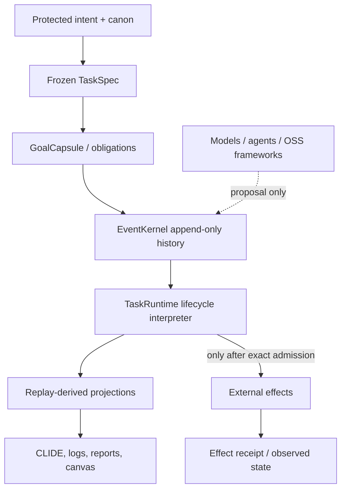
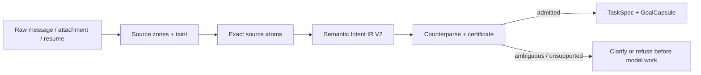
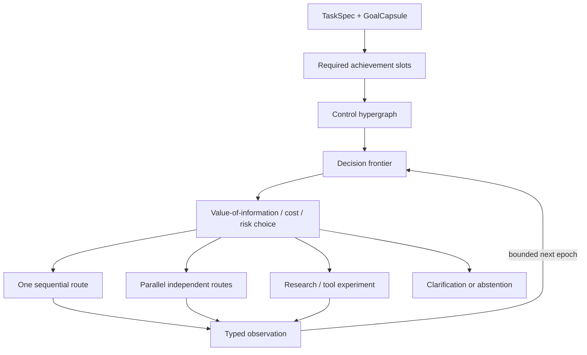
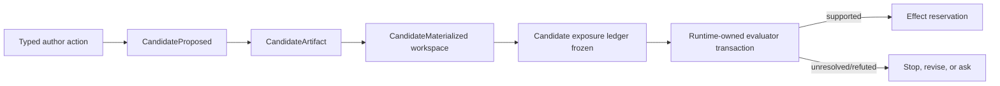

# ARC / CLIDE: The Complete End-to-End Brain

> **Historical architecture book.** This is a 2026-08-11 explanatory capture,
> valuable for orientation but not a substitute for current source, a current
> Atlas basis, or product proof. See
> [`ATLAS-RELEASE-READINESS-2026-08-20.md`](./ATLAS-RELEASE-READINESS-2026-08-20.md).

## A plain-English architecture book for people joining the project

**Snapshot:** 2026-08-11 · repository HEAD `00b9a49d` plus a measured live working-tree overlay  
**Interactive map:** [open the infinite canvas](./index.html)  
**Raw map:** [complete graph data](./arc-clide-infinite-canvas-prototype.data.json)

---

## How to read this book

This project is trying to build a local-first replacement for the useful parts of ChatGPT,
Codex, Claude Code, Claude Cowork and related agent products. That sentence can sound like a
chatbot goal. It is not. The actual goal is a system that can take a human's messy, high-stakes,
long-running request and carry it through understanding, planning, context acquisition, tool use,
candidate creation, independent checking, safe effects, recovery, memory and a user-visible result.

The system therefore has two very different kinds of graphs:

1. **The static architecture graph**: the organs, files, contracts, event types, models, memory
   stores and routes that exist in the product.
2. **The runtime task graph**: the temporary, task-specific workflow created for one request and
   advanced as observations change what should happen next.

The first graph is measured in the [interactive canvas](./index.html). The second graph is not
pretended to be enumerable in advance. It is created from typed runtime events and shown by the
canvas's **Materialize task** control. That is how the surface can be practically infinite without
inventing future nodes or claiming that a static diagram already solves arbitrary tasks.

### The evidence vocabulary

Every capability in this book should be read through this ladder:

```text
EXISTS -> REACHABLE -> DEFAULT-LIVE -> OBSERVED -> CAUSAL -> PRODUCT-PROVEN
```

- **Exists** means code, a schema or a test fixture is present.
- **Reachable** means a real product path can call it.
- **Default-live** means normal configuration reaches it without a fixture switch.
- **Observed** means a real run produced the claimed event or artifact.
- **Causal** means a controlled change in evidence or state changed a downstream decision.
- **Product-proven** means a public user path completed the intended task with independent checks,
  safe effects and replay evidence.

The project has many strong organs at the first four levels. The complete product claim requires
the last two levels, and those are deliberately not claimed yet.

---

## Part I — The thesis

### 1. The problem we are actually solving

Most agent systems optimize for producing a plausible answer. ARC/CLIDE is designed around a
harder question:

> Can the system preserve what the person meant, choose useful next actions, avoid leaking hidden
> answers, create the right artifact, prove the artifact with an evaluator that can catch its own
> mistakes, apply only the approved effect, recover from interruption, and honestly stop when the
> evidence is insufficient?

That is a systems problem, not just a larger-model problem. The model is important, but it is one
component inside a governed loop. A model may propose a claim, branch, tool call, candidate or
question. It does not get to silently redefine the task, invent a fact, mutate the repository or
declare completion.

### 2. The central bet

The central product bet is:

> A model becomes substantially more useful when it is placed inside a typed, evidence-aware,
> dynamically compiled control graph whose state is durable, whose context is selected by
> provenance and scope, and whose completion requires candidate-specific independent evidence.

This bet has three parts.

**Cognitive bet.** A task-local belief state and a task-conditioned workflow are more reliable than
one undifferentiated conversation history. The system should know what is observed, believed,
assumed, contested, unknown, forbidden and worth checking next.

**Engineering bet.** A single append-only authority and replay membrane can connect many specialized
graphs without allowing each graph framework, agent or model to create a competing lifecycle.

**Epistemic bet.** The hardest part is not generating an answer; it is knowing when an answer has
earned promotion. The evaluator must be treated as a hypothesis with fault models, controls,
independence boundaries and an unresolved outcome.

### 3. The one-picture version

```mermaid
flowchart LR
  H["Human intent, values, constraints"] --> S["Exact source + semantic intent"]
  S --> G["GoalCapsule + obligations"]
  G --> K["EventKernel + TaskRuntime"]
  K --> B["Belief / evidence state"]
  B --> W["Task-conditioned workflow"]
  W --> C["Context and exposure compiler"]
  C --> M["Model, specialist, tool or question"]
  M --> O["Typed observation / claim / proposal"]
  O --> B
  O --> A["Candidate artifact"]
  A --> V["Independent oracle and controls"]
  V -->|supported| E["Candidate-specific effect"]
  V -->|unresolved or refuted| R["Honest stop / revise / ask"]
  E --> P["Observed effect + post-effect check"]
  P --> T["TaskCompleted"]
  K --> UI["CLIDE and read-only projections"]
  B --> UI
  A --> UI
  V --> UI
  T --> UI
```



The arrow from model output back into the belief state is the learning loop. The arrow from the
candidate into the oracle is the truth barrier. The arrows into CLIDE are projections, not a second
controller.

---

## Part II — The complete graph family

The phrase “all the graphs” refers to different views of the same task, not independent databases
that tell parallel stories. Every view must bind to the same task, correlation, intent epoch,
graph epoch, node, artifact, actor, runtime and provenance lineage.

### 4. The fourteen graph families

| Graph | What it represents | Why it exists | Current shape |
|---|---|---|---|
| Intent/value graph | What the human asked for and cares about | Prevents convenience from overriding the request | Protected intent map plus live TaskSpec/GoalCapsule |
| Source/semantic graph | Exact spans, clauses, references, languages and opaque zones | Prevents text extraction from dropping obligations | Source Atoms, physical counterparser and Semantic Intent V2 |
| Obligation/acceptance graph | Required outcomes, prohibitions, alternatives and checks | Defines what “done” means | Obligation compiler, coverage and intent-as-tests |
| Identity/provenance graph | Task, entity, scope, time, epoch, source and lineage bindings | Stops cross-task and stale-evidence transplantation | Distributed bindings; unified compiler still missing |
| Belief/epistemic graph | Known, believed, assumed, contested, unknown and forbidden state | Gives the planner a current world model rather than chronological soup | TaskDecisionState and Epistemic Graph V1 |
| Evidence/contradiction graph | Support, refutation, absence, stale data and conflict | Makes uncertainty and disagreement explicit | Partial evidence and inhibition machinery |
| Capability/authority graph | Which actor may read, propose, execute or promote what | Stops a model response from becoming an effect | Contracts, policies, leases and TaskRuntime |
| Control hypergraph | AND obligations, OR tactics, guards, joins and outcome laws | Compiles task-specific workflows | Task-conditioned workflow plus GraphControl V2 |
| Context/exposure graph | What is available, what is model-visible, what is citable and what is hidden | Prevents context loss and evaluator leakage | Working-set and exposure machinery; universal ContextProgram incomplete |
| Execution/effect graph | Requests, starts, results, joins, reservations and recovery | Makes nondeterministic work replayable and external effects safe | Dynamic invocation/effect ledgers, partially integrated |
| Candidate/workspace graph | Candidate bytes, source, materialization and exact target lineage | Ensures the thing evaluated is the thing applied | Candidate stores, workspace router and patch workspace |
| Oracle/evaluation graph | Evaluator plan, controls, receipts, mutations, verdict and denominator | Prevents green-but-weak verification | Strong integrity substrate; promotional oracle transaction missing |
| Memory/learning graph | Episodes, claims, procedures, competence, independence and plasticity | Learns reusable mechanisms rather than hoarding answers | Several stores and procedures; promotion governor incomplete |
| Product/projection graph | CLIDE views, observability, operations, security and release state | Lets humans inspect the same authoritative truth | Rust projections and read-only surfaces, still partial |

### 5. The cross-graph binding layer

This is one of the most important missing deep modules. The current implementation has many exact
bindings, but they are distributed across artifacts and validators. The long-term design needs a
single binding object conceptually like this:

```text
Binding = {
  taskId,
  correlationId,
  intentEpoch,
  graphEpoch,
  nodeId,
  entityIds,
  scope,
  sourceEventId,
  parentArtifactIds,
  authority,
  taint,
  timeWindow,
  permittedInfluence,
  expectedEffect,
  falsifier,
  actor,
  runtimeIdentity,
  environmentIdentity
}
```

The key field is **permittedInfluence**. A retrieved document may be citable but not executable.
An evaluator plan may be physically bound but not model-visible. A model hypothesis may influence a
research branch but not TaskCompleted. A user approval may authorize a class of effect but not
change the candidate bytes. This is the connective tissue that turns many graphs into one mind.

### 6. The authority spine



EventKernel is the durable history. TaskRuntime is the only component allowed to interpret that
history as lifecycle, effect or completion. Models, LangGraph, n8n, Temporal, OpenKB, Langfuse and
other frameworks can be adapters or observation surfaces; none may become a peer checkpoint
authority.

---

## Part III — One request through the whole brain

### 7. Ingress and preservation

The request can arrive through the public WebSocket, CLI, CLIDE TUI, automation or a resumed task.
The first obligation is not to summarize it. It is to preserve the exact source and distinguish:

- instruction from quoted data;
- user preference from acceptance requirement;
- observation from claim;
- adversarial text from control input;
- unknown from false;
- a request to explain from a request to mutate.

The source is frozen into a TaskSpec and a GoalCapsule. The GoalCapsule carries the goal, required
checks, invariants, authority limits, acceptance semantics and unresolved policy.



The semantic compiler must preserve conjunction, sequence, alternatives, conditionals, negation,
references and acceptance criteria. For example:

```text
Implement X without changing Y, then prove Z.
```

must become three bound obligations: implement X, preserve Y, and prove Z, with a sequence edge.
It must not become one bag of words or silently discard the prohibition. The current V2 lane is a
major improvement, but complex language, mixed languages, unresolved anaphora and arbitrary nested
conditionals still require broader promotion tests.

### 8. Belief state: the brain's current world model

The system should never plan directly from the last model paragraph. It plans from a task-local
belief state:

```text
Known       directly observed and checked
Believed    claims with evidence, scope and confidence
Assumed     temporary premises with expiry and falsifiers
Contested   competing explanations and their discriminating experiments
Unknown     gaps that could change the next decision
Forbidden   actions, flows or authority expansions that are illegal
Irrelevant  intentionally excluded information
```

A belief state is revisable within a task but is not silently rewritten. Each revision is a new
event or artifact bound to its parent observations. Long-term memory is slower and harder to
promote; an episode is not automatically a fact.

### 9. Dynamic graph engineering

The system does not run one universal workflow. It compiles a finite task-specific control graph
from the task's obligations and legal capabilities.



The graph compiler distinguishes:

- **AND**: obligations that all must be discharged;
- **OR**: alternative tactics for the same obligation;
- **guards**: prerequisites that must be true before a branch is legal;
- **joins**: evidence that multiple branches completed and are comparable;
- **outcomes**: supported, refuted, unresolved, blocked or needs-user-input;
- **leases and budgets**: limits on time, tokens, GPU, money and authority;
- **loop quarantine**: repeated state or diminishing-gain detection.

The model can propose a typed graph delta. It cannot append arbitrary nodes, widen authority,
choose a hidden evaluator or declare the task complete. Runtime changes are bounded and replayable;
long-term workflow learning happens offline with held-out promotion.

### 10. Context is a program, not a prompt dump

The model does not receive “the brain.” It receives a task-conditioned working set compiled from
the brain. Every item has a role and a permitted influence:

```text
physically bound     exists for verification/replay but is hidden from the model
model-visible        may be included in the current request
citable              may support a claim but cannot authorize an effect
proposal-only        model-generated and not yet trusted
evaluator-only       private control material, never author context
```

Context selection uses exact source spans, structured queries, repository and symbol relations,
provenance, freshness, scope, taint, contradiction and budget. A vector similarity result is one
retrieval proposal; it is not a fact. This is why the project does not treat RAG as the brain.

### 11. Model, specialist and tool routing

Different tasks need different routes:

| Task shape | Likely route | Extra protection |
|---|---|---|
| Simple explanation | One model call with a small typed context | No effect authority; source/claim distinction |
| Coding change | Repository grounding, author, tests, candidate workspace | Candidate/effect lineage and patch oracle |
| Research synthesis | Search/retrieval branches, source contradiction, citation ledger | Stale-source and provenance checks |
| Mathematics | Multiple derivations, symbolic/numeric checks, counterexamples | Independent method and unit/limit controls |
| Numerical physics | Event semantics, convergence, limiting cases, independent integration | Tri-state boundary handling and exact reference binding |
| Security/adversarial task | Threat model, mutation, isolation, red-team route | No shared evaluator blind spot |
| Ambiguous request | Clarification branch | Zero consequential model/effect work before resolution |
| Long-running task | Durable heartbeat, leases, checkpoint and homeostat | Crash/replay and budget laws |

Routing is learned from held-out outcomes, not model self-confidence. Independence means different
failure mechanisms—not merely five calls to the same model with different names.

### 12. Typed model output

No naked model text crosses a critical seam. A response must become one of a small set of typed
objects:

```text
Claim | Hypothesis | Observation | ActionProposal | Question
GraphDelta | CandidateArtifact | EvidenceAttachment | UnresolvedResult
```

Each object carries its task/epoch binding, authority, lineage, expected effect and falsifier.
Model text can remain visible to the user, but it cannot become a fact, command, patch or completion
by implication.

### 13. Candidate and workspace lineage

For coding, the author produces immutable candidate bytes. The candidate is proposed, materialized
into an isolated workspace, and then evaluated. The evaluator must be bound to exactly that
candidate, not merely to the task or a matching patch hash.



The author must not see private evaluator cases, held-out commands, hidden answers, oracle opening
handles or evaluator-only evidence. The candidate must be frozen before the evaluator is revealed.

### 14. The oracle foundry

This is the hardest research-grade engineering problem in the project.

An executable check can still be semantically weak. A candidate can satisfy a no-op test, an oracle
can share the candidate generator's blind spot, and a double fault can make a wrong candidate look
right. Therefore every task family needs a code-owned evaluator plan and a control matrix.

```text
R+ x O0  known-good candidate, base oracle       must pass
R- x O0  candidate mutant, base oracle           must fail at candidate layer
R+ x O1  good candidate, oracle mutant           must fail at oracle layer
R- x O1  both mutants                            must not be mistaken for support
C        submitted candidate                    evaluated only after controls conform
```

Every cell requires a unique runtime-attested receipt bound to task, epoch, plan, candidate,
workspace, case, evaluator, runtime, environment, role and time window. Missing, duplicated,
transplanted, stale, correlated or in-doubt evidence yields `unresolved`.

The black-hole numerical task is a particularly valuable transfer challenge. The orbit kernel and
first integral were independently checked, so the physics equations are not the current problem.
The evaluator must instead handle separatrix-side binding, tri-state finite-budget events,
convergence and an actually executed independent numerical route. A self-hashed caller object or a
generic `node --version` check is not an oracle.

### 15. Effects, reconciliation and completion

Verification is not completion. After supported evaluation:

1. reserve an effect keyed to the exact candidate materialization and evaluation;
2. revalidate the current source/base immediately before mutation;
3. apply only immutable candidate bytes in the governed workspace;
4. record `EffectStarted`;
5. record `EffectObserved` or `EffectInDoubt`;
6. reconcile interruption before retrying;
7. rerun acceptance against the observed state under the same lineage;
8. append `TaskCompleted` only when every parent identity matches.

External effects cannot honestly promise exactly-once behavior merely because the event log is
exactly-once. The safe law is idempotency where possible, physical observation and reconciliation
where not.

### 16. CLIDE is the window, not another brain

The Rust TUI, public WebSocket, CLI and future web surfaces project EventKernel/TaskRuntime state:

- current task and intent epoch;
- belief state and contested claims;
- context/exposure ledger;
- active branches and leases;
- candidate bytes and target files;
- evaluator state and unresolved debt;
- effect state and recovery status;
- final completion lineage.

CLIDE should make the system inspectable, steerable and interruptible. It must not create a second
checkpoint graph or silently infer completion from a pretty UI state.

---

## Part IV — The research-grade problems

### 17. Semantic intent is a programming-language problem

Natural language contains composition, scope, references, ellipsis, negation, mixed languages,
domain notation and conversational carry-over. Regexes can provide deterministic anchors, but they
cannot be the whole solution. The target is a lossless source-bound intermediate representation,
model-proposed parses, contrastive counterparses, round-trip checks, explicit ambiguity and a
deterministic refusal when an obligation disappears.

### 18. Cross-graph identity is a database and logic problem

The same entity can appear in prose, code, a repository symbol graph, a research source, a model
claim and a verifier case. Identity needs scope, time, provenance and conflict semantics. Without a
binding layer, memory, context, research and verification are parallel narratives.

### 19. Planning is an active experiment-design problem

The next action should minimize expected decision loss per cost, latency, GPU, authority and
irreversibility. “Ask another agent” is not a planning law. Every action needs the hypothesis it
discriminates, expected observation, predicted decision impact, falsifier, budget and termination
rule.

### 20. Evaluation is a measurement-science problem

The evaluator is itself a measurement instrument. It has sensitivity, blind spots, contamination,
correlated errors and denominator problems. Mutation score is conditional on the fault model.
Agreement between two correlated routes is not independence. A candidate miss canceled by an oracle
miss is not a pass.

### 21. Memory is a causal-learning problem

The system should remember mechanisms, not just outcomes. A useful procedural memory is:

```text
Near a separatrix, binary classification confuses finite-budget uncertainty
with physical outcome; use tri-state event semantics and a convergence witness.
```

Promotion requires repeated compatible evidence, scope, counter-trigger, held-out benefit, no
unacceptable negative transfer and rollback/tombstone support. Retrieval alone never promotes a
memory.

### 22. Long-horizon autonomy is a control and recovery problem

Three clocks are needed:

```text
Fast       seconds: observe, act, verify, update task state
Deliberate minutes/hours: replan, branch, research, ask the user
Slow       days/weeks: consolidate procedures and promote skills
```

Leases, budgets, heartbeats, checkpoints, in-doubt effects, semantic loop quarantine and cold
replay make the clocks safe. A model saying “done” is not a termination event.

### 23. Context is an information-flow and systems problem

Long context is not solved by truncating less carelessly. The system must preserve exact source
zones, selectively compile working sets, make omissions explicit, maintain provenance and detect
when the decision depends on an omitted item. The right question is not “how many tokens fit?” but
“which information is legally allowed and decision-relevant at this step?”

### 24. General intelligence needs representation bridges

The same obligation may need to move between prose, a logical formula, a graph, a state machine,
code, a proof, a test, a simulation and a user-facing explanation. Every bridge needs a preservation
invariant and an independent check. A single universal prompt is not a representation bridge.

---

## Part V — Current status, honestly

### 25. Measured architecture status

The current atlas has 204 named architecture organs:

| Atlas status | Count | Plain meaning |
|---|---:|---|
| Sole authority / constitution | 6 | Durable laws and controllers |
| Live / default | 29 | Normal paths reach these |
| Live / partial | 114 | Real substrate exists, but composition or proof is incomplete |
| Exists / dark or non-promotional | 20 | Present or tested, but not allowed to underwrite completion |
| Missing / launch blocker | 27 | Required bridge is absent or deliberately fail-closed |
| Optional external / pattern only | 8 | Useful ideas, not peer authorities |

These are architecture labels, not a completion percentage. The product-level verdict remains:

```text
substrate-measured-product-capability-unproven
```

### 26. What is genuinely demonstrated

The strongest current causal slice is:

```text
Public WebSocket / CLIDE intent
  -> exact TaskSpec and GoalCapsule
  -> Semantic Intent V2 admission or refusal
  -> EventKernel / TaskRuntime
  -> bounded GraphControl epoch
  -> code-owned repository observation
  -> evidence-conditioned next epoch
  -> typed author eligibility
  -> real model author
  -> CandidateProposed
  -> CandidateMaterialized
  -> OracleEvaluationRecorded(unresolved, authority=none)
  -> hard stop before effect and completion
```

The key causal result is real: sufficient governed repository evidence can make a typed candidate
reachable, while blank or masked evidence keeps it unreachable. That proves cognition can change an
action boundary. It does **not** prove candidate correctness, safe application or successful task
completion.

### 27. What remains red

The completion corridor is:

```text
runtime-signed candidate-author receipt
  -> private pre-candidate evaluator commitment
  -> frozen exposure ledger
  -> runtime-owned sealed oracle/control batch
  -> candidate-bound supported/refuted/unresolved evaluation
  -> effect reservation
  -> exact isolated effect
  -> observed effect or in-doubt reconciliation
  -> post-effect candidate-bound verification
  -> completeCandidate
  -> TaskCompleted
```

The current daemon intentionally records `unresolved` and refuses promotion. That is a safety
feature, not a failure of the architecture. The next work is to make one tiny deterministic code
candidate earn `supported` from a physically executed, runtime-owned control matrix, then prove the
effect and completion transaction with deliberate broken controls.

### 28. What “percentage complete” would mean

A naive percentage based on files or modules would be misleading. A useful scorecard has separate
axes:

| Axis | Current position |
|---|---|
| Architectural coverage | Broad: the complete measured atlas exists |
| Durable authority spine | Strong substrate: EventKernel/TaskRuntime are the intended owners |
| Semantic admission | Real and causally consequential for a bounded lane |
| Dynamic graph execution | Real bounded substrate, not universal or fully default-live |
| Context and memory | Many organs, cross-graph promotion still incomplete |
| Candidate lifecycle | Proposal/materialization real; promotion intentionally unresolved |
| Independent oracle | Integrity substrate; promotional semantic transaction missing |
| External effect | Not earned in the current safe path |
| Product completion | Not proven |

The honest summary is: **the nervous system and control membrane are substantially built; the proof-
to-effect synapse is the launch-critical gap.** The project is not starting over, but it is not yet
an end-to-end replacement either.

---

## Part VI — OSS and ecosystem choices

### 29. LangGraph, n8n and Temporal patterns

These projects demonstrate useful workflow ideas: branching, checkpoints, human interruption,
visual composition, retries and activity isolation. ARC should borrow those patterns through an
adapter. They must not own durable task truth, event identity or completion because the product
already has EventKernel/TaskRuntime as the authority spine.

### 30. OpenKB

OpenKB-like Markdown/wiki/PageIndex/citation patterns are useful for read-only knowledge browsing,
file trees and source-linked retrieval. Generated summaries, skills and rewrites remain proposals.
They enter the brain only as scoped, provenance-bound evidence and never become hidden completion
authority.

### 31. Langfuse

Langfuse is useful as an optional one-way observability sink for traces, latency, token usage and
debugging. It must not feed prompts, scores or evaluator decisions back into TaskRuntime authority.
Its self-hosted stack is also heavier than the current development host, so it is a deployment
choice—not a prerequisite for the core brain.

### 32. iii

The iii catalog/schema/console ideas may inform discovery and observability. Direct engine
integration is unsafe for the core because an effectful function router, trust-by-default listener,
mutable queues or a second state owner would duplicate EventKernel/TaskRuntime authority.

---

## Part VII — The launch plan

### 33. Phase 1: make one candidate earn support

Use a tiny deterministic subject and a code-owned evaluator adapter. The public API accepts only the
materialized candidate identity. The runtime chooses private cases, controls, receipts and the
denominator.

Required failures to test:

- candidate mutant;
- oracle mutant;
- double-fault cancellation;
- missing or duplicate receipt;
- wrong task, epoch, workspace or evaluator;
- post-candidate commitment;
- private-plan exposure;
- crash at every transaction boundary;
- cold replay performing no new work.

### 34. Phase 2: make one exact effect safe

Reserve an effect against the supported candidate, validate current source identity, apply only
immutable bytes, persist physical observation, reconcile interruption and re-run candidate-bound
acceptance. Do not route through the legacy generic completion path.

### 35. Phase 3: make CLIDE and the public path prove the same lineage

Drive the real WebSocket and rebuilt TUI with the local GPU model. Show the same task, intent,
belief, branch, candidate, evaluator, effect and completion IDs in both surfaces. Restart the
process and prove no model, evaluator or effect work is repeated.

### 36. Phase 4: generalize and attack

Run matched campaigns across coding, research, math, physics and cross-domain synthesis with:

- ambiguity and negation;
- stale or poisoned memory;
- missing dependencies;
- malformed tool output;
- timeouts and daemon crashes;
- source drift;
- user interruption;
- hidden-evaluator exposure canaries;
- polarity and neutral-context controls;
- black-hole finite-budget separatrix cases;
- held-out transfer and negative-transfer measurement.

The campaign must publish exact planned, executed, attested, unresolved and abstained denominators.

---

## Part VIII — Honest conclusion

The ambitious part of this project is real: it is not merely building a prompt wrapper or a larger
RAG index. It is attempting to make cognition, context, workflow, evidence, authority, recovery,
memory and product UX obey one causal constitution.

The architecture has already moved beyond a chronological agent loop. It has typed intent, durable
authority, bounded dynamic graphs, task-local decision state, information-flow boundaries, candidate
lineage and explicit unresolved outcomes. The infinite canvas makes that whole structure legible.

The dangerous self-deception would be to mistake those organs for a finished brain. The decisive
remaining proof is narrower and more concrete: one real candidate must pass an independent,
runtime-owned control matrix, survive candidate-specific effect and post-effect verification, and
appear as the same lineage in CLIDE after cold replay. Once that synapse is real, the rest of the
system has a credible foundation for broader task families and deeper learning.

The project's promise is therefore neither “the model is always right” nor “every graph is already
complete.” It is:

> The system preserves intent, chooses actions because of evidence, knows what it does not know,
> refuses unearned authority, and can prove exactly what happened.

That is the standard the launch must meet.
